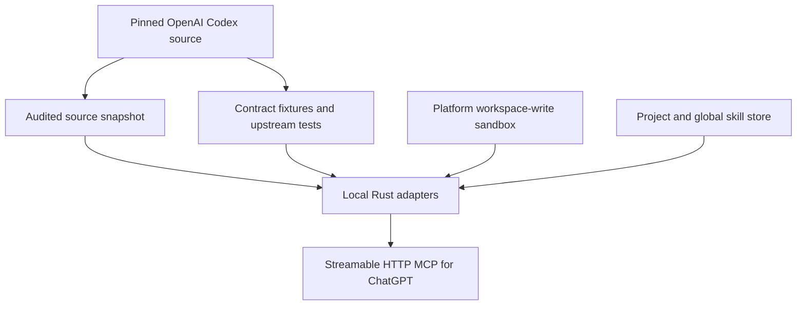
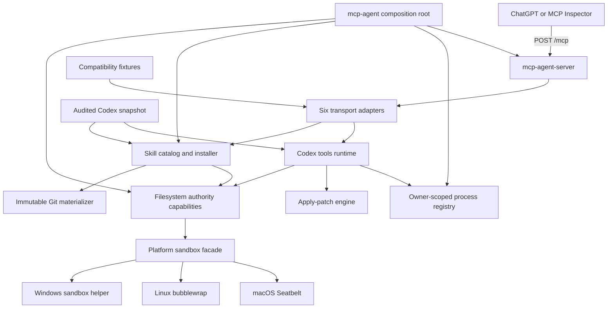
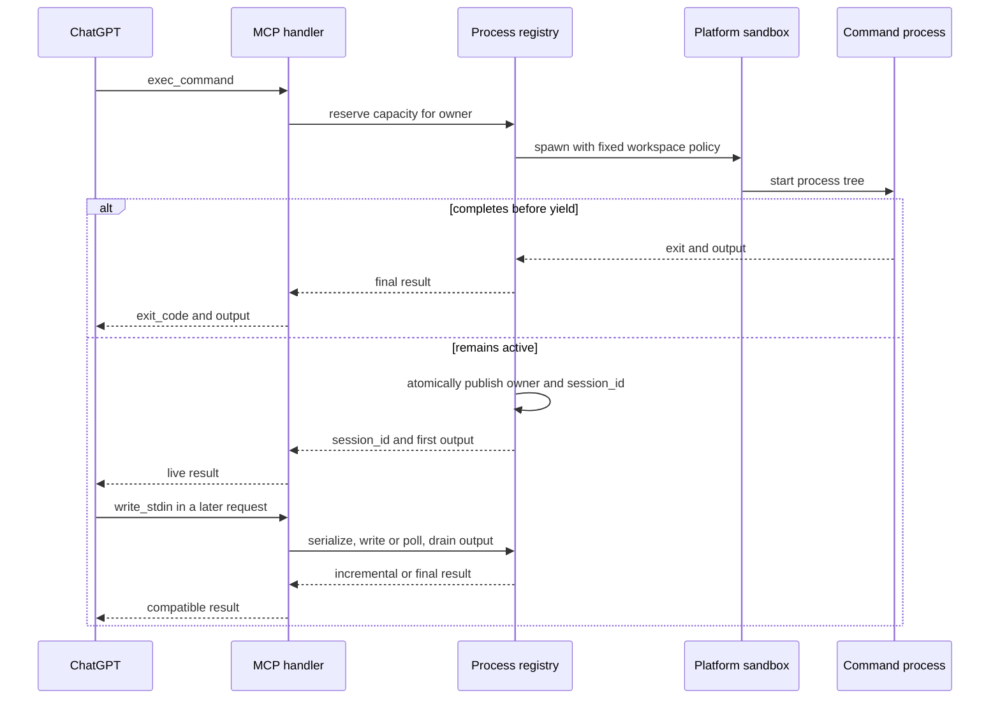
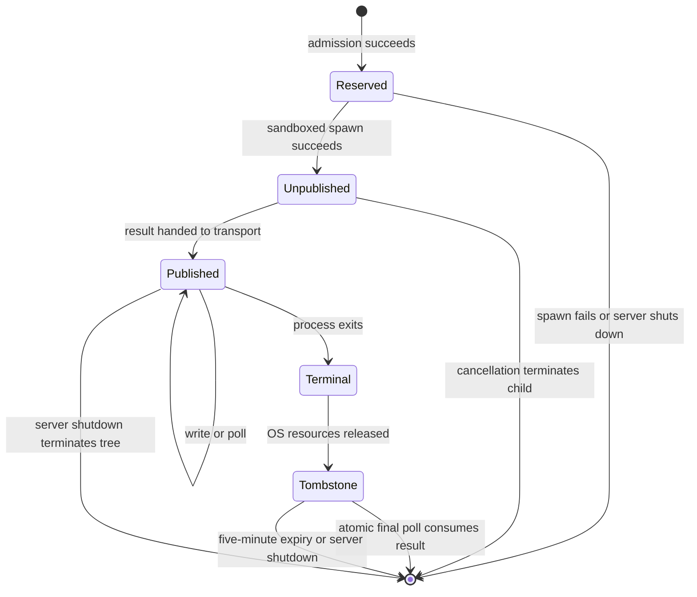
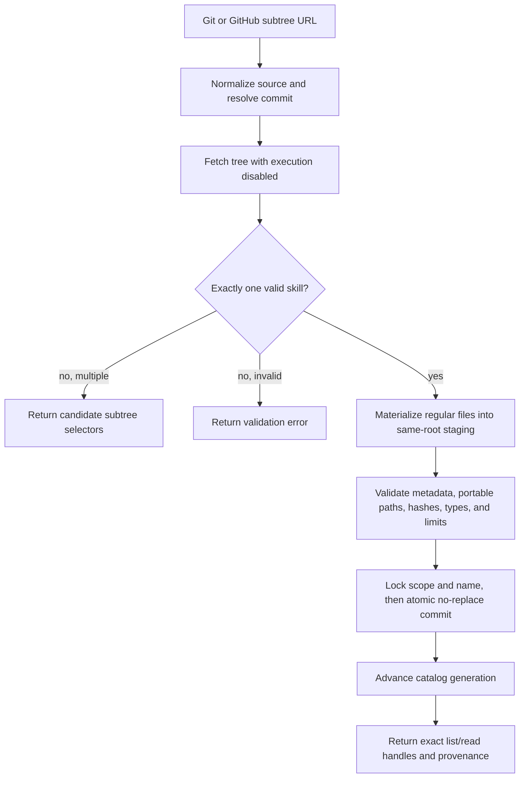
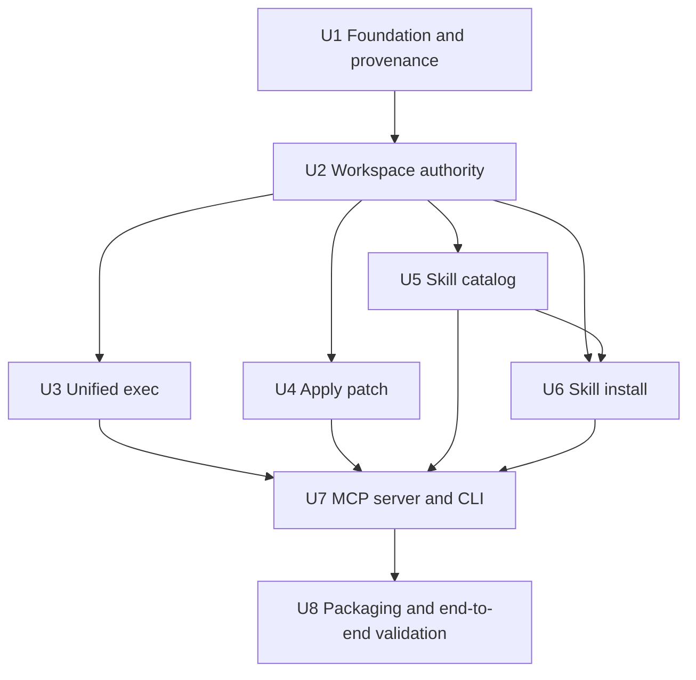

# Codex Tools MCP Agent - Plan

> **Historical plan — superseded on 2026-08-23.** This document records the
> original six-tool, brokered-installer, protected-metadata, and cross-platform
> design. It is not the active product contract. The implementation and release
> gates are governed by
> `docs/plans/2026-08-23-1219-refactor-codex-parity-skills-sandbox-plan.md`.
> Obsolete requirements below are intentionally preserved as decision history,
> not as current promises.

## Goal Capsule

- **Objective:** Build one primary `mcp-agent` application binary, packaged with any required native sandbox helper or policy assets, that gives ChatGPT the Codex command, terminal-session, patch, and skill capabilities through six MCP tools without running Codex or calling the OpenAI API.
- **Product authority:** User-confirmed product decisions govern scope and OpenAI Codex commit `8cabf5a6cf103cebe338d46346e43e3201e64f41` governs behavior that exists upstream.
- **Execution profile:** Implement one Rust workspace, reuse or extract the pinned Codex Rust code, expose Streamable HTTP at `/mcp`, and verify macOS, Linux, and Windows with one conformance contract.
- **Stop conditions:** Stop implementation if a required platform cannot enforce Codex-style direct-filesystem workspace-write without an unsandboxed fallback, or if a claimed upstream extraction cannot be traced to the pinned commit.
- **Tail ownership:** The implementation includes tests, cross-platform packaging, license notices, local ngrok documentation, MCP Inspector validation, and a manual ChatGPT developer-mode smoke test.
- **Product Contract preservation:** R10, F2, AE3, the Summary, Success Criteria, Key Decisions, and Dependencies were changed after the user selected Codex-style workspace-write on 2026-08-10. Host reads are allowed, while writes remain confined to the workspace and server-managed skill storage. All other stable requirement, flow, and acceptance IDs are preserved.

---

## Product Contract

### Summary

Build a cross-platform `mcp-agent` command that exposes a workspace-write Streamable HTTP MCP server with six coding and skill tools.
Reuse original Codex Rust modules when they can stand alone, otherwise maintain a narrow traced extraction with compatibility tests against the pinned source.

### Problem Frame

ChatGPT can call an external MCP server, but it does not receive Codex's local execution and editing tools by default.
The desired server must provide those capabilities without running Codex itself and without using the OpenAI API.
Behavior-compatible rewrites are insufficient when the open-source Codex implementation can be reused directly.

### Actors

- A1. **User:** Starts `mcp-agent` in a project directory, connects the endpoint to ChatGPT, and requests coding work or skill installation.
- A2. **ChatGPT MCP client:** Discovers and calls the advertised tools; its prompting, confirmations, and reasoning loop are outside this product.
- A3. **MCP agent server:** Enforces workspace-write authority, runs Codex-derived tool logic, manages live terminal sessions, and stores skills.

### Key Decisions

- **Upstream-first reuse** (session-settled: user-directed — chosen over behavior-compatible reimplementation: preserve original Codex code whenever it can be reused or faithfully extracted). Governs R2-R9.
- **Codex-style workspace-write authority** (session-settled: user-directed — chosen over strict read isolation and whole-machine direct filesystem writes: allow host and local-service access while containing direct filesystem writes to the workspace and managed skill roots). Governs R1, R10-R11.
- **Automatic command execution** (session-settled: user-directed — chosen over per-command confirmation: preserve uninterrupted agent work). Governs R11.
- **Global and project skills** (session-settled: user-directed — chosen over a single storage scope: reuse personal skills while allowing project overrides). Governs R14-R20.
- **All desktop operating systems** (session-settled: user-directed — chosen over an initial macOS/Linux release: provide one public contract on macOS, Linux, and Windows). Governs R12.
- **Unauthenticated ngrok development mode** (session-settled: user-directed — chosen over Secure MCP Tunnel or OAuth for the local version: prioritize immediate local testing despite the accepted exposure risk). Governs R21-R22.

### Requirements

**Server surface**

- R1. Running `mcp-agent` must canonicalize the current directory as an immutable workspace root and expose a Streamable HTTP MCP endpoint, normally at `/mcp`.
- R2. The model-visible tool surface must contain exactly `exec_command`, `write_stdin`, `apply_patch`, `skills.install`, `skills.list`, and `skills.read` without requiring Codex or the OpenAI API.
- R3. `exec_command`, `write_stdin`, and `apply_patch` must preserve their upstream names, descriptions, arguments, defaults, result fields, truncation behavior, and error semantics wherever MCP and the fixed workspace authority support the same contract.
- R4. `exec_command` must run commands with a workspace-contained working directory, support PTY allocation, bounded output, yielding, completion results, and live session creation in accordance with the pinned Codex contract.
- R5. `write_stdin` must write to or poll a live `exec_command` session and return incremental output and completion data in accordance with the pinned Codex contract.
- R6. `apply_patch` must use the original Codex patch grammar, parser, validation, and application behavior; its MCP adapter accepts freeform patch text through one JSON string argument because MCP tools require structured arguments.

**Upstream reuse and compatibility**

- R7. For each Codex-derived capability, implementation must prefer an unchanged upstream module, then a minimal adapter around upstream code, and only then a faithful extraction when upstream coupling prevents direct reuse.
- R8. Every reused or modified upstream file must record its source commit and comply with Apache 2.0 license, notice-retention, and modification-marking requirements.
- R9. Compatibility verification must reuse applicable upstream tests and compare advertised schemas, descriptions, outputs, errors, limits, and edge cases against the pinned Codex commit.

**Execution boundary and portability**

- R10. Commands may read host files and use host services allowed by the operating-system account, but direct command filesystem writes, working directories, patches, project-skill writes, traversal, symlink or reparse resolution, inherited writable handles, and child-process filesystem writes must remain confined to the immutable workspace. Commands and patches may edit project skills because they live inside that workspace; only `skills.install` may write to the managed global skill root.
- R11. Commands and outbound dependency operations must run without per-command confirmation while remaining subject to R10.
- R12. macOS, Linux, and Windows must expose the same tool contracts and acceptance behavior even when their sandbox and process backends differ.
- R13. Live terminal sessions must remain addressable until process completion or server shutdown, must not be evicted while live, must remain inside a non-breakaway process tree, and must release operating-system resources after termination.

**Skill lifecycle**

- R14. `skills.install` must install exactly one valid skill from a public HTTPS Git repository plus an optional repository-relative subtree selector, or an equivalent GitHub tree URL, into an explicitly selected `global` or `project` destination and return immutable source provenance without automatically reading the installed instructions.
- R15. Project skills must override global skills with the same canonical name for name-based selection; both origins remain visible to `skills.list` and readable through exact handles.
- R16. `skills.list` must preserve the original Codex catalog, pagination, cursor, and selection semantics while adding the authority, source, and scope metadata needed for global and project host storage.
- R17. `skills.read` must preserve the original Codex package-resource and pagination semantics for `SKILL.md` and referenced files without allowing a resource path to escape its package.
- R18. Installation must validate skill structure, metadata, portable normalized path names, resource types, fetch and materialization limits, and resource paths before committing the complete package atomically.
- R19. Installation must reject a same-scope canonical-name collision without changing the existing skill, including concurrent installation attempts.
- R20. Installation must not execute source scripts, ambient Git configuration, credential helpers, hooks, filters, submodules, external transport helpers, or repository code.

**Local exposure and future deployment**

- R21. The local version must support an externally managed ngrok tunnel and display an unmissable persistent warning that possession of the URL grants command execution, host reads, workspace writes, and durable project or global skill installation.
- R22. Unauthenticated exposure is a development mode only; a future stable VPS mode must be able to add authentication and deployment state without changing the six model-visible tool contracts.

### Key Flows

- F1. **Launch and connect**
  - **Trigger:** A1 runs `mcp-agent` from a project directory.
  - **Actors:** A1, A3
  - **Steps:** A3 canonicalizes the workspace, verifies its platform sandbox, starts the MCP endpoint, advertises the six tools, and prints connection information plus the unauthenticated-mode warning.
  - **Outcome:** A2 can connect to one server whose write authority remains fixed to that workspace.
  - **Covers:** R1-R3, R10, R21.
- F2. **Execute a coding task**
  - **Trigger:** A2 calls a command or patch tool while completing a user request.
  - **Actors:** A2, A3
  - **Steps:** A3 validates the working directory and write boundary, invokes the Codex-derived implementation inside the platform sandbox, and returns the compatible result.
  - **Outcome:** A2 can inspect host-readable dependencies and modify the project while writes outside the workspace are denied.
  - **Covers:** R3-R13.
- F3. **Continue an interactive process**
  - **Trigger:** `exec_command` yields while its process is still running.
  - **Actors:** A2, A3
  - **Steps:** A3 returns the original session identifier field; A2 calls `write_stdin` to send input or poll; A3 serializes access and returns only newly drained output until completion.
  - **Outcome:** Interactive and long-running commands remain usable across independent MCP requests.
  - **Covers:** R4-R5, R13.
- F4. **Install and use a skill**
  - **Trigger:** A1 asks A2 to install a skill from a supported Git URL into a named scope.
  - **Actors:** A1, A2, A3
  - **Steps:** A3 resolves one immutable Git tree, validates and stages the package without checkout execution, commits it atomically, refreshes the catalog, and returns exact handles for `skills.read`.
  - **Outcome:** A2 can discover and read installed instructions immediately without restarting the server or calling the OpenAI API.
  - **Covers:** R14-R20.

### Acceptance Examples

- AE1. **Exact tool discovery**
  - **Covers:** R2-R3.
  - **Given:** A fresh server is connected through an MCP inspector.
  - **When:** The client lists tools.
  - **Then:** Exactly the six required names appear; the core tools and upstream skill tools match the pinned definitions except for registered adaptations, while `skills.install` is identified as new behavior.
- AE2. **Long-running terminal session**
  - **Covers:** R4-R5, R13.
  - **Given:** A command remains active beyond the initial yield window.
  - **When:** A2 receives its session identifier and polls with `write_stdin` through independent HTTP requests.
  - **Then:** Each successful call returns newly drained output. A terminal result remains available until the first server-to-transport handoff or five-minute expiry, is consumed at most once after that handoff, and releases process resources; a response lost after handoff is explicitly not replayable because MCP has no client acknowledgment.
- AE3. **Workspace-write policy**
  - **Covers:** R10-R11.
  - **Given:** Readable and writable sentinels exist outside the launch workspace.
  - **When:** A command reads the readable sentinel and then a command, patch, child process, working directory, absolute path, traversal sequence, symlink, junction, or reparse point attempts an external write.
  - **Then:** The read succeeds under host permissions, every tested direct external filesystem write is denied, and the external writable sentinel is unchanged.
- AE4. **Original patch behavior through MCP**
  - **Covers:** R6-R9.
  - **Given:** A valid upstream-format patch is supplied through the MCP JSON adapter.
  - **When:** A2 calls `apply_patch`.
  - **Then:** The original parser and application behavior produce the same workspace change and equivalent errors as the pinned Codex implementation.
- AE5. **Project skill overrides global skill**
  - **Covers:** R14-R20.
  - **Given:** Global and project scopes contain valid skills with the same canonical name.
  - **When:** A2 lists the catalog and follows an exact resource handle.
  - **Then:** Name-based selection prefers the project skill, while `skills.list` identifies both origins and `skills.read` can read either exact package.
- AE6. **Ambiguous or conflicting skill installation**
  - **Covers:** R14, R18-R20.
  - **Given:** A Git source exposes multiple skills, contains an invalid package, exceeds a resource limit, or resolves to a name already present in the selected scope.
  - **When:** A2 calls `skills.install`.
  - **Then:** A3 reports retryable repository-relative candidate selectors or a validation error without executing repository code or changing installed skills.
- AE7. **Cross-platform contract**
  - **Covers:** R12.
  - **Given:** Equivalent fixtures on macOS, Linux, and Windows.
  - **When:** The shared conformance suite exercises all six tools and the write-boundary adversarial cases.
  - **Then:** Model-visible schemas and behavioral outcomes agree across the three operating systems.

### Success Criteria

- The shared conformance suite passes on macOS, Linux, and Windows without an unsandboxed command fallback.
- Every intentional difference from pinned Codex behavior is documented as an MCP adaptation, fixed-workspace rule, session-lifecycle rule, or new skill requirement.
- MCP Inspector can discover and exercise all six tools through the local HTTP endpoint.
- A permitted command can read a host file outside the workspace, while no acceptance scenario can directly modify external filesystem content except through the server-internal global skill installation path.
- Installed project and global skills are visible immediately and remain valid after server restart.
- One documented ChatGPT developer-mode configuration completes a command, a follow-up terminal poll, a patch, and a skill installation through the external HTTPS endpoint; denials in other account configurations remain client-policy observations.

### Scope Boundaries

**Deferred for later**

- Authenticated VPS deployment, OAuth, multi-user isolation, distributed process routing, stable hosting, and operational monitoring.
- Installer-driven skill update, removal, registry search, signature verification, and non-Git installation sources beyond `skills.install`; direct command or patch edits of project skills remain ordinary workspace work.
- Authenticated private Git skill sources, SSH Git transport, and ambient Git credential-helper integration.
- Additional Codex tools beyond the six tools in R2.
- Automatic synchronization with new Codex commits after the pinned baseline.
- The draft ChatGPT-native skill-import extension; this release exposes callable `skills.list` and `skills.read` tools only.

**Outside this product's identity**

- Running the Codex agent loop, models, prompts, UI, or OpenAI API.
- Controlling how ChatGPT selects tools, phrases prompts, requests confirmations, or conducts its own reasoning loop.
- Embedding or managing ngrok inside `mcp-agent`; the binary exposes a loopback endpoint for an external tunnel.
- Replacing original Codex behavior with a separately designed command or patch interface when an upstream contract exists.

### Dependencies / Assumptions

- The pinned Codex source remains reusable under Apache 2.0 subject to its redistribution conditions.
- The ChatGPT connection supports Streamable HTTP MCP and JSON-schema tool arguments, but account-level restrictions may still prevent some write tools from being invoked.
- Workspace-write follows the pinned Codex threat model: it contains direct filesystem writes but does not claim to prevent indirect effects through allowed Docker, database, agent, local-network, or other host services.
- The workspace must not contain pre-existing hardlinks, bind mounts, mount points, or reparse topology that aliases external writable objects.
- Each platform provides its required native sandbox helper; startup fails closed when that helper or prerequisite is unavailable.
- Public Git HTTPS access is available when `skills.install` fetches a source.
- The server runs as one instance for this release; terminal session identifiers do not survive restart and cannot move between hosts.

### Sources / Research

- [OpenAI Codex repository at the pinned baseline](https://github.com/openai/codex/tree/8cabf5a6cf103cebe338d46346e43e3201e64f41)
- [Codex unified exec tool specifications](https://github.com/openai/codex/blob/8cabf5a6cf103cebe338d46346e43e3201e64f41/codex-rs/core/src/tools/handlers/shell_spec.rs)
- [Codex apply_patch specification](https://github.com/openai/codex/blob/8cabf5a6cf103cebe338d46346e43e3201e64f41/codex-rs/core/src/tools/handlers/apply_patch_spec.rs)
- [Codex skill list and read tools](https://github.com/openai/codex/tree/8cabf5a6cf103cebe338d46346e43e3201e64f41/codex-rs/ext/skills/src/tools)
- [Codex modern host skill roots](https://github.com/openai/codex/blob/8cabf5a6cf103cebe338d46346e43e3201e64f41/codex-rs/ext/skills/src/host_roots.rs)
- [MCP Streamable HTTP specification](https://modelcontextprotocol.io/specification/2026-07-28/basic/transports/streamable-http)
- [MCP tool and stateful-handle specification](https://modelcontextprotocol.io/specification/2026-07-28/server/tools)
- [Rust MCP SDK at rmcp 3.0.1](https://github.com/modelcontextprotocol/rust-sdk/tree/rmcp-v3.0.1)
- [OpenAI MCP server guidance](https://developers.openai.com/plugins/build/mcp-server)
- [OpenAI skill installer reference](https://github.com/openai/skills/blob/main/skills/.system/skill-installer/scripts/install-skill-from-github.py)
- [Gitoxide in-process Git implementation](https://github.com/GitoxideLabs/gitoxide)
- [Apache License 2.0 and Codex NOTICE](https://github.com/openai/codex/tree/8cabf5a6cf103cebe338d46346e43e3201e64f41)

---

## Planning Contract

### Key Technical Decisions

- KTD1. **Use one all-Rust application process.** (session-settled: user-directed — chosen over a TypeScript MCP wrapper around Rust tools: keep PTY ownership, schemas, sandbox state, and packaging in one runtime.) Create one Cargo workspace and one primary `mcp-agent` application binary, then package it with required native sandbox helper or policy assets. Pin the Rust toolchain to the pinned Codex baseline and pin the official `rmcp` patch release to `=3.0.1`, which includes the stateless-initialization fixes needed by this server; isolate it behind the server crate so a later protocol upgrade does not change tool runtime contracts. Governs R1-R5, R12, R21-R22.
- KTD2. **Maintain a narrow audited Codex source snapshot.** (session-settled: user-approved — chosen over importing the coupled `codex-core` workspace or independently rewriting behavior: reuse a whole module only when it compiles as a clean boundary.) Keep unmodified copied files in an upstream-only subtree, place adaptations outside that subtree, and record original path, commit, checksum, license, and modification status in a machine-checkable source map. An unchanged file may depend only on the standard library, audited external crates, or other mapped upstream files; the upstream audit must prove this transitive closure. Governs R3, R6-R9, R16-R17.
- KTD3. **Make compatibility a tested registry, not a claim.** Freeze tool descriptions, JSON schemas, defaults, result fixtures, truncation cases, and error cases from the pinned commit. Register every difference with its owning requirement and fail conformance when an unregistered difference appears. Use the upstream schema builders with approvals disabled so escalation-only arguments are not advertised. Governs R2-R9.
- KTD4. **Implement Codex-style workspace-write through a shared authority layer and fail-closed native backends.** (session-settled: user-directed — chosen over strict host isolation and unsandboxed execution: retain normal compiler, local-service, and dependency access while containing direct filesystem writes.) Put immutable workspace, project-skill, global-skill, and server-staging capabilities in a foundational crate used by both runtime and skill-store. Reuse the pinned Seatbelt policy path on macOS, bubblewrap launcher path on Linux, and restricted-token/elevated helper path on Windows. Keep command working directories inside the workspace, protect `.git`, `.codex`, `.mcp-agent`, the global skill root, and server staging, but allow ordinary workspace tools to edit project `.agents/skills`; close non-stdio writable handles before spawn, permit outbound and local network access, and reject startup when the backend cannot establish the policy. Server-managed writes use handle-relative, no-follow operations and revalidate immediately before commit. Governs R1, R10-R12.
- KTD5. **Keep terminal state in an owner-scoped server-instance process registry.** (session-settled: user-approved — chosen over upstream live-session eviction: reject new admission when all 64 live or reserved slots are occupied.) Preserve the original numeric `session_id` field as an opaque server-local handle, but key every operation by owner context plus that ID; local mode uses one explicit anonymous owner. Reserve, spawn, and publish a process atomically. Cancellation before publication terminates the child and releases capacity; disconnection after publication does not terminate it. Serialize interactions per process, treat non-empty `write_stdin` as non-idempotent and never auto-retry it, and stage drained output until the transport accepts the result so earlier cancellation can restore the chunk. Consume server state at most once after transport handoff and document that MCP provides no end-to-end client acknowledgment, so a response lost after handoff is not replayable. Release operating-system resources at exit and retain one terminal tombstone for the first final poll or five minutes. Governs R4-R5, R13.
- KTD6. **Adapt original skill tools to local host scopes.** Reuse the original list/read pagination, cursor fingerprint, response-size, and package-resource behavior. Add a local host authority and explicit `project` or `global` scope because the upstream public tool authority does not expose host entries directly. Use the workspace `.agents/skills` root and the user-level global `.agents/skills` root, order project entries first, resolve name selection with project precedence, and keep reads exact-handle based through logical `skill://` resources. Reconcile a lightweight root fingerprint before each list/read operation so command or patch edits to project skills become visible, invalidate catalog generations after a successful install, and rebuild on restart. Governs R14-R19.
- KTD7. **Install from an immutable public HTTPS Git tree without an external Git executable.** Pin `gix = 0.86.0` and route every DNS lookup, redirect, and socket connection through a server-owned HTTPS connector so fetch cannot read host Git configuration, invoke credential helpers, or require Git on Windows. Reject URL userinfo and query strings; reject private, loopback, link-local, and metadata destinations after every resolution and redirect; and enforce transport bytes, disk, object expansion, and time limits before materialization. Resolve one commit, inspect regular files with one conservative cross-platform path grammar, apply the optional subtree selector, materialize into a server-only same-filesystem staging root, revalidate hashes, then atomically commit under a scope-and-name lock without replacement. A source with multiple valid skills returns repository-relative candidate selectors for a retry. Governs R14, R18-R20.
- KTD8. **Keep `rmcp` as a transport-only adapter over shared application capabilities.** The `mcp-agent` composition root owns workspace authority, owner context, process registry, skill catalog, install coordinator, and HTTP admission controls; runtime and skill-store never import MCP or HTTP types. Mount Streamable HTTP at `/mcp` with legacy transport sessions disabled, JSON responses enabled, deterministic `tools/list`, and a fresh handler per request. Default to a 4 MiB request body, 64 KiB aggregate headers with at most 100 fields, 32 in-flight requests, 16 concurrent SSE responses, a 15-second upload-idle timeout, and a 120-second response-idle timeout; reject excess with explicit 413, 429, or timeout responses before tool work starts. Configure public Host allowlists separately from the loopback bind address, validate every present Origin, reject wildcard validation, and ignore forwarded host headers unless the immediate proxy is trusted. Freeze truthful tool annotations and object `structuredContent` plus JSON text fallback as registered MCP adaptations. Recoverable execution failures use tool errors, and future authentication supplies owner context without changing the six contracts. Logs must omit tool arguments, command output, skill bodies, authorization headers, URL userinfo/query data, and absolute host paths; only bounded identifiers, classifications, timings, sizes, and redacted provenance may be recorded. Governs R1-R3, R13, R21-R22.
- KTD9. **Ship native helpers as one executable compatibility set.** Bind binary version, helper or policy version, target triple, checksum, and sandbox capability protocol in one release manifest. Resolve helpers relative to the installed release rather than the workspace or `PATH`, hold the resolved artifact against replacement, and require its capability self-test before serving. Package only architectures exercised in CI, while keeping the source build available for other architectures. Governs R8, R10, R12, R21.

### High-Level Technical Design

The HTTP handler owns no durable terminal state.
The `mcp-agent` composition root creates every long-lived capability and gives transport-neutral handles to the HTTP adapter.
Each request carries an owner context and shared references to the immutable workspace authority, process registry, skill catalog, and install coordinator.
This allows modern stateless Streamable HTTP requests to continue a process through the original `session_id` field.

#### Authority matrix

| Operation | Host read | Workspace write | Project skill write | Global skill write | Network |
|---|---:|---:|---:|---:|---:|
| `exec_command` child | Allowed | Allowed except protected roots | Allowed inside workspace | Denied | Allowed |
| `write_stdin` child continuation | Allowed | Allowed except protected roots | Allowed inside workspace | Denied | Allowed |
| `apply_patch` | Workspace only | Allowed except protected roots | Allowed inside workspace | Denied | None |
| `skills.list` / `skills.read` | Managed skill roots only | None | None | None | None |
| `skills.install` project | Staging and Git inputs | Server staging only | Allowed | Denied | Allowed |
| `skills.install` global | Staging and Git inputs | None | Denied | Allowed | Allowed |

The matrix governs direct filesystem effects.
Allowed commands may still cause external effects through Docker, databases, local APIs, agents, and network services; this is an accepted Codex-parity risk rather than a sandbox guarantee.

#### Terminal execution sequence

#### Process lifecycle

#### Skill installation pipeline

### Output Structure

- `Cargo.toml`, `Cargo.lock`, and `rust-toolchain.toml` define the pinned Rust workspace.
- `crates/mcp-agent/` is the composition root and owns CLI parsing, capability construction, owner context, warnings, admission, and ordered graceful shutdown.
- `crates/mcp-agent-server/` owns only `rmcp`, Streamable HTTP policy, the six transport adapters, and MCP result serialization.
- `crates/mcp-agent-authority/` owns immutable workspace, managed skill-root, server-staging, path-operation, and platform-sandbox capabilities shared by runtime and skill-store.
- `crates/codex-tools-runtime/` owns Codex-derived contracts, unified execution, and patch application while consuming authority capabilities.
- `crates/skill-store/` owns skill discovery, precedence, cursor/resource handles, Git installation, atomic commits, and catalog invalidation.
- `third_party/openai-codex/` owns the pinned license, NOTICE, source manifest, checksums, and modification ledger.
- `tests/conformance/` owns cross-crate contract fixtures and cross-platform behavioral scenarios.
- `tests/e2e/` owns packaged-binary, HTTP, Inspector, and manual ChatGPT smoke artifacts.
- `xtask/` owns upstream snapshot verification, contract fixture generation, conformance orchestration, and release packaging.
- `.github/workflows/` owns the macOS, Linux, and Windows build, test, sandbox, and package matrix.
- `docs/` owns local setup, ngrok exposure, threat-model, upstream-update, and VPS-auth seam documentation.

### Implementation Constraints

- Code in `crates/codex-tools-runtime/src/upstream/` and `crates/skill-store/src/upstream/` must remain byte-identical to its recorded upstream file; adaptations live in sibling modules.
- `third_party/openai-codex/SOURCE.toml` must be the machine-readable authority for every copied file and fixture.
- An unchanged upstream file must not import local DTOs, authority types, adapters, or transport types; the upstream audit verifies its complete source dependency closure.
- Dependency direction is `mcp-agent` to server, runtime, skill-store, and authority; server may depend on transport-neutral contracts; runtime and skill-store may depend on authority; no lower layer may depend on `rmcp`, HTTP, or another sibling runtime.
- The public six-tool schemas must not expose approval escalation fields because server-side approval is disabled.
- The compatibility-delta registry must explicitly record every omitted approval-only input, its pinned upstream source field, and the fixed automatic-execution reason for omission.
- MCP schema derives must use the `schemars` version re-exported by `rmcp`; importing the pinned Codex `schemars 0.8` types into MCP DTOs is forbidden.
- Nonzero command exit is a successful tool call with an `exit_code`; protocol failure and malformed requests use JSON-RPC errors, while recoverable tool failures use an MCP tool result with `isError`.
- All process state is server-instance state; it must not depend on an HTTP connection or `Mcp-Session-Id`.
- Temporary write paths used by runtime and project installation must remain under the workspace; global installation staging must remain on the global skill root filesystem.
- Skill installation staging is server-only and inaccessible to command children even when it resides on the workspace filesystem.
- Direct command or patch edits under the project `.agents/skills` root are ordinary workspace changes; list/read must detect them before serving a catalog result. The global skill root and all staging remain inaccessible to command children.
- Graceful shutdown stops new HTTP admission, quiesces in-flight adapters, cancels install work, terminates process trees, clears retained state, and then drops transport.
- No platform may silently retry outside its sandbox after a denial or setup failure.

### Sequencing and Dependencies

U3 and U4 may proceed in parallel after U2.
U5 begins after U2 exposes the shared authority capabilities.
U7 begins only when all runtime tool contracts are executable without HTTP.

### Alternatives Considered

| Alternative | Decision | Reason |
|---|---|---|
| TypeScript MCP server with Rust subprocesses | Rejected | It splits schemas and PTY state across runtimes and adds IPC and packaging failure modes. |
| Import the full Codex Cargo workspace | Rejected | Tool handlers depend on private agent, approval, network, telemetry, and configuration surfaces that are outside this product. |
| Independently reimplement equivalent tools | Rejected | It violates upstream-first reuse and makes behavioral parity a prose claim instead of a source-backed contract. |
| Container or VM for literal read isolation | Rejected | The selected authority is standard Codex workspace-write, which intentionally permits host reads. |
| Embed ngrok or authentication in the first binary | Deferred | Local external tunneling is sufficient now, and the stable seam is the six MCP tool contracts. |

### System-Wide Impact

- **Filesystem authority:** The immutable workspace becomes the write boundary for every command and patch request, while the skill installer owns narrowly scoped exceptions.
- **Process lifecycle:** MCP request lifetime is separated from child-process lifetime, so shutdown, capacity, and final-output retention become server-wide concerns.
- **Supply chain:** Copied Codex source, Git skill inputs, platform helpers, and release artifacts all require provenance and bounded validation.
- **Prompt context:** A successfully installed skill becomes available to `skills.list` immediately, but its text remains untrusted model input and is never executed during installation.
- **Future deployment:** Authentication, distributed routing, and storage can wrap the HTTP and state seams later, but a live PTY remains pinned to one server instance unless a future router adds affinity.

### Risks and Mitigations

| Risk | Impact | Mitigation |
|---|---|---|
| Pinned Codex modules remain internally coupled | Source extraction grows or drifts | Enforce the source map, isolate unchanged files, and require registered compatibility deltas. |
| The pinned `rmcp = 3.0.1` adapter differs from ChatGPT's deployed client behavior | Tool discovery or stateless initialization may fail | Run a stub-server transport gate before runtime implementation and keep raw HTTP, Inspector, and ChatGPT discovery fixtures around the isolated adapter. |
| Platform helper is missing or behaves differently | External writes become possible | Verify helper identity and capabilities at startup and fail closed without fallback. |
| Host reads plus outbound network can expose secrets | A malicious prompt or URL can exfiltrate readable data | Print an explicit warning, bind loopback, constrain writes, document the risk, and defer public exposure until authenticated VPS mode. |
| Allowed local services can broker effects outside the workspace | A command can change Docker, a database, an agent, or a local API despite direct filesystem containment | State the boundary accurately, preserve Codex-compatible access, and include brokered effects in the unauthenticated exposure warning. |
| A skill repository is malicious or very large | Hook execution, traversal, or resource exhaustion | Use tree inspection without checkout, reject unsafe entry types, enforce limits, and atomically no-replace commit. |
| Skill text contains prompt injection | Later model behavior may be redirected persistently | Treat installation as prompt-level trust, return provenance without an automatic read, warn before exposure, and never auto-run installed scripts. |
| ChatGPT account policy blocks write tools | Correct MCP server still cannot perform coding tasks | Keep Inspector and raw HTTP conformance authoritative and document client-side availability as an external dependency. |
| Process output or tombstones accumulate | Memory and capacity are exhausted | Preserve upstream caps, bounded buffers, destructive drains, admission reservation, and timed tombstone expiry. |
| One admitted command exhausts host resources | A fork bomb or runaway build can consume processes, CPU, memory, or disk | Keep all descendants in a non-breakaway process tree, bound HTTP admission and output, expose optional platform resource budgets, and document that unauthenticated mode is not denial-of-service resistant. |
| Diagnostic logging captures secrets or host layout | Console or collected logs become a durable exfiltration path | Log only bounded identifiers, classifications, timings, sizes, and redacted provenance; test representative failures for forbidden payloads and paths. |
| HTTP cancellation creates an unreachable process or duplicates stdin | Capacity leaks or commands execute twice | Publish sessions atomically, kill pre-publication children, never auto-retry non-empty stdin, and test cancellation at every state edge. |
| Apache 2.0 notices are incomplete | Redistribution is non-compliant | Ship LICENSE, NOTICE, source map, SPDX headers, and a modification ledger in every source and binary release. |

---

## Implementation Units

### U1. Rust foundation, upstream provenance, and contract fixtures

- **Goal:** Create the workspace and a mechanically auditable boundary between original Codex material, local adapters, and new behavior.
- **Requirements:** R2-R3, R7-R9.
- **Flows / acceptance:** F1-F4; AE1, AE4-AE6.
- **Key decisions:** KTD1-KTD3.
- **Dependencies:** None.
- **Files:** `Cargo.toml`, `Cargo.lock`, `rust-toolchain.toml`, `crates/codex-tools-runtime/Cargo.toml`, `crates/codex-tools-runtime/src/lib.rs`, `crates/codex-tools-runtime/src/contracts/`, `crates/codex-tools-runtime/src/upstream/`, `crates/skill-store/src/upstream/`, `crates/mcp-agent-server/Cargo.toml`, `crates/mcp-agent-server/src/lib.rs`, `crates/mcp-agent-server/src/stub.rs`, `third_party/openai-codex/LICENSE`, `third_party/openai-codex/NOTICE`, `third_party/openai-codex/SOURCE.toml`, `third_party/openai-codex/MODIFICATIONS.md`, `xtask/src/upstream.rs`, `xtask/src/transport_spike.rs`.
- **Upstream patterns:** The pinned tool schema builders, unified-exec output types, apply-patch parser tests, skill parser tests, and list/read schema tests.
- **Approach:** Pin the Rust toolchain and `rmcp = 3.0.1`, create DTOs that preserve the original fields, import only separable upstream files, and generate golden fixtures from the pinned checkout. Keep unchanged source physically separate from adapters. Add a delta registry keyed to product requirements and verify the transitive dependency closure of every file classified as unchanged. Before U2, compile minimal adapter-backed slices of unified exec, apply patch, and skills list/read; also expose the six frozen schemas through stub handlers and exercise current stateless discovery plus legacy initialization over loopback and one temporary ngrok-to-ChatGPT Scan Tools run. If an extraction slice pulls forbidden Codex runtime dependencies or the real client cannot discover the stub surface, review KTD1-KTD3 before building dependent units.
- **Test scenarios:** Detect a wrong SHA, missing notice, modified supposedly unchanged file, unmapped transitive source dependency, local import crossing into the snapshot, schema drift, description drift, default drift, annotation drift, error-shape drift, multiple `rmcp` versions in the dependency graph, a non-compiling minimal extraction slice, stateless initialization regression, and ChatGPT discovery mismatch.
- **Test files:** `crates/codex-tools-runtime/tests/upstream_contracts.rs`, `crates/skill-store/tests/upstream_contracts.rs`, `xtask/tests/upstream_snapshot.rs`, `tests/conformance/fixtures/`.
- **Verification:** `cargo run -p xtask -- upstream-verify`, `cargo test -p codex-tools-runtime --test upstream_contracts`, and the loopback/Inspector portion of `cargo run -p xtask -- transport-spike` must pass from a clean checkout; a separate checkpoint record confirms the temporary ChatGPT Scan Tools result before U2 starts.

### U2. Immutable workspace authority and platform sandboxing

- **Goal:** Enforce the selected host-read and workspace-write contract on macOS, Linux, and Windows before any command or managed write runs.
- **Requirements:** R1, R10-R12, R20-R21.
- **Flows / acceptance:** F1-F2, F4; AE3, AE5-AE7.
- **Key decisions:** KTD4, KTD7, KTD9.
- **Dependencies:** U1.
- **Files:** `crates/mcp-agent-authority/Cargo.toml`, `crates/mcp-agent-authority/src/lib.rs`, `crates/mcp-agent-authority/src/workspace.rs`, `crates/mcp-agent-authority/src/roots.rs`, `crates/mcp-agent-authority/src/operations.rs`, `crates/mcp-agent-authority/src/sandbox/mod.rs`, `crates/mcp-agent-authority/src/sandbox/macos.rs`, `crates/mcp-agent-authority/src/sandbox/linux.rs`, `crates/mcp-agent-authority/src/sandbox/windows.rs`, `crates/mcp-agent-authority/src/sandbox/preflight.rs`, `crates/mcp-agent-authority/tests/workspace_write_security.rs`, `crates/mcp-agent-authority/tests/platform_sandbox.rs`.
- **Upstream patterns:** Codex `sandboxing` Seatbelt policies, `linux-sandbox` bubblewrap launcher, `windows-sandbox-rs` process backend, workspace root policies, and protected-root transformations.
- **Approach:** Canonicalize the launch directory once and derive separate immutable capabilities for command execution, managed skill roots, and server-only staging. Use handle-relative, no-follow server operations and native inherited policy for arbitrary child writes. Close every non-stdio writable descriptor or handle before spawn. Add startup probes that prove the backend blocks an external sentinel write while allowing a host read, local-service access, and workspace write. Before U3-U6, build a minimal binary-plus-helper set on each native OS, install it into a clean directory, resolve helpers relative to that release, pass the capability self-test, and rerun the outside-write sentinel proof from the packaged layout.
- **Test scenarios:** Relative and absolute working-directory escape, `..` traversal, static and concurrent symlink or junction replacement, rename exchange, reparse replacement, patch move target escape, newly created hardlink, inherited external writable handle, child-process escape, protected-root write, server-staging access, outside read success, local-service access, outside write denial, missing helper, mismatched capability protocol, helper replacement, and shutdown of descendants. Test the documented pre-existing hardlink and mount-topology precondition separately from guaranteed cases.
- **Test files:** `crates/mcp-agent-authority/tests/workspace_write_security.rs`, `crates/mcp-agent-authority/tests/platform_sandbox.rs`, `tests/conformance/workspace_write.rs`.
- **Verification:** `cargo test -p mcp-agent-authority --test workspace_write_security --test platform_sandbox` and the minimal clean-install preflight must pass on each native CI runner with an unchanged outside sentinel and no skipped sandbox case.

### U3. Codex unified execution and live-session registry

- **Goal:** Reuse the pinned unified-exec behavior for `exec_command` and `write_stdin` while making sessions safe across stateless MCP requests.
- **Requirements:** R3-R5, R9-R13.
- **Flows / acceptance:** F2-F3; AE2-AE3, AE7.
- **Key decisions:** KTD3-KTD5, KTD8.
- **Dependencies:** U1, U2.
- **Files:** `crates/codex-tools-runtime/src/process/mod.rs`, `crates/codex-tools-runtime/src/process/manager.rs`, `crates/codex-tools-runtime/src/process/state.rs`, `crates/codex-tools-runtime/src/process/output.rs`, `crates/codex-tools-runtime/src/process/pty.rs`, `crates/codex-tools-runtime/src/contracts/exec_command.rs`, `crates/codex-tools-runtime/src/contracts/write_stdin.rs`.
- **Upstream patterns:** Pinned `core/src/unified_exec/` process state, head-tail buffering, yield clamps, token-count metadata, PTY handling, interaction locks, and tool handlers under `core/src/tools/handlers/unified_exec/`.
- **Approach:** Extract the process manager away from Codex session, approval, hook, and telemetry dependencies. Preserve default output limits, one-mebibyte collection behavior, yield bounds, Windows initial-yield floor, chunk IDs, wall time, nonzero exit handling, interrupt behavior, and result fields. Carry owner context on every lookup, reserve capacity atomically, publish only after the response reaches the transport boundary, keep at most 64 live or reserved sessions, reject new admission at capacity, and implement the atomically consumed terminal tombstone from KTD5.
- **Test scenarios:** Short command, nonzero exit, long-running command, PTY and non-PTY input, empty poll, Ctrl-C, output truncation, invalid or foreign-owner session, concurrent sessions, concurrent calls to one session, two simultaneous final polls, reconnect between calls, cancellation before and after publication, cancellation before poll-result handoff with chunk restoration, ambiguous non-empty stdin with no automatic retry, shutdown during publication, capacity accounting at each failure edge, tombstone expiry, spawn failure rollback, server shutdown, fork or daemon descendants, and descendant termination.
- **Test files:** `crates/codex-tools-runtime/tests/unified_exec.rs`, `crates/codex-tools-runtime/tests/process_lifecycle.rs`, `tests/conformance/exec_command.rs`, `tests/conformance/write_stdin.rs`.
- **Verification:** `cargo test -p codex-tools-runtime --test unified_exec --test process_lifecycle` and the pinned transcript fixtures must pass without live-session eviction.

### U4. Original apply-patch engine behind the workspace adapter

- **Goal:** Expose the Codex patch grammar and application behavior without importing the coupled Codex agent runtime or allowing managed-path escape.
- **Requirements:** R3, R6-R10.
- **Flows / acceptance:** F2; AE3-AE4, AE7.
- **Key decisions:** KTD2-KTD4.
- **Dependencies:** U1, U2.
- **Files:** `crates/codex-tools-runtime/src/patch/mod.rs`, `crates/codex-tools-runtime/src/patch/adapter.rs`, `crates/codex-tools-runtime/src/upstream/apply_patch/`, `crates/codex-tools-runtime/src/contracts/apply_patch.rs`.
- **Upstream patterns:** Pinned `apply-patch` parser, seek sequence, streaming parser, text-file and file-update behavior, plus `apply_patch_spec` and its tests.
- **Approach:** Copy parser and update modules unchanged where possible, replace only the filesystem seam, and keep the MCP JSON argument adaptation outside the engine. Resolve every add, update, delete, and move through the shared authority capability, then perform handle-relative no-follow operations that remain valid at mutation time. Preserve upstream diagnostics and partial-patch semantics where the write boundary does not require earlier rejection.
- **Test scenarios:** Add, update, delete, move, multiple hunks, Unicode, line-ending cases, malformed patch, missing context, absolute path, traversal, static and racing symlink or junction, reparse replacement, protected root, destination escape, inherited handle isolation, and no-change-on-preflight-failure.
- **Test files:** `crates/codex-tools-runtime/tests/apply_patch.rs`, `crates/codex-tools-runtime/tests/patch_security.rs`, `tests/conformance/apply_patch.rs`.
- **Verification:** `cargo test -p codex-tools-runtime --test apply_patch --test patch_security` must pass the imported upstream cases and leave all outside sentinels unchanged.

### U5. Project and global skill catalog, list, and read

- **Goal:** Make installed host skills discoverable and readable through original Codex semantics plus the required two-scope metadata.
- **Requirements:** R2-R3, R7-R9, R15-R17.
- **Flows / acceptance:** F4; AE3, AE5, AE7.
- **Key decisions:** KTD2-KTD4, KTD6.
- **Dependencies:** U1, U2.
- **Files:** `crates/skill-store/Cargo.toml`, `crates/skill-store/src/lib.rs`, `crates/skill-store/src/catalog.rs`, `crates/skill-store/src/roots.rs`, `crates/skill-store/src/precedence.rs`, `crates/skill-store/src/cursor.rs`, `crates/skill-store/src/resource.rs`, `crates/skill-store/src/contracts/list.rs`, `crates/skill-store/src/contracts/read.rs`.
- **Upstream patterns:** Pinned `skills` parser and model, `ext/skills` catalog and host roots, and `ext/skills/src/tools/list.rs`, `read.rs`, and `schema.rs` pagination, cursor fingerprint, and response limits.
- **Approach:** Discover the workspace and user-level global `.agents/skills` roots through authority capabilities, validate packages with the upstream parser, expose both entries with local host authority and scope, and make logical handles independent of absolute host paths. Keep twenty-item list pages and the pinned response-size limits. Rebuild the catalog on startup, reconcile a lightweight directory fingerprint before list/read so project-skill edits made by command or patch are visible, and use a generation counter for installer invalidation.
- **Test scenarios:** Empty roots, valid skill, malformed frontmatter, project precedence, both origins visible, exact global read, exact project read, referenced resource, command-edited project skill, patch-edited project skill, stale list cursor, stale read cursor, traversal, symlink resource, oversized response, invalid UTF-8, restart rebuild, and no absolute path leak.
- **Test files:** `crates/skill-store/tests/catalog.rs`, `crates/skill-store/tests/resource_read.rs`, `crates/skill-store/tests/cursor_compatibility.rs`, `tests/conformance/skills_list_read.rs`.
- **Verification:** `cargo test -p skill-store --test catalog --test resource_read --test cursor_compatibility` must match the pinned fixtures plus the registered host-scope extension.

### U6. Hardened Git skill installation

- **Goal:** Add `skills.install` as a safe, atomic, immediately visible extension to the original skill lifecycle.
- **Requirements:** R10-R11, R14-R20.
- **Flows / acceptance:** F4; AE5-AE7.
- **Key decisions:** KTD4, KTD6-KTD7.
- **Dependencies:** U2, U5.
- **Files:** `crates/skill-store/src/install/mod.rs`, `crates/skill-store/src/install/source.rs`, `crates/skill-store/src/install/fetch.rs`, `crates/skill-store/src/install/tree.rs`, `crates/skill-store/src/install/limits.rs`, `crates/skill-store/src/install/commit.rs`, `crates/skill-store/src/contracts/install.rs`.
- **Upstream patterns:** OpenAI skill-installer URL validation, temporary staging, collision refusal, and `SKILL.md` validation, strengthened with Git tree inspection and atomic no-replace commit.
- **Approach:** Normalize public HTTPS repository URLs, GitHub tree URLs, and the optional subtree selector, reject userinfo and query strings, then resolve a full commit through pinned `gix` with every lookup, redirect, and connection forced through the server-owned HTTPS connector. Constrain DNS, redirects, transport bytes, disk, time, and object expansion before tree inspection, and enumerate candidates without checkout. Reject unsafe or non-portable tree entries, materialize one package through authority handles into server-only staging, validate and hash the complete package, hold a scope-and-name lock, revalidate, and commit without replacement. Return redacted provenance, retryable selectors, and exact list/read handles, but do not return or automatically read the skill body.
- **Test scenarios:** Generic repository root skill, generic repository subtree selector, GitHub subtree, default branch, explicit commit, branch-like path ambiguity, no skill, multiple candidates with retry selector, malformed metadata, URL userinfo, credential-like query, path escape, symlink, submodule, device or special entry, case-fold or Unicode collision, Windows reserved name, alternate data stream, oversized pack, pathological delta chain, too many files, slow response, redirect to private address, DNS rebinding through the controlled connector, host Git configuration isolation, same-scope collision, cross-scope same name, concurrent installers, concurrent command staging mutation, root replacement, interrupted staging, atomic cleanup, immediate catalog visibility, installation without automatic read, and logs/provenance that never reproduce rejected credentials.
- **Test files:** `crates/skill-store/tests/install.rs`, `crates/skill-store/tests/install_security.rs`, `crates/skill-store/tests/install_concurrency.rs`, `tests/conformance/skills_install.rs`.
- **Verification:** `cargo test -p skill-store --test install --test install_security --test install_concurrency` must prove that failed calls leave both skill roots unchanged.

### U7. Streamable HTTP MCP server and `mcp-agent` CLI

- **Goal:** Publish the six tested runtime capabilities through one deterministic MCP endpoint and one local-first command.
- **Requirements:** R1-R6, R13-R22.
- **Flows / acceptance:** F1-F4; AE1-AE6.
- **Key decisions:** KTD1, KTD3, KTD5-KTD8.
- **Dependencies:** U3, U4, U5, U6.
- **Files:** `crates/mcp-agent-server/Cargo.toml`, `crates/mcp-agent-server/src/lib.rs`, `crates/mcp-agent-server/src/http.rs`, `crates/mcp-agent-server/src/handler.rs`, `crates/mcp-agent-server/src/context.rs`, `crates/mcp-agent-server/src/result.rs`, `crates/mcp-agent-server/src/tools/`, `crates/mcp-agent/Cargo.toml`, `crates/mcp-agent/src/main.rs`, `crates/mcp-agent/src/cli.rs`, `crates/mcp-agent/src/startup.rs`, `crates/mcp-agent/src/shutdown.rs`.
- **Upstream patterns:** Pinned Codex tool descriptions and schemas; official `rmcp 3.0.1` Streamable HTTP service and stateless-handler pattern.
- **Approach:** Let the CLI construct owner-scoped application capabilities and fixed HTTP admission limits before mounting `/mcp`. Disable legacy session state, validate configured public Host and every present Origin separately from loopback binding, and distrust forwarded host headers by default. Enforce the KTD8 body, header, request, SSE, and idle limits before dispatch. Advertise exactly six deterministic tools with frozen truthful annotations. Serialize typed results to both `structuredContent` and a JSON text fallback. Map expected runtime failures to actionable `isError` results without absolute host paths, and emit payload-free structured diagnostics under the KTD8 logging contract. Print a redacted workspace identity, endpoint, durable-skill and local-service warning, external ngrok example, and platform preflight result before accepting calls.
- **Test scenarios:** Exact `tools/list`, no approval or escalation arguments, approval-disabled delta fixtures, annotation fixtures, schema validation, unknown tool, malformed arguments, per-tool recoverable error matrix, nonzero command exit, equivalent structured and text results, handle composability between exec and stdin and between install and read, immediate install-list-read across fresh handlers, same-name project precedence, JSON response, request-scoped SSE response, current stateless discovery, legacy initialization, absent or unrelated `Mcp-Session-Id`, HTTP cancellation, oversized body and headers, header-count overflow, request-concurrency saturation, SSE saturation, upload-idle and response-idle timeouts, admission recovery after rejection, public Host allowlist, forged forwarded Host, Origin denial, modern GET and DELETE rejection, independent requests sharing owner-scoped process state, redacted logs for every error class, ordered graceful shutdown, and no seventh tool.
- **Test files:** `crates/mcp-agent-server/tests/tool_contracts.rs`, `crates/mcp-agent-server/tests/tool_errors.rs`, `crates/mcp-agent-server/tests/composability.rs`, `crates/mcp-agent-server/tests/streamable_http.rs`, `crates/mcp-agent-server/tests/shared_sessions.rs`, `crates/mcp-agent/tests/cli.rs`, `tests/conformance/tool_surface.rs`.
- **Verification:** `cargo test -p mcp-agent-server --test tool_contracts --test tool_errors --test composability --test streamable_http --test shared_sessions` and `cargo test -p mcp-agent --test cli` must pass with the server bound to loopback; admission-limit tests must prove recovery after every rejection and log snapshots must contain none of the forbidden payload classes.

### U8. Cross-platform packaging, CI, documentation, and end-to-end proof

- **Goal:** Produce installable release artifacts on every supported operating system and prove the external ngrok-to-ChatGPT workflow once through the manual release checklist.
- **Requirements:** R8-R12, R21-R22.
- **Flows / acceptance:** F1-F4; AE1-AE7.
- **Key decisions:** KTD4, KTD8-KTD9.
- **Dependencies:** U7.
- **Files:** `xtask/src/main.rs`, `xtask/src/conformance.rs`, `xtask/src/package.rs`, `.github/workflows/ci.yml`, `.github/workflows/release.yml`, `tests/conformance/`, `tests/e2e/packaged_binary.rs`, `tests/e2e/mcp_inspector.rs`, `tests/e2e/chatgpt-manual.md`, `docs/installation.md`, `docs/local-ngrok.md`, `docs/security-model.md`, `docs/upstream-update.md`, `docs/vps-auth-seam.md`, `THIRD_PARTY_NOTICES.md`.
- **Upstream patterns:** Codex platform helper packaging and license layout; official MCP Inspector and OpenAI ChatGPT developer-mode connection flow.
- **Approach:** Build the binary with its platform policy or helper assets and compatibility manifest, emit checksums, a reproducible provenance manifest, and notices, install into a clean test directory, and run the same loopback and Inspector conformance command on native macOS, Linux, and Windows runners without skipped sandbox cases. Pin the Inspector used by `xtask`, document external ngrok startup, and run one remote/manual smoke check under a disposable OS profile with synthetic credentials, services, skill roots, and sentinels.
- **Test scenarios:** Clean source build, packaged startup, helper checksum or protocol mismatch, swapped helper, writable install location, path shadowing, path with spaces, Ctrl-C shutdown, process-tree cleanup, external ngrok forwarding with exact public Host, unrelated Host and Origin rejection, Inspector list and calls, project/global skill persistence and inventory cleanup, and manual ChatGPT direct, follow-up, unsupported, and write-action prompts.
- **Test files:** `tests/e2e/packaged_binary.rs`, `tests/e2e/mcp_inspector.rs`, `tests/e2e/chatgpt-manual.md`, `tests/conformance/cross_platform.rs`.
- **Verification:** `cargo run -p xtask -- conformance`, `cargo run -p xtask -- package`, and `cargo run -p xtask -- inspector-smoke` must pass on each supported CI target. Release is also gated on one documented ChatGPT developer-mode configuration successfully invoking a command, follow-up poll, patch, and skill installation through ngrok; denials from other account configurations are recorded separately as client-policy observations.

---

## Verification Contract

### Required Commands

| Gate | Command | Applies to | Done signal |
|---|---|---|---|
| Format | `cargo fmt --all -- --check` | U1-U8 | No formatting diff. |
| Lint | `cargo clippy --workspace --all-targets --all-features -- -D warnings` | U1-U8 | No warning or denied lint. |
| Unit and integration | `cargo test --workspace --all-targets --all-features` | U1-U8 | All Rust tests pass. |
| Upstream audit | `cargo run -p xtask -- upstream-verify` | U1, U3-U5 | SHA, license, source map, and golden contracts match the pinned commit. |
| Shared conformance | `cargo run -p xtask -- conformance` | U2-U8 | All six tools and all registered deltas pass. |
| Package | `cargo run -p xtask -- package` | U8 | Native binary, helper assets, notices, and checksums are produced. |
| Inspector | `cargo run -p xtask -- inspector-smoke` | U7-U8 | `/mcp` lists and calls all six tools through the pinned Inspector. |
| Dependency audit | `cargo tree -d` | U1, U8 | One `rmcp 3.0.1` line exists and no unreviewed duplicate protocol stack is present. |

### Acceptance Coverage

| Acceptance | Primary units | Automated evidence |
|---|---|---|
| AE1 exact tool discovery | U1, U7 | `tool_contracts.rs`, `tool_surface.rs`, Inspector smoke |
| AE2 long-running terminal | U3, U7 | `unified_exec.rs`, `process_lifecycle.rs`, `shared_sessions.rs` |
| AE3 workspace-write policy | U2-U4, U6 | `workspace_write_security.rs`, `patch_security.rs`, `install_security.rs` |
| AE4 original patch behavior | U1, U4 | imported upstream cases, `apply_patch.rs`, golden diagnostics |
| AE5 project override | U5-U7 | `catalog.rs`, `resource_read.rs`, `skills_list_read.rs` |
| AE6 install rejection and atomicity | U6-U7 | `install_security.rs`, `install_concurrency.rs`, `skills_install.rs`, `tool_errors.rs` |
| AE7 cross-platform contract | U2-U8 | native CI matrix, `cross_platform.rs`, packaged-binary smoke |

### Platform Matrix

| Platform | Required backend | Required proof |
|---|---|---|
| macOS | Seatbelt policy derived from pinned Codex sandboxing | Outside read and local service access succeed, direct outside write fails under race fixtures, descendants inherit policy, and the release manifest self-test passes. |
| Linux | Bundled or verified bubblewrap launcher derived from pinned Codex linux sandbox | Outside read and network succeed, direct outside write fails under race fixtures, descendants cannot break away, and the release manifest self-test passes. |
| Windows | Pinned Codex restricted-token or elevated helper backend | Outside read and local service access succeed, direct outside write fails through reparse and race cases, ConPTY and process-tree shutdown work, and the helper protocol matches. |

### Tool Result and Annotation Contract

| Tool or case | Result classification | Required model-visible behavior |
|---|---|---|
| Unknown tool or malformed JSON-RPC request | Protocol error | No runtime action starts and the protocol error identifies the invalid request class. |
| Known tool with invalid arguments | Recoverable tool error | Input validation identifies the invalid field and no runtime action starts. |
| `exec_command` nonzero exit | Successful tool result | Original output fields include `exit_code`; `isError` is not set. |
| Capacity, spawn, sandbox, or unknown-session failure | Recoverable tool error | The result uses `isError`, preserves actionable context, and leaks no absolute host path. |
| Patch parse, context, or policy failure | Recoverable tool error | The original diagnostic or registered policy adaptation is present and no rejected mutation occurs. |
| Stale cursor or missing skill resource | Recoverable tool error | The result identifies the invalid handle or cursor and tells the caller to list again without exposing host paths. |
| Ambiguous, conflicting, unsafe, or limited install | Recoverable tool error | Candidate subtree selectors or collision and validation metadata remain machine-readable and existing skills stay unchanged. |

| Tool | Read-only | Destructive | Open world |
|---|---:|---:|---:|
| `exec_command` | No | Yes | Yes |
| `write_stdin` | No | Yes | Yes |
| `apply_patch` | No | Yes | No |
| `skills.install` | No | Yes | Yes |
| `skills.list` | Yes | No | No |
| `skills.read` | Yes | No | No |

Every successful typed result must validate against its output schema and contain equivalent object `structuredContent` and JSON text content.
Tool discovery must contain no approval, escalation, or server-elicitation argument.

### Cross-Tool Composability

- A yielded `exec_command` result supplies the exact `session_id` accepted by `write_stdin` through a fresh HTTP handler.
- A successful `skills.install` result supplies the exact authority, package, and resource values accepted by `skills.read` through a fresh handler.
- A successful install is visible to the next `skills.list` request without restart, and a same-name project entry immediately becomes the name-selection winner over global.
- Restart rebuilds the same project/global catalog, while a stale cursor returns guidance to list again.

### Manual Client Validation

- Connect MCP Inspector directly to the loopback `/mcp` endpoint and call every tool with a representative valid and invalid request.
- Create a disposable OS profile with synthetic environment variables, local services, skill roots, and filesystem sentinels before any remote smoke test.
- Start ngrok externally with its exact public authority configured, connect ChatGPT developer mode to the HTTPS `/mcp` URL, rescan tools, and verify all six schemas.
- Ask ChatGPT for a short command, a yielded command with follow-up polling, one patch, one global skill install, one project skill install, and reads from both scopes.
- Record any client-side denial or confirmation separately from server conformance because the server cannot control ChatGPT account policy.
- Inventory skills before and after the smoke test, destroy the tunnel, stop `mcp-agent`, verify all descendant processes terminated and live/tombstone state cleared, remove test-installed packages, and confirm the warning described host reads, local-service effects, workspace writes, and persistent skill installation.

---

## Definition of Done

### Global Completion

- The Product Contract remains traceable through R, F, AE, KTD, and U IDs with no unresolved launch-blocking question.
- All required commands pass on native macOS, Linux, and Windows CI runners.
- Every copied Codex file and fixture is pinned, checksummed, licensed, and classified as unchanged or adapted.
- Exactly six deterministic MCP tools are visible, and every registered compatibility delta names its governing requirement.
- Commands can read a permitted outside sentinel but cannot modify it through direct filesystem attempts by the command, child process, path alias, or patch covered by the threat model.
- Live sessions are owner-scoped and never evicted, pre-publication cancellation cannot leak capacity, terminal state is consumed at most once after transport handoff with the documented no-replay limitation, and shutdown terminates all process trees.
- Skill installation executes no repository or ambient Git code, cannot be mutated through command-visible staging, commits atomically, returns provenance without an automatic read, respects both scopes, and refreshes list/read immediately.
- Packaged artifacts include helper assets, checksums, Apache 2.0 license material, NOTICE content, and third-party notices.
- Local loopback, external ngrok, MCP Inspector, and manual ChatGPT workflows are documented and verified.
- Dead-end experiments, unused adapters, temporary fixtures, abandoned staging data, and superseded source copies are removed before handoff.

### Unit Completion

| Unit | Done when |
|---|---|
| U1 | The workspace builds, minimal extraction slices compile, the stub transport passes Inspector and ChatGPT discovery, and the upstream audit rejects any untracked source or contract drift. |
| U2 | Every platform source and clean-install preflight proves host-read and direct-filesystem workspace-write behavior under static and racing path cases and fails closed without its packaged backend. |
| U3 | Unified exec compatibility, owner isolation, publication cancellation, concurrency, capacity, terminal retention, and shutdown tests pass. |
| U4 | Imported patch tests and workspace escape tests pass with an unchanged outside sentinel. |
| U5 | Both skill roots, precedence, pagination, cursors, resource reads, and restart rebuilding pass. |
| U6 | Valid public HTTPS installs commit atomically and every malicious, ambiguous, conflicting, concurrent, non-portable, redirected, or oversized case leaves existing skills unchanged. |
| U7 | Raw HTTP and MCP tests expose exactly six composable tools, preserve owner-scoped process state across independent requests, and return the expected result or error class for every tool. |
| U8 | Native packages, capability manifests, provenance, CI matrix, notices, disposable-profile Inspector smoke, ngrok instructions, and manual ChatGPT checklist are complete. |

---

## Appendix

### Upstream Source Map Seed

| Capability | Pinned upstream source | Planned treatment |
|---|---|---|
| `exec_command` / `write_stdin` schemas | [shell specification](https://github.com/openai/codex/blob/8cabf5a6cf103cebe338d46346e43e3201e64f41/codex-rs/core/src/tools/handlers/shell_spec.rs) | Preserve descriptions, fields, defaults, approval-disabled schema, and tests. |
| Unified process runtime | [unified exec directory](https://github.com/openai/codex/tree/8cabf5a6cf103cebe338d46346e43e3201e64f41/codex-rs/core/src/unified_exec) | Extract buffering, lifecycle, PTY, yields, and output metadata; replace agent-session dependencies. |
| Unified tool handlers | [unified exec handlers](https://github.com/openai/codex/tree/8cabf5a6cf103cebe338d46346e43e3201e64f41/codex-rs/core/src/tools/handlers/unified_exec) | Preserve request/result mapping outside approvals, hooks, and telemetry. |
| `apply_patch` schema | [apply patch specification](https://github.com/openai/codex/blob/8cabf5a6cf103cebe338d46346e43e3201e64f41/codex-rs/core/src/tools/handlers/apply_patch_spec.rs) | Preserve description and behavior with the MCP structured-argument adapter. |
| Patch engine | [apply-patch crate](https://github.com/openai/codex/tree/8cabf5a6cf103cebe338d46346e43e3201e64f41/codex-rs/apply-patch/src) | Copy parser and update modules where separable; replace the coupled execution and filesystem seam. |
| Platform sandboxing | [sandboxing crate](https://github.com/openai/codex/tree/8cabf5a6cf103cebe338d46346e43e3201e64f41/codex-rs/sandboxing), [Linux sandbox](https://github.com/openai/codex/tree/8cabf5a6cf103cebe338d46346e43e3201e64f41/codex-rs/linux-sandbox), [Windows sandbox](https://github.com/openai/codex/tree/8cabf5a6cf103cebe338d46346e43e3201e64f41/codex-rs/windows-sandbox-rs) | Reuse platform policy and launcher code behind one fixed workspace-write facade. |
| Skill parser | [skills crate](https://github.com/openai/codex/tree/8cabf5a6cf103cebe338d46346e43e3201e64f41/codex-rs/skills/src) | Reuse metadata and package validation without the Codex invocation layer. |
| Skill list/read | [extension tools](https://github.com/openai/codex/tree/8cabf5a6cf103cebe338d46346e43e3201e64f41/codex-rs/ext/skills/src/tools) | Preserve pagination, cursors, response limits, and exact-resource reads; add host scope. |
| Skill roots | [host roots](https://github.com/openai/codex/blob/8cabf5a6cf103cebe338d46346e43e3201e64f41/codex-rs/ext/skills/src/host_roots.rs) | Use modern global and project `.agents/skills` roots. |
| Skill installation | [OpenAI installer](https://github.com/openai/skills/blob/main/skills/.system/skill-installer/scripts/install-skill-from-github.py) | Borrow source validation and collision semantics, then add tree-only materialization and atomic commit. |

### Registered Compatibility Deltas

| Surface | Intentional difference | Governing requirement |
|---|---|---|
| `apply_patch` input | Freeform patch text is carried in one MCP object field. | R6 |
| Workspace authority | Working directory is fixed and writes are workspace-contained; host reads remain allowed. | R1, R10 |
| Approval-disabled schemas | Approval and escalation fields are omitted because server-side approval is disabled. | R3, R11 |
| Process capacity | New admission is rejected at 64 live or reserved processes instead of evicting a live older process. | R13 |
| Terminal completion | One bounded tombstone preserves the final poll after operating-system resources are released. | R5, R13 |
| Skill authority | A local host authority and scope expose project and global filesystem skills. | R15-R17 |
| Skill catalog cache | Successful installation advances a catalog generation, while list/read also reconcile direct project-skill edits for immediate visibility. | R14-R18 |
| `skills.install` | This is a new tool based on OpenAI installer semantics, not an original Codex MCP tool. | R14, R18-R20 |
| MCP results | Typed results include object `structuredContent` and an equivalent JSON text fallback. | R2-R3 |
| MCP annotations | Truthful read-only, destructive, and open-world hints are frozen as transport metadata. | R2-R3, R11 |
