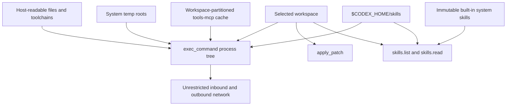
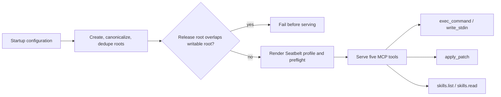
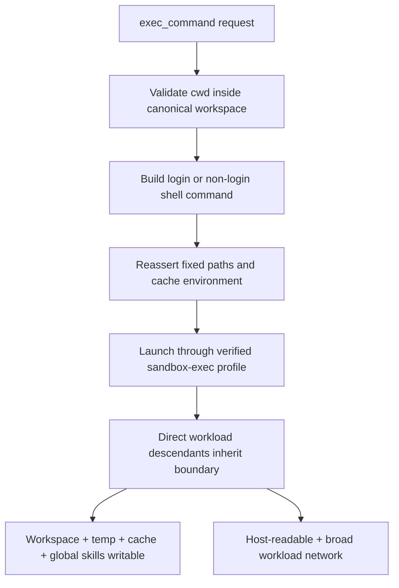
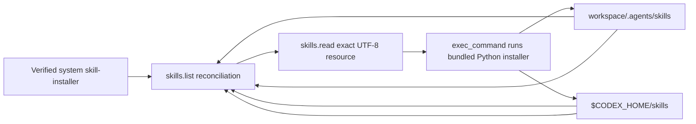
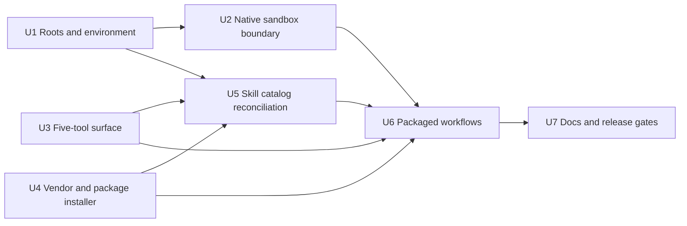

# Codex-Parity Skills and Sandbox - Plan

## Goal Capsule

- **Objective:** Replace the restrictive command sandbox and custom skill installation tool with a usable-by-default macOS capability model and the pinned Codex skill-installer workflow.
- **Product authority:** The decisions in this contract supersede conflicting skills and sandbox requirements in `docs/plans/2026-08-10-001-feat-codex-tools-mcp-agent-plan.md`; pinned upstream Codex source governs copied tool and installer behavior.
- **Execution profile:** Refactor the existing Rust workspace in dependency order, preserve the five pinned tool contracts, and validate the result through native macOS conformance plus packaged agent workflows.
- **Stop conditions:** Stop if the native sandbox cannot enforce the declared writable roots and inherited process boundary, if release-owned system skills overlap a writable root, or if an upstream installer adaptation would require changing either Python script.
- **Tail ownership:** The implementation run owns focused tests, full CI-equivalent gates, deterministic package verification, documentation reconciliation, and removal of abandoned installer or sandbox code.
- **Open blockers:** None. The user confirmed unrestricted workload inbound/outbound networking after native research showed that Seatbelt cannot enforce loopback-only workload listeners.

---

## Product Contract

Preservation note: this enrichment preserves R1-R21, A1-A4, F1-F5, and AE1-AE8. It applies the user-confirmed network correction to R9 and linked flows/examples, then adds implementation detail without narrowing the remaining product behavior.

### Summary

Expose five minimal MCP primitives and let normal developer commands work inside the selected workspace.
Ship the original Codex skill-installer as a built-in system skill and perform global or project installation through `exec_command` instead of a dedicated MCP installer.

### Problem Frame

The current macOS policy permits writes only below the workspace while protecting its root `.git`, `.codex`, and `.mcp-agent` paths.
This blocks `git init` at the workspace root and prevents tools from using ordinary macOS temporary and cache locations.
The separate Rust `skills.install` backend also duplicates a workflow that Codex already expresses as a skill backed by Python scripts.

The server is normally reachable through a tunnel whose URL grants remote command execution.
The product therefore needs enforceable external boundaries and truthful documentation, not restrictions that break ordinary development while implying stronger isolation than the server provides.

### Actors

- A1. **Operator:** Starts `mcp-agent` in a chosen workspace and controls who receives the tunnel URL.
- A2. **MCP client agent:** Discovers skills lazily and invokes coding tools to complete development work.
- A3. **Command workload:** The command and every descendant process execute with the same filesystem, network, and process capabilities.
- A4. **MCP server:** Fixes the workspace and managed roots, launches sandboxed workloads, exposes skill resources, and fails closed if its native boundary is unavailable.

### Key Decisions

- **Codex-parity usability** (session-settled: user-directed — chosen over bespoke installer hardening and restrictive workspace metadata protection: normal development must work without workarounds). Governs R1-R13, R16-R18.
- **Hybrid writable roots** (session-settled: user-directed — chosen over session-only temporary roots and broad home-cache access: support normal tools without granting arbitrary home writes). Governs R7-R8.
- **Host-readable execution** (session-settled: user-directed — chosen over secret-directory denylists and read allowlists: preserve toolchain and host configuration compatibility). Governs R6, R13.
- **Codex-parity workload networking** (session-settled: user-approved — chosen over loopback-only workload listeners after native research showed that Seatbelt cannot distinguish loopback from wildcard or LAN binds: preserve usable development behavior without a false boundary claim). Governs R9, R13.
- **Built-in upstream installer** (session-settled: user-directed — chosen over first-run copying and manual bootstrap: the installer must always be discoverable and cannot be accidentally replaced). Governs R14-R18.
- **Upstream-faithful Python behavior** (session-settled: user-directed — chosen over the current controlled Rust fetch and validation pipeline: installation behavior should match the pinned Codex workflow). Governs R15-R18.

### Capability Boundary

| Capability | `exec_command` and descendants | `apply_patch` | `skills.list` / `skills.read` |
|---|---|---|---|
| Read workspace | Allowed | Allowed as needed to patch | Allowed for project skills |
| Write workspace, including `.git` and `.agents/skills` | Allowed | Allowed | Denied |
| Read host files allowed to the OS account | Allowed | Denied outside workspace | Allowed only for registered skill roots |
| Write `/tmp`, canonical `$TMPDIR`, managed cache, and resolved Cargo/Gradle user state | Allowed | Denied | Denied |
| Write `$CODEX_HOME/skills` | Allowed | Denied | Denied |
| Write other home or system paths | Denied | Denied | Denied |
| Outbound network and local-service connections | Allowed | Not applicable | Not applicable |
| Bind or accept workload listeners | Allowed on any host interface | Not applicable | Not applicable |
| Spawn descendants | Allowed with inherited direct capabilities | Not applicable | Not applicable |

The boundary applies to direct filesystem and process-tree effects.
It does not contain effects brokered through allowed network APIs, `launchctl`, local services, Docker, databases, credential-bearing tools, or other account-accessible capabilities.
Shared writable temp roots can also contain pre-existing aliases or state created by other same-user processes; the documentation must not describe them as private workspace storage.



### Requirements

**MCP surface and tool ownership**

- R1. The model-visible tool surface must contain exactly `exec_command`, `write_stdin`, `apply_patch`, `skills.list`, and `skills.read`; `skills.install` must not be advertised or callable.
- R2. `exec_command`, `write_stdin`, and `apply_patch` must preserve the pinned Codex contracts except where the fixed capability model or MCP transport requires a registered adaptation.
- R3. `exec_command` must support ordinary non-interactive, interactive, yielding, compiler, formatter, test, build, package-manager, and development-server workflows without per-command approval.
- R4. `write_stdin` must continue or poll a live `exec_command` session without changing that process tree's capabilities.
- R5. `apply_patch` must remain confined to the canonical workspace while allowing all workspace content, including metadata directories that are no longer protected from normal development.

**Filesystem, network, and process capabilities**

- R6. A command may read every host file and directory readable by the operating-system account.
- R7. A command may create, modify, rename, and delete content anywhere under the canonical workspace, including root `.git`, `.codex`, `.mcp-agent`, project caches, build outputs, and `.agents/skills`.
- R8. A command may also write canonical `/tmp`, canonical `$TMPDIR`, a persistent tools-mcp cache partitioned by canonical workspace, `$CODEX_HOME/skills`, and the resolved Cargo and Gradle user-state roots; the server must steer cache-only environment into the partition without hiding existing Cargo or Gradle configuration, and no other home or system path is writable by default.
- R9. A command may make unrestricted inbound and outbound network connections, connect to host-local services, and bind listeners on loopback, wildcard, or non-loopback interfaces; the `mcp-agent` server endpoint itself remains loopback-only.
- R10. A command may launch arbitrary child processes available to the operating-system account, and direct workload descendants must retain the same filesystem and network boundary without an unsandboxed breakaway path.
- R11. The server must close or withhold ambient writable capabilities that would bypass R8 before launching a workload.
- R12. The server must fail closed before serving tools if the macOS sandbox or required capability roots cannot be established; a denial or setup failure must never retry unsandboxed.
- R13. User-facing security documentation must state that possession of the tunnel URL grants remote command execution, host-readable data access, writable-root access, unrestricted workload networking and listeners, durable global-skill modification, and durable Cargo/Gradle configuration, init-script, plugin, or executable modification; remotely sourced skills are unreviewed third-party instructions or executable content that receive the ordinary workload capabilities when used.

**Skill discovery and installation**

- R14. The release must include `skill-installer` as an immutable built-in system skill that appears in `skills.list` on first startup and is lazily readable through `skills.read` without prior installation; workloads must receive a stable path bridge to its packaged resources.
- R15. The built-in package must carry the pinned upstream `SKILL.md`, `scripts/install-skill-from-github.py`, `scripts/github_utils.py`, `LICENSE.txt`, `agents/openai.yaml`, `assets/skill-installer-small.svg`, and `assets/skill-installer.png`; `list-skills.py` and curated or experimental catalog behavior must be omitted.
- R16. Installer Python logic must remain upstream-faithful, including public download, private GitHub token support, system Git and SSH fallback, multiple source paths, destination collision refusal, temporary checkout or extraction, cleanup, and non-transactional partial results.
- R17. Minimal integration adaptations may select the destination and remove unsupported listing instructions: global installation targets `$CODEX_HOME/skills`, while project installation targets `<workspace>/.agents/skills` through the original `--dest` option.
- R18. An agent must install skills by reading the built-in `SKILL.md` and running its Python script with `exec_command`; the MCP server must not broker, reinterpret, prevalidate, roll back, or postprocess the install operation.
- R19. `skills.list` must expose built-in, project, and global origins while preserving project-over-global selection for ordinary user-installed names and keeping exact origins addressable; the reserved canonical name `skill-installer` must resolve to the system origin, while colliding user packages remain exact-origin addressable and installer guidance always uses the exact system handle.
- R20. `skills.read` must preserve lazy, exact-package UTF-8 resource access and must reject traversal or resource resolution outside the selected skill package; retained binary assets remain verified package inputs rather than new MCP payload types.
- R21. A skill installed, modified, removed, or recreated through `exec_command` must become visible to a later `skills.list` or `skills.read` call without restarting the server, including after replacement of the project or global skill-root directory itself.

### Key Flows

- F1. **Launch and discover tools**
  - **Trigger:** A1 starts `mcp-agent` in a workspace.
  - **Actors:** A1, A4
  - **Steps:** A4 fixes the canonical workspace, resolves the managed roots, verifies the release and macOS boundary, and advertises the five tools plus system-skill discovery guidance.
  - **Outcome:** A2 receives a stable, usable capability set or the server fails before accepting work.
  - **Covers:** R1-R2, R8, R12-R14.
- F2. **Perform ordinary development**
  - **Trigger:** A2 requests a coding task.
  - **Actors:** A2, A3, A4
  - **Steps:** A4 launches the requested workload; A3 edits workspace files and Git metadata, uses temp and cache storage, fetches dependencies, and starts development services as needed.
  - **Outcome:** The development workflow completes without sandbox-specific workarounds while direct writes beyond the declared roots remain denied.
  - **Covers:** R3-R13.
- F3. **Continue an interactive workload**
  - **Trigger:** An `exec_command` call yields with a live session.
  - **Actors:** A2, A3, A4
  - **Steps:** A2 calls `write_stdin`; A4 routes input or polling to the existing workload without changing its authority.
  - **Outcome:** Interactive and long-running tools remain usable across MCP requests.
  - **Covers:** R4, R10.
- F4. **Install a global skill**
  - **Trigger:** A2 is asked to install a skill globally.
  - **Actors:** A2, A3, A4
  - **Steps:** A2 discovers and reads the built-in installer, then executes the original Python script with its default `$CODEX_HOME/skills` destination.
  - **Outcome:** The installed package is immediately discoverable and readable as a global skill.
  - **Covers:** R14-R21.
- F5. **Install a project skill**
  - **Trigger:** A2 is asked to add a skill to the current project.
  - **Actors:** A2, A3, A4
  - **Steps:** A2 reads the built-in installer and executes the same Python script with `--dest <workspace>/.agents/skills`.
  - **Outcome:** The package becomes ordinary workspace content and is immediately discoverable as a project skill.
  - **Covers:** R14-R21.

### Acceptance Examples

- AE1. **Five-tool discovery**
  - **Covers:** R1-R2.
  - **Given:** A fresh packaged server is running.
  - **When:** The MCP client lists tools or calls `skills.install`.
  - **Then:** Exactly the five required tools are listed, and `skills.install` is rejected as unknown.
- AE2. **Git repository initialization**
  - **Covers:** R3, R7, R10.
  - **Given:** The selected workspace has no `.git` directory.
  - **When:** A command runs `git init .`, creates a commit, changes a branch, and invokes Git from a child process.
  - **Then:** Git may create and modify root `.git` state and every operation succeeds under the same sandbox.
- AE3. **Representative development workflow**
  - **Covers:** R3-R10.
  - **Given:** A project requires dependency installation, compilation, formatting, tests, generated files, process spawning, temporary files, cache files, and a development server.
  - **When:** The agent runs the project's ordinary commands without sandbox-specific flags.
  - **Then:** Workspace, temp, cache, network, descendant-process, and listener operations succeed.
- AE4. **External write containment**
  - **Covers:** R7-R12.
  - **Given:** A writable sentinel exists outside every declared writable root.
  - **When:** A command, descendant, traversal path, symlink path, renamed path, new hard-link attempt, or inherited descriptor attempts to change it.
  - **Then:** The write is denied, the sentinel is unchanged, and execution is not retried outside the sandbox.
- AE5. **Codex-parity workload network**
  - **Covers:** R9-R10, R13.
  - **Given:** A workload can access the network.
  - **When:** It connects outbound, connects to a local service, binds loopback, binds wildcard or a concrete non-loopback interface, and repeats through a child process.
  - **Then:** Every operation succeeds, while the product documentation distinguishes workload listeners from the loopback-only MCP endpoint.
- AE6. **Built-in installer bootstrap**
  - **Covers:** R14-R15, R19-R20.
  - **Given:** No user skills have been installed.
  - **When:** A2 calls `skills.list` for the system origin and lazily reads `skill-installer`.
  - **Then:** Every retained file is package-verified, every retained text resource is readable without copying the package into `$CODEX_HOME/skills`, and binary assets remain available through the verified workload path.
- AE7. **Upstream-faithful global installation**
  - **Covers:** R16-R21.
  - **Given:** A valid GitHub skill source and a working Python environment are available.
  - **When:** A2 runs the bundled installer without `--dest`.
  - **Then:** The original script installs into `$CODEX_HOME/skills`, reports its original result, and the new skill is immediately listable and readable.
- AE8. **Upstream-faithful project installation**
  - **Covers:** R16-R21.
  - **Given:** A valid GitHub skill source is available.
  - **When:** A2 runs the same script with `--dest <workspace>/.agents/skills`.
  - **Then:** The project package is installed with original collision and partial-result semantics and becomes immediately listable and readable with project precedence.

### Negative Scenarios

- Writes to arbitrary home paths, system paths, sibling workspaces, and undeclared caches remain denied.
- Root `.git`, `.codex`, `.mcp-agent`, `.agents/skills`, build directories, and generated files are not special deny targets when they are inside the workspace.
- A direct child, grandchild, daemonized workload descendant, or interactive continuation cannot gain broader direct filesystem authority than its originating command.
- Missing or replaced sandbox assets, invalid writable roots, release/writable-root overlap, and failed startup probes stop the server instead of enabling an unsandboxed fallback.
- The built-in `skill-installer` package cannot be modified through command writes, but user-installed global skills may be created, changed, renamed, or removed through `exec_command`.
- `skills.read` cannot use absolute paths, traversal, symlinks, root replacement, or resource handles to escape a registered package.
- Calling removed curated, experimental, registry, or `skills.install` behavior returns no substitute server-side workflow.
- Original installer failures, interruption, partial multi-path installation, an existing destination, missing `SKILL.md`, invalid source path, download failure, Git failure, or unavailable credentials remain command/script outcomes rather than MCP-specific contracts.
- Shared temp aliases, credentialed local services, Docker, `launchctl`, and other external brokers are not represented as direct sandbox containment guarantees.

### Preserved Protection Boundaries

- The workspace is canonical and fixed for the server lifetime; command working directories and `apply_patch` stay inside it.
- Direct writes are limited to the roots in R8, with path-alias and descendant enforcement at the native sandbox boundary.
- User workloads cannot bypass the verified macOS launch path or receive an unsandboxed retry.
- The packaged release and built-in system skill stay outside every writable root and are verified against build-owned expectations.
- `skills.list` and `skills.read` expose bounded package resources rather than ambient filesystem reads.
- There is no per-command escalation argument that can widen authority after startup.
- The `mcp-agent` HTTP endpoint remains loopback-bound even though command workloads may expose listeners on other interfaces.

### Restrictions Removed

- Remove protected-root treatment for workspace `.git`, `.codex`, and `.mcp-agent`.
- Remove the rule that all command temporary and cache writes must stay inside the workspace.
- Remove server-exclusive write ownership of global skills; `$CODEX_HOME/skills` is an ordinary `exec_command` writable root.
- Remove the custom public-only Git source policy, controlled HTTP transport, immutable-tree receipt, resource limits, atomic staging, and concurrency semantics attached to `skills.install`.
- Remove the legacy global root default `~/.agents/skills`; global discovery and installation use `$CODEX_HOME/skills`, defaulting with Codex home semantics.
- Remove macOS requirements that depend on deferred Linux or Windows parity from this work unit.
- Remove any claim that the sandbox protects readable secrets, prevents unrestricted workload listeners, or contains indirect effects through allowed services and network access.

### Existing Plan Revisions

The following portions of `docs/plans/2026-08-10-001-feat-codex-tools-mcp-agent-plan.md` are superseded for this work:

- Change the Goal Capsule, Summary, Actors, diagrams, and tool-count language from six tools to the five tools in R1.
- Replace old R2, R10-R12, and R14-R20 with this contract's tool, platform, capability, and installer requirements.
- Rewrite F1, F2, and F4 plus AE1, AE3, AE5, and AE6 around the new writable roots and skill-driven installation flow; remove cross-platform AE7 from the macOS work unit.
- Rewrite Success Criteria, Scope Boundaries, Dependencies, authority matrix, registered compatibility deltas, manual validation, and Definition of Done wherever they require `skills.install`, server-only global writes, protected `.git`, or three-platform completion.
- Replace KTD4's protected-root model, update KTD6 for `$CODEX_HOME/skills` and built-in system skills, and delete KTD7's Rust installer architecture.
- Narrow U2 to the practical macOS capability boundary, update U5 for system/project/global discovery, and replace U6 with bundling and validating the pinned upstream installer package rather than implementing an installer backend.

### Existing Code and Test Impact

Planning must account for retiring or revising these current surfaces:

- `crates/mcp-agent-server/src/handler.rs`, `crates/mcp-agent-server/src/context.rs`, and related shutdown paths currently dispatch and own `skills.install`.
- `crates/skill-store/src/install/` and its install-specific dependencies implement the custom Rust installer that is no longer part of the product.
- `crates/mcp-agent-authority/src/workspace.rs` currently protects workspace metadata and resolves global skills under `~/.agents/skills`.
- `crates/mcp-agent-authority/src/sandbox/macos.rs` currently grants only workspace writes and explicitly excludes root `.git`, `.codex`, and `.mcp-agent`.
- `crates/skill-store/src/roots.rs` retains startup directory handles and must be changed so root deletion and recreation become visible safely.
- Tool-surface, installer, sandbox, packaging, provenance, composability, and end-to-end fixtures currently assert the removed six-tool and strict workspace-write behavior.
- `docs/security-model.md`, `docs/installation.md`, `third_party/openai-codex/SOURCE.toml`, `third_party/openai-codex/MODIFICATIONS.md`, and `THIRD_PARTY_NOTICES.md` must describe the new boundary and the added upstream sample package accurately.

### Success Criteria

- A clean macOS package advertises exactly five tools and includes the readable built-in `skill-installer` package.
- `git init`, Git metadata updates, package installation, build, test, formatter, compiler, temp, cache, child-process, and development-server scenarios run without sandbox-specific workarounds.
- Direct writes outside the declared roots remain denied for workloads and descendants, while workload network operations match the broad pinned Codex capability.
- The copied installer files match the pinned Codex source except for documented minimal `SKILL.md` integration changes, and upstream script behavior remains intact.
- Global and project installations performed through `exec_command` become immediately visible through progressive `skills.list` then `skills.read` discovery, including after root recreation.
- Documentation describes the tunnel and capability model without claiming secret isolation, loopback-only workload listeners, whole-machine containment, or installer hardening that the product does not provide.
- The implementation leaves no model-visible installer broker, installer-specific lifecycle, or install-only dependency in MCP core.
- The resulting implementation-ready plan can be produced without inventing additional security restrictions or skill installation behavior.

### Scope Boundaries

- Linux and Windows sandbox implementations and cross-platform conformance are deferred.
- Authentication, authorization, multi-user isolation, tunnel management, and VPS deployment remain outside this work.
- Curated or experimental skill listing, remote registries, `list-skills.py`, skill search, update, and removal commands are not MCP capabilities.
- A Rust, brokered, privileged, registry-backed, or policy-wrapped skill installer is outside this product direction.
- Strict loopback-only workload listener enforcement and a replacement network containment layer are outside this work.
- Preventing data exfiltration through host reads, outbound network, credentials, local services, or developer tools is not a security promise of this server.
- Arbitrary write access to the rest of the user's home directory or system directories is not granted.

### Dependencies / Assumptions

- The pinned Codex commit remains the authority for tool contracts and the bundled sample installer package.
- macOS Seatbelt can express the writable-root set, host reads, broad inbound/outbound networking, and inherited descendant boundary required by this contract.
- `$CODEX_HOME` defaults consistently with Codex to `~/.codex`; its skills and cache subdirectories can be created before sandbox launch and passed as canonical roots.
- Effective Cargo and Gradle user homes can be resolved, created when missing, and exposed as explicit writable roots without replacing their existing configuration.
- Python 3 is available to run the installer; system Git and configured GitHub or SSH credentials are optional dependencies for the original fallback paths.
- Canonical `/tmp`, canonical `$TMPDIR`, and the persistent tools-mcp cache root are resolved before serving commands.
- The packaged release provides an owner-writable, manifest-verified preflight canary outside every workload writable root; startup fails when that proof cannot be established.
- The workspace does not rely on pre-existing hard-link or brokered-service topology that turns an allowed path into an undeclared external mutation.
- `skills.read` remains a UTF-8 text-resource tool; binary assets are package and workload inputs.

### Sources / Research

- `docs/plans/2026-08-10-001-feat-codex-tools-mcp-agent-plan.md`
- `docs/security-model.md`
- `crates/mcp-agent-authority/src/workspace.rs`
- `crates/mcp-agent-authority/src/operations.rs`
- `crates/mcp-agent-authority/src/sandbox/macos.rs`
- `crates/mcp-agent-authority/src/sandbox/preflight.rs`
- `crates/mcp-agent-server/src/handler.rs`
- `crates/skill-store/src/install/`
- `crates/skill-store/src/roots.rs`
- `tests/conformance/`
- [Pinned Codex skill-installer package](https://github.com/openai/codex/tree/8cabf5a6cf103cebe338d46346e43e3201e64f41/codex-rs/skills/src/assets/samples/skill-installer)
- [Pinned upstream installer script](https://github.com/openai/codex/blob/8cabf5a6cf103cebe338d46346e43e3201e64f41/codex-rs/skills/src/assets/samples/skill-installer/scripts/install-skill-from-github.py)
- [Pinned Codex Seatbelt implementation](https://github.com/openai/codex/blob/8cabf5a6cf103cebe338d46346e43e3201e64f41/codex-rs/sandboxing/src/seatbelt.rs)
- [Rust `std::process::Command`](https://doc.rust-lang.org/std/process/struct.Command.html)
- [Zsh startup file order](https://zsh.sourceforge.io/Doc/Release/Files.html)

---

## Planning Contract

### Key Technical Decisions

- **KTD1 — Resolve one immutable capability snapshot at startup.** Resolve and canonicalize the workspace, `/tmp`, the effective `$TMPDIR`, `$CODEX_HOME`, `$CODEX_HOME/skills`, the workspace cache, the effective Cargo and Gradle user-state roots, and the release-owned system-skill root before serving MCP. Create managed writable roots first, canonicalize again, deduplicate aliases and nested roots, and retain the resulting values independently of workload environment changes. Covers R5-R8, R11-R14.
- **KTD2 — Partition cache without replacing configuration-bearing tool homes.** Use `$CODEX_HOME/cache/tools-mcp/workspaces/<sha256(canonical-workspace)>` as the managed cache root. Steer cache-only build and package-manager variables into it, preserve the effective `CARGO_HOME` and `GRADLE_USER_HOME` as explicit writable roots, and leave `HOME` and `PATH` unchanged. Covers R3, R8.
- **KTD3 — Reassert path authority after login-shell startup.** Pass the fixed environment to the sandbox launcher and inject a dialect-specific, shell-safe prologue after login startup, because startup files may replace inherited variables. Reassert canonical `CODEX_HOME`, `TMPDIR`, `MCP_AGENT_SYSTEM_SKILLS_ROOT`, cache variables, `CARGO_HOME`, and `GRADLE_USER_HOME` for PTY and non-PTY launches. Support explicit adapters for macOS `sh`, `bash`, `zsh`, and `fish`; reject other shells before launch instead of guessing syntax. The sandbox roots, not mutable environment strings, remain the authority. Covers R3-R4, R8, R10, R14.
- **KTD4 — Render indexed Seatbelt roots and broad Codex networking.** Generate `WRITABLE_ROOT_0...N` parameters and one write rule over their canonical subpaths. Allow host reads, process fork/exec, unrestricted outbound and inbound networking, and listener binds without interface claims. Do not exclude workspace metadata. Covers R6-R10.
- **KTD5 — Preflight the actual boundary before serving.** Probe writes in every declared root, descendant inheritance, sandbox availability, and denial against a manifest-verified canary inside the non-writable release root. Before sandbox launch, prove that the server account can open the canary for write without changing its bytes; inside the sandbox, the same open must be denied. Fail startup if the canary cannot distinguish Seatbelt denial from ordinary Unix permissions. Covers R8, R10-R12.
- **KTD6 — Keep `apply_patch` workspace-only but remove metadata exceptions.** Its path validation and no-follow behavior remain independent from `exec_command`; only the special denial of `.git`, `.codex`, and `.mcp-agent` is deleted. Covers R5, R7.
- **KTD7 — Delete the installer RPC and Rust installer lifecycle.** Remove dispatch, context ownership, shutdown handling, schemas, conformance fixtures, install-only dependencies, and `crates/skill-store/src/install/`. The public contract is exactly five tools. Covers R1-R4, R16-R18.
- **KTD8 — Add an immutable `system` skill origin and reopen mutable roots.** Register the verified release root as `skill://host/system/...`; reserve canonical `skill-installer` selection for that origin, preserve project-over-global precedence for ordinary user skills, and keep all exact origins addressable. Reopen the project root by walking no-follow from the retained workspace handle. Reopen global skills from the same workspace anchor when canonical `CODEX_HOME` is nested inside the workspace; otherwise walk from a retained non-writable CODEX_HOME anchor. This keeps replacement of `.agents`, nested CODEX_HOME, and either skill root visible. Revalidate system-package identity and manifest digests on each system list/read rather than trusting startup bytes forever. Covers R14, R19-R21.
- **KTD9 — Vendor and package the pinned sample, not a derivative installer.** Store the retained upstream package under `third_party/openai-codex/skill-installer/`, copy it into the release at `system-skills/skill-installer/`, add the preflight canary, verify source and release digests at startup and system-resource access, preserve script modes, and document the single `SKILL.md` adaptation. Covers R12, R14-R18.
- **KTD10 — Treat installer execution as an ordinary command lifecycle.** The Python script's stdout, stderr, exit code, interruption, collision behavior, cleanup, and partial multi-path results flow through `exec_command` and `write_stdin`; the server adds no rollback or receipt layer. Covers R4, R16-R18.
- **KTD11 — Reject release/writable overlap.** Startup fails if the verified system-skill root is equal to, below, or contains any writable root after canonicalization. This keeps the default installer discoverable but immutable to workloads. Covers R12, R14-R15.
- **KTD12 — Preserve configured release overrides without a verification bypass.** Keep `--release-dir` for development and conformance, but split release verification so an external asset root must satisfy the same build-owned protocol, exact-file, digest, mode, overlap, canary, and system-skill checks while only the executable-colocation invariant is relaxed. Covers R12, R14-R15.
- **KTD13 — Use the verified server binary as the child-side launch adapter.** Add a hidden self-reexec mode to `mcp-agent` that accepts only the internally constructed sandbox launch, closes every descriptor above stderr, sets a recursion guard, and `exec`s the verified sandbox command. Configure `ProcessManager` with the canonical current executable and route both `std::process::Command` and `portable_pty::CommandBuilder` through this mode so PTY conversion cannot discard descriptor hygiene. The mode is not an MCP tool and never launches a workload outside the sandbox. Covers R10-R12.

### High-Level Technical Design







### Output Structure

```text
third_party/openai-codex/
  skill-installer/
    SKILL.md
    LICENSE.txt
    agents/openai.yaml
    assets/skill-installer-small.svg
    assets/skill-installer.png
    scripts/install-skill-from-github.py
    scripts/github_utils.py

release-root/
  mcp-agent
  LICENSE
  NOTICE
  THIRD_PARTY_NOTICES.md
  sandbox-manifest.json
  sandbox/preflight-canary
  sandbox/macos-seatbelt.marker
  sandbox/workspace-write.policy
  system-skills/skill-installer/...
```

The exact executable names remain governed by the existing release manifest; the tree above only adds the nested `system-skills/skill-installer` payload. Workloads receive `MCP_AGENT_SYSTEM_SKILLS_ROOT=<verified-release-root>/system-skills` so the adapted built-in instructions can invoke their colocated scripts without copying them into a writable directory.

### Implementation Constraints

- Preserve `scripts/install-skill-from-github.py` and `scripts/github_utils.py` byte-for-byte at pinned commit `8cabf5a6cf103cebe338d46346e43e3201e64f41`; do not port, wrap, patch, or reimplement their logic in Rust.
- Preserve `LICENSE.txt`, `agents/openai.yaml`, and both assets byte-for-byte. Adapt only `SKILL.md`, limited to removing unsupported listing/escalation language and using the packaged path bridge plus global/project destination instructions.
- Omit `list-skills.py`; do not replace it with a registry, curated catalog, or MCP listing endpoint.
- Pre-create managed writable roots outside the workload sandbox, then canonicalize. Canonical paths must authorize `/tmp` and `$TMPDIR` aliases while symlink escapes remain denied.
- Use shell-dialect adapters to reassert canonical `CODEX_HOME`, `TMPDIR`, `MCP_AGENT_SYSTEM_SKILLS_ROOT`, effective `CARGO_HOME`, effective `GRADLE_USER_HOME`, `MCP_AGENT_CACHE_HOME`, `XDG_CACHE_HOME`, `CARGO_TARGET_DIR`, `npm_config_cache`, `YARN_CACHE_FOLDER`, `npm_config_store_dir`, `PIP_CACHE_DIR`, `UV_CACHE_DIR`, `GOCACHE`, and `GOMODCACHE`. Do not replace `HOME`, `PATH`, Cargo configuration, or Gradle configuration with empty managed state.
- Support `sh`, `bash`, `zsh`, and `fish` explicitly on macOS. Reject unsupported shell dialects before creating a workload session; do not pass a POSIX prologue to an unknown shell.
- Route PTY and non-PTY creation through the hidden `mcp-agent` self-reexec launcher. Its argv contains only the already constructed sandbox command after an internal delimiter, its environment carries a recursion guard, it closes every descriptor above stderr, and it never provides an unsandboxed command mode. The descendant guarantee applies to user workloads, not server-owned helpers such as the existing `/bin/kill` process-control path.
- Keep `skills.read` text-only. PNG assets are verified release files accessible to the workload through the system-skill path, not MCP binary resources.
- Do not add filesystem watchers. Request-time reconciliation is the correctness mechanism for mutable roots.
- Increment the protocol/conformance version for removal of `skills.install` and the new system origin.
- Treat `/usr/bin/sandbox-exec` as a required, deprecated macOS dependency: verify its identity/availability and fail closed; do not promise future macOS compatibility beyond tested releases.

### Sequencing



U1 and U3 may proceed independently. U4 can proceed alongside them after the pinned package is captured. U2 depends on the resolved-root and environment contract from U1. U5 depends on both the new origins and the public tool removal. U6 is the first end-to-end integration point; U7 owns final reconciliation and deletion checks.

### System-Wide Impact

- **Authority and launch:** `mcp-agent-authority` changes from protected workspace metadata plus one write root to a canonical multi-root capability snapshot. `codex-tools-runtime` and server process launch consume that snapshot for every PTY and non-PTY workload.
- **MCP protocol:** the model-visible schema drops one tool, adds a `system` skill origin/resource namespace, updates startup guidance, and requires a versioned compatibility delta.
- **Skill store:** installation code disappears; mutable catalog roots become request-reconciled, while the verified release root is immutable and independently addressable.
- **Packaging/provenance:** the release moves from a flat exact-file set to an exact manifest that also covers a nested upstream payload, file modes, digests, license, modifications, and deterministic archive behavior.
- **Security posture:** direct external writes remain the real containment boundary, but readable host data, broad networking/listeners, shared temp state, credentials, and brokered external effects are explicitly outside the promise.
- **Operations:** startup gains managed-directory creation, overlap validation, and broader native preflight. Failures remain release/startup errors, never per-command escalation prompts.

### Risks and Mitigations

| Risk | Consequence | Mitigation / stop gate |
|---|---|---|
| Canonical aliases accidentally widen or narrow writes | Tool failures or external mutation | Pre-create, canonicalize, dedupe, test `/tmp`/`private/tmp`, `$TMPDIR`, nested roots, symlink-in, and symlink-out before U2 is accepted. |
| Login shell startup replaces cache variables | Packages write denied home caches | Inject the export prologue after startup and test login/non-login plus PTY/non-PTY. |
| Redirected tool homes hide registries, credentials, or init scripts | Previously working Cargo/Gradle builds fail | Keep effective Cargo/Gradle homes as declared writable roots and test configured private/local fixtures. |
| Existing writable descriptors bypass path rules | External writes despite Seatbelt | Close non-stdio descriptors and retain a native inherited-FD negative test. Stop if the sentinel can change. |
| System skills overlap mutable roots | Built-in installer becomes replaceable | Canonical overlap rejection at startup and release-layout tests. |
| Root replacement leaves stale handles | Installed/removed skills stay invisible or unsafe | Reopen from stable parents on every reconciliation and test delete/recreate plus symlink substitution. |
| Release contents change after startup | System reads execute unverified installer bytes | Revalidate root identity and manifest digests on every system list/read and reject in-place mutation. |
| Packaging silently drifts from pinned Codex | Installer behavior or licensing changes | Exact source hashes, explicit adapted-file classification, deterministic package verification, and upstream verification gate. |
| Broad listener capability surprises operators | Workload service becomes LAN-reachable | Preserve MCP endpoint loopback binding, document workload exposure prominently, and regression-test actual wildcard behavior instead of claiming isolation. |
| Removing Rust installer leaves dead protocol/dependencies | Hidden sixth tool or lifecycle debt | Repo-wide symbol/dependency checks and exact tool-surface/package tests in U3/U7. |

---

## Implementation Units

### U1. Resolve Managed Roots and Workload Environment

**Goal:** Produce one validated startup capability snapshot and apply deterministic temp/cache/global-skill environment to every workload mode.

**Requirements:** R3-R4, R7-R8, R11-R12. Flows F1-F3. Examples AE3-AE4. Decisions KTD1-KTD3.

**Dependencies:** None.

**Files:** `crates/mcp-agent-authority/src/workspace.rs`, `crates/mcp-agent-authority/src/roots.rs`, authority configuration/error modules, `crates/codex-tools-runtime/src/process/manager.rs`, `crates/codex-tools-runtime/src/process/pty.rs`, `crates/mcp-agent/src/startup.rs`, server startup/configuration tests, and focused authority/runtime tests.

**Approach:** Replace the legacy global root with Codex home resolution; create the global skills and workspace-partitioned cache directories; resolve effective Cargo/Gradle state; canonicalize and deduplicate all writable roots; reject release overlap; expose the snapshot to process launch. Add the fixed path and cache variables to inherited command environment and the `sh`/`bash`/`zsh`/`fish` post-startup adapters. Preserve `HOME`, `PATH`, existing tool configuration, cwd confinement, timeout, PTY, and session behavior.

**Test scenarios:** absolute CODEX_HOME set/unset and invalid empty/relative values; pre-existing and missing managed directories; effective Cargo/Gradle homes with registry/init configuration; `/tmp` and `$TMPDIR` aliases; nested/deduplicated roots; workspace hashes are stable and distinct; overlap rejection; login true/default and false; PTY and non-PTY environment; hostile supported-shell startup files that replace every fixed path; unsupported shell rejection; variables intentionally changed by the command cannot widen Seatbelt roots.

**Verification:** Focused authority and process-manager tests pass; an integration command observes the fixed values in all four shell/PTY combinations; no code still defaults global skills to `~/.agents/skills`.

### U2. Replace the Restrictive macOS Sandbox Policy

**Goal:** Allow normal development in all declared roots and broad Codex-parity networking while preserving direct external-write denial and descendant inheritance.

**Requirements:** R3, R6-R13. Flow F2-F3. Examples AE2-AE5. Decisions KTD4-KTD6.

**Dependencies:** U1.

**Files:** `crates/mcp-agent-authority/src/sandbox/macos.rs`, `crates/mcp-agent-authority/src/sandbox/preflight.rs`, `crates/mcp-agent-authority/src/operations.rs`, `crates/mcp-agent-authority/src/workspace.rs`, `crates/mcp-agent/src/main.rs`, `crates/mcp-agent/src/cli.rs`, `crates/mcp-agent/src/startup.rs`, `crates/mcp-agent-authority/tests/platform_sandbox.rs`, `crates/mcp-agent-authority/tests/workspace_write_security.rs`, `tests/conformance/workspace_write.rs`, and sandbox fixtures.

**Approach:** Delete protected-root exclusions, render indexed canonical writable-root parameters, allow the pinned broad network/process policy, and keep all user command launches behind the verified sandbox. Rebuild preflight around per-root positive probes, an unsandboxed-openable but sandbox-denied release canary, descendant checks, and no unsandboxed fallback. Add the hidden self-reexec child mode with an explicit internal argv delimiter and recursion guard; configure both PTY and non-PTY paths to invoke it before sandbox exec. Remove metadata restrictions from `apply_patch` without widening it beyond the workspace.

**Test scenarios:** `git init`, commit and branch mutation; create/rename/delete `.git`, `.codex`, `.mcp-agent`, `.agents/skills`; build/temp/cache/tool-state writes; multiple roots simultaneously; missing-root precreation; symlink alias into an allowed root; symlink/traversal/rename/hard-link attempt out; child/grandchild/daemonized writes; inherited-FD attempts through PTY and non-PTY; self-reexec recursion or malformed internal argv is rejected; the hidden mode cannot select an unsandboxed command; release-canary ownership, digest stability, and fail-closed allocation/permission errors; nested sandbox cannot loosen policy; outbound, local-service, loopback/wildcard/LAN bind and inbound acceptance; direct write to arbitrary home/system/sibling path denied.

**Verification:** Native macOS sandbox/conformance suites prove every declared positive and negative case. Any external sentinel mutation, unsandboxed retry, or inability to establish the profile blocks completion.

### U3. Reduce MCP Core to Five Tools

**Goal:** Remove `skills.install` and every server-side installation lifecycle while preserving the remaining pinned contracts.

**Requirements:** R1-R5, R16-R18. Flows F1, F3-F5. Example AE1. Decisions KTD6-KTD7, KTD10.

**Dependencies:** None.

**Files:** `crates/mcp-agent-server/src/handler.rs`, `crates/mcp-agent-server/src/context.rs`, shutdown/startup modules, protocol/schema code, `crates/skill-store/src/install/`, skill-store manifests and lockfile, `tests/conformance/tool_surface.rs`, common test clients, compatibility fixtures, and installer-specific tests.

**Approach:** Remove tool advertisement and dispatch, installer ownership from shared state, cancellation/shutdown hooks, install schemas, the Rust installer module, install-only dependencies, and obsolete tests. Bump protocol compatibility data and update all clients/fixtures to the exact five-tool surface. Keep `exec_command`, `write_stdin`, `apply_patch`, `skills.list`, and `skills.read` behavior unchanged except for separately planned capability/origin work.

**Test scenarios:** exact five-tool listing; unknown-tool response for `skills.install`; no install operation in generated schemas or compatibility snapshots; live `write_stdin` sessions still shut down correctly; repository search finds no model-visible or dispatchable installer path; dependency tree contains no install-only crates unless justified elsewhere.

**Verification:** Tool-surface conformance and server lifecycle tests pass; `cargo tree -d` is reviewed; the removed installer module and its tests no longer exist.

### U4. Vendor, Verify, and Package the Pinned Installer Skill

**Goal:** Ship the default system skill with original Codex scripts and complete provenance, licensing, and deterministic release coverage.

**Requirements:** R14-R18. Flows F1, F4-F5. Examples AE6-AE8. Decisions KTD9-KTD11.

**Dependencies:** None; must finish before U5/U6 integration.

**Files:** `third_party/openai-codex/skill-installer/**`, `third_party/openai-codex/SOURCE.toml`, `third_party/openai-codex/MODIFICATIONS.md`, `third_party/openai-codex/LICENSE`, `THIRD_PARTY_NOTICES.md`, `xtask/src/upstream.rs`, `xtask/src/package.rs`, `xtask/tests/upstream_snapshot.rs`, `xtask/tests/package.rs`, `crates/mcp-agent-authority/src/release.rs`, `crates/mcp-agent/src/startup.rs`, `crates/mcp-agent/src/cli.rs`, and `tests/e2e/packaged_binary.rs`.

**Approach:** Copy the seven retained files from the pinned commit, omit `list-skills.py`, preserve executable mode on the installer script, and adapt only `SKILL.md`. Register exact upstream hashes and a separately recorded adapted hash. Extend upstream verification to classify non-JSON adapted assets, extend the exact release manifest to nested files, modes, and the preflight canary, and verify the installed system root before startup and system-resource access. Split release verification so `--release-dir` remains a development/conformance override but cannot bypass build-owned asset checks; only executable colocation is relaxed for that explicit path.

**Pinned SHA-256 inputs:** `SKILL.md` upstream `d68b77e5bbb34dedab89d134da52855f140fc4b4299b80104f534e3b9e98f8ee`; installer script `0fbbd36e8ea294442c0bd48d6f610a2e8656216bfef5c322f1dcf448ef2f09f1`; `github_utils.py` `61c1bbe2ae217433b4b6f9f09f21aca4df52c12598068343ade719f706e4859b`; `LICENSE.txt` `cfc7749b96f63bd31c3c42b5c471bf756814053e847c10f3eb003417bc523d30`; `agents/openai.yaml` `5ce223d8b1070b82c42298538f1b8d376f788eb9e7a42a987e8c094070d73f0e`; SVG `3928703ff00dc1a681e7a22401843b7edcbd4b2051651ce4c43b75f7e140504e`; PNG `d0a230b1a79b71b858b7c215a0fbb0768d6459c14ea4ef80c61592629bf0e605`.

**Test scenarios:** source hashes and modes; only `SKILL.md` differs from upstream and every changed instruction is integration-required; omitted listing script; deterministic archive across two builds; unexpected/missing/modified nested file or canary rejection; configured release override receives the same compiled asset verification; in-place system-package mutation is rejected on later access; license and notices present.

**Verification:** `cargo run -p xtask -- upstream-verify` and package tests pass; two package runs produce the same manifest/archive digest; direct hash comparison confirms both Python files are byte-identical.

### U5. Add System Skill Discovery and Safe Mutable-Root Reconciliation

**Goal:** Make built-in, project, and global skills progressively discoverable with exact origins and immediate visibility after filesystem mutation.

**Requirements:** R14, R19-R21. Flows F1, F4-F5. Examples AE6-AE8. Decisions KTD8-KTD9, KTD11.

**Dependencies:** U1, U3, U4.

**Files:** `crates/skill-store/src/roots.rs`, `crates/skill-store/src/catalog.rs`, skill-store public types, `crates/mcp-agent-server/src/handler.rs`, guidance/resource schemas, catalog tests, composability tests, and conformance fixtures.

**Approach:** Add the verified immutable system root and `skill://host/system/...` handles; reserve canonical `skill-installer` selection and make all installer guidance use its exact system handle while retaining project-over-global selection for ordinary names. Replace lifetime-held mutable root handles with request-time no-follow walks from the retained workspace and canonical CODEX_HOME anchors, rebuilding the bounded catalog before list/read. Validate mutable package/resource paths after each reopen, revalidate system identity and digests, and keep UTF-8-only response semantics.

**Test scenarios:** fresh startup lists system installer; lazy read of retained text files; binary resource rejected as text but reachable at packaged path; reserved system selection, exact guidance, and exact user access under name collision; install/modify/remove/rename; replacement of `.agents`, project/global skill roots, and CODEX_HOME itself when nested under workspace; external CODEX_HOME remains anchored; roots replaced by symlinks; traversal/absolute path/resource symlink/root escape; system file or root changed after startup; pagination remains stable per response snapshot.

**Verification:** Skill-store, composability, and MCP conformance tests pass without restart or watchers; exact system origin remains reachable even when a user skill is also named `skill-installer`.

### U6. Prove Global and Project Installation Through Ordinary Commands

**Goal:** Validate the complete default installer workflow through the packaged server and the five MCP primitives.

**Requirements:** R3-R4, R8-R10, R14-R21. Flows F3-F5. Examples AE3, AE6-AE8. Decisions KTD2-KTD5, KTD8-KTD10.

**Dependencies:** U2-U5.

**Files:** packaged end-to-end/inspector fixtures, `tests/conformance/`, installer workflow fixtures, and test GitHub/local HTTP repositories as permitted by the existing harness.

**Approach:** Start from the built artifact, discover and read the exact system installer, run its original Python entry point via `exec_command`, and observe global/project results through later `skills.list` and `skills.read`. Exercise both immediate and yielded sessions. Cover representative success, collision, interruption, cleanup, and partial multi-path pass-through; rely on pinned byte hashes and provenance rather than rebuilding a second exhaustive harness for untouched token/download/Git fallback internals.

**Test scenarios:** default global destination; explicit project `--dest`; one representative public or local fixture install; multiple source paths with an early success and later failure; existing destination; missing `SKILL.md`; command interruption; temp cleanup; subsequent discovery including root recreation. Static pinned-source verification remains responsible for `GITHUB_TOKEN`/`GH_TOKEN`, 401/403/404, sparse HTTPS/SSH fallback, and other untouched internal branches.

**Verification:** Packaged end-to-end and inspector smoke flows use no `skills.install` call, no direct test-only catalog mutation, and no manual copy of the built-in skill. Script exit status/stdout/stderr remain observable as ordinary command results.

### U7. Reconcile Documentation, Compatibility, and Release Gates

**Goal:** Leave one truthful product contract, no obsolete installer/security claims, and a green release-quality validation tail.

**Requirements:** R1-R21. Flows F1-F5. Examples AE1-AE8. All KTDs.

**Dependencies:** U6.

**Files:** `docs/plans/2026-08-10-001-feat-codex-tools-mcp-agent-plan.md`, `docs/security-model.md`, `docs/installation.md`, README/operator docs, compatibility-delta fixtures, release notes/manifests, third-party notices, and all workspace tests affected by removed behavior.

**Approach:** Mark superseded legacy requirements explicitly, document the five-tool architecture and default installer workflow, publish the exact writable/readable/network/process boundary, tunnel warning, tool-state roots, and third-party skill trust warning, and remove all wording that promises secret isolation, protected Git metadata, loopback-only workload listeners, Rust installer hardening, or current Linux/Windows delivery. Run focused suites first, then the repository's entire CI/release gate set, and delete dead attempts or fixtures revealed by the sweep.

**Test scenarios:** docs/tool schema consistency; compatibility delta is complete; release validation finds every nested system-skill file and no removed tool; clean-install operator walkthrough; repository search for obsolete six-tool, `skills.install`, `~/.agents/skills`, protected-root, and loopback-workload claims; macOS-only support statement remains explicit.

**Verification:** Full Verification Contract passes from a clean worktree/package; documentation has been reviewed against native observed behavior; no abandoned installer, staging, receipt, registry, or cross-platform implementation remains in the diff.

---

## Verification Contract

### Focused Development Gates

- Authority/root resolution: `cargo test -p mcp-agent-authority`
- Process lifecycle and PTY environment: `cargo test -p codex-tools-runtime`
- Skill origins and reconciliation: `cargo test -p skill-store`
- Server surface/lifecycle: `cargo test -p mcp-agent-server`
- Native capability behavior: `cargo test -p mcp-agent-authority --test workspace_write_security --test platform_sandbox`, followed by the shared conformance fixtures through `cargo run -p xtask -- conformance`.
- Installer provenance/package tests: `cargo run -p xtask -- upstream-verify` plus focused xtask package tests.

### Full Repository Gates

Run from `/Users/nkt/dev/tools-mcp` on macOS after focused tests pass:

```bash
cargo fmt --all -- --check
cargo clippy --workspace --all-targets --all-features -- -D warnings
cargo test --workspace --all-targets --all-features
cargo run -p xtask -- upstream-verify
cargo run -p xtask -- conformance
cargo run -p xtask -- package
cargo run -p xtask -- inspector-smoke
cargo tree -d
```

### Behavioral Evaluation

- From a clean packaged release, list exactly five tools, read the built-in installer progressively, and install one fixture globally and one into the project using only MCP-visible primitives.
- Run the representative developer workflow from AE2-AE5, including `git init`, child processes, package/build caches, temp aliases, outbound/local networking, and listeners on loopback and wildcard/non-loopback addresses.
- Attempt every external-write escape in AE4 and verify the same sentinel remains byte-identical. Repeat from a child, grandchild, PTY, and yielded session.
- Run configured Cargo and Gradle fixtures that consume existing registry/init configuration while writing their state roots successfully; prove hostile shell startup files cannot redirect fixed integration paths.
- Delete and recreate each mutable skill root, replace it temporarily with a symlink, and prove safe immediate reconciliation or explicit rejection without server restart.
- Build the release twice and compare manifests, modes, and archive digests; hash the two Python scripts against the pinned values.

### Release and Documentation Gates

- The release verifier accepts the complete expected nested system-skill tree and rejects an extra, missing, modified, or mode-changed file.
- The installed system-skill root is outside all writable roots and startup rejects a deliberately overlapping layout.
- `docs/security-model.md` names host-readable data, broad workload network/listeners, shared temp/cache/tool-state implications, tunnel URL authority, durable global-skill writes, unreviewed remote-skill content, and the limited direct-write guarantee.
- `docs/installation.md` shows both original script invocations: default global destination and project `--dest <workspace>/.agents/skills`.
- Repo-wide searches confirm no callable `skills.install`, no legacy global-root default, no workspace metadata denylist, and no unsupported curated/experimental workflow remains.

---

## Definition of Done

### Global Completion

- All R1-R21 requirements and AE1-AE8 examples are demonstrably satisfied on the supported macOS package.
- The model-visible API contains exactly five tools; removed installer RPC code, schemas, lifecycle, dependencies, tests, and documentation are gone.
- Normal workspace development succeeds without special sandbox workarounds, including Git metadata, temp/cache use, descendants, networking, and listeners.
- Direct writes outside the canonical declared roots remain denied for the complete workload process tree, and no unsandboxed fallback exists.
- The built-in installer is present on first startup, its Python scripts and retained helpers match pinned upstream inputs, and only the documented `SKILL.md` adaptation differs.
- Global and project installations use ordinary commands and are immediately discoverable/readable after mutation or root recreation.
- All focused, full-repository, packaging, provenance, inspector, and behavioral gates pass.
- Security and installation documentation state the actual authority and exposure model without legacy or false containment claims.
- Dead ends, experimental policies, obsolete fixtures, and abandoned installer code are removed from the final diff.

### Unit Completion

- **U1:** One canonical capability snapshot feeds every launch mode; cache, global-skill, Cargo/Gradle state, fixed-path, and supported-shell tests pass.
- **U2:** Native positive/negative probes prove the usable multi-root boundary, broad networking, descriptor hygiene, and descendant inheritance; the release canary remains unchanged.
- **U3:** The exact five-tool protocol is versioned and no server-side install path or install-only dependency survives.
- **U4:** The pinned installer payload, hashes, modes, canary, license, provenance, configured-release verification, deterministic release manifest, and minimal adaptation record all verify.
- **U5:** Reserved system-installer selection, system revalidation, project/global precedence, exact reads, traversal defense, and anchored root recreation work without watchers or restart.
- **U6:** Packaged global and project installs complete through `exec_command`, with original script results and failure semantics preserved.
- **U7:** Legacy plan/docs/fixtures are reconciled, every release gate passes, and the shipped behavior matches the final documented contract.
