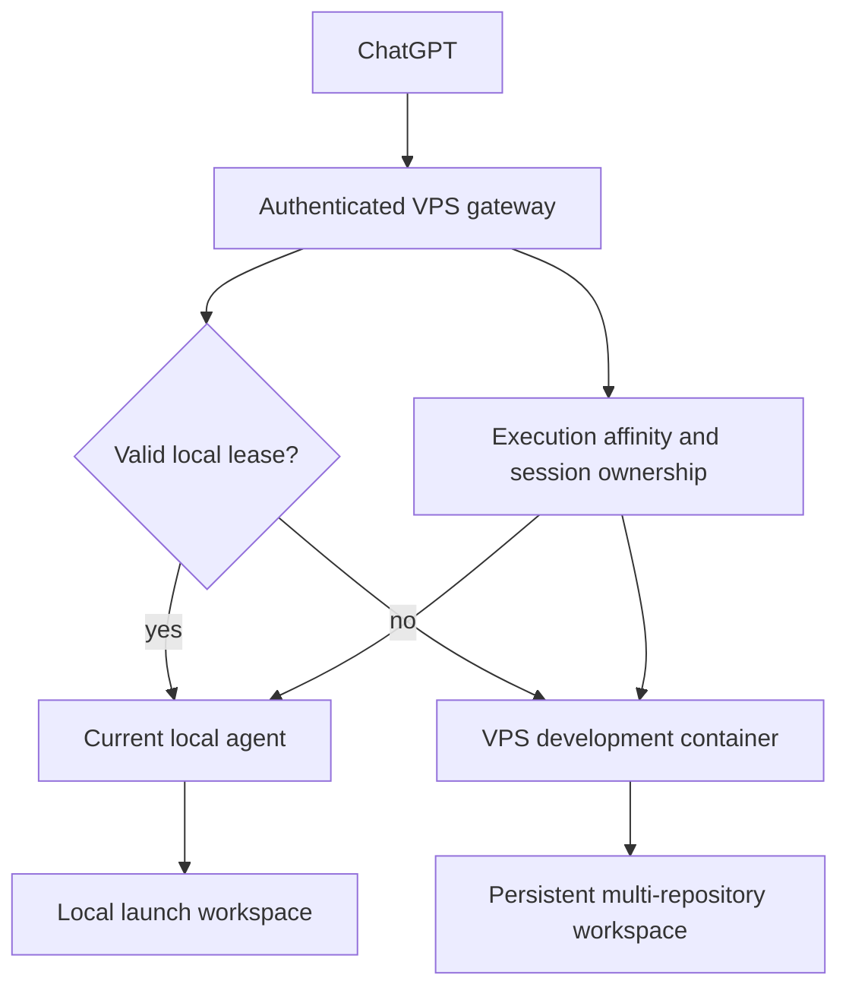
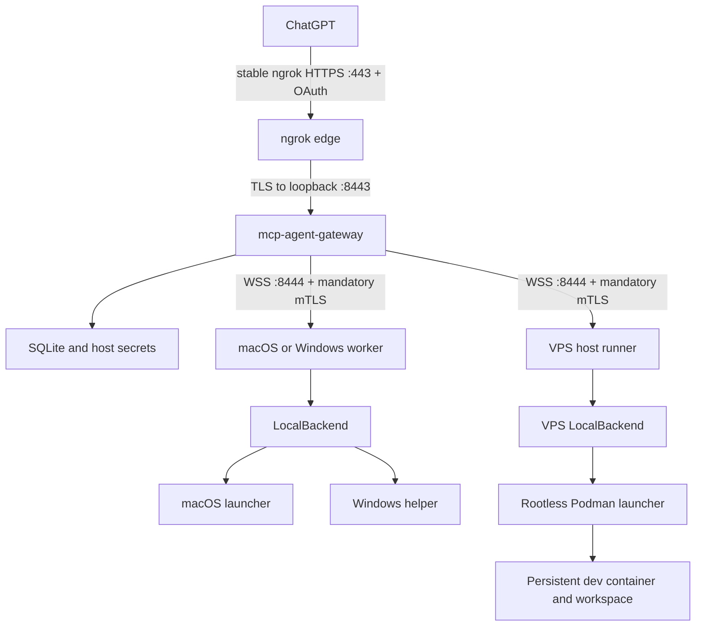
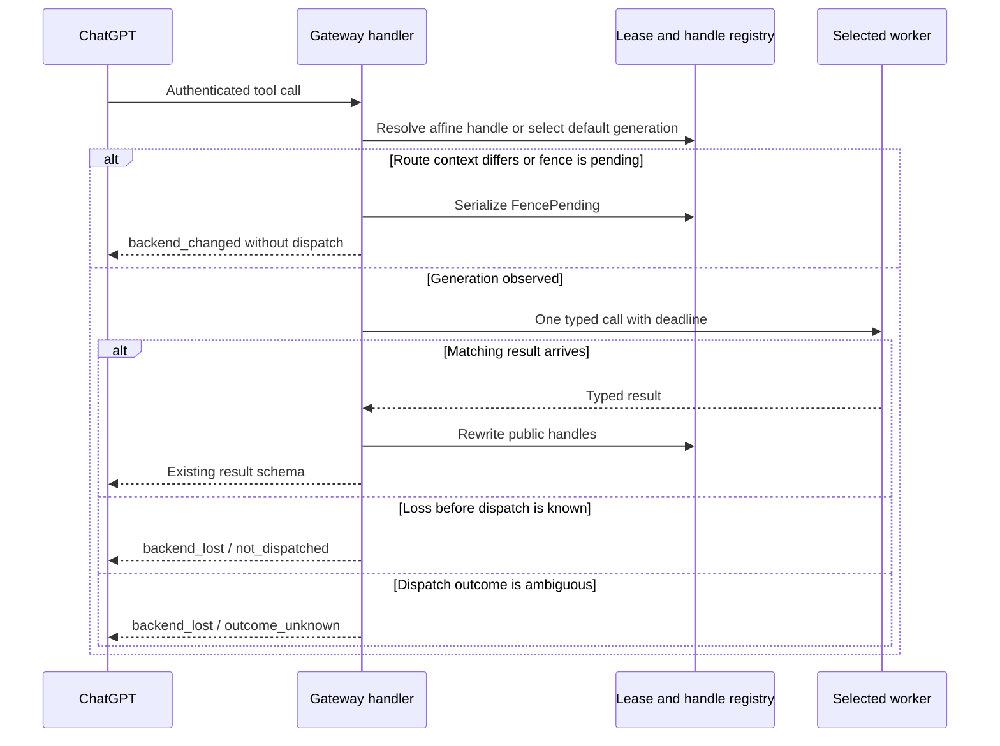
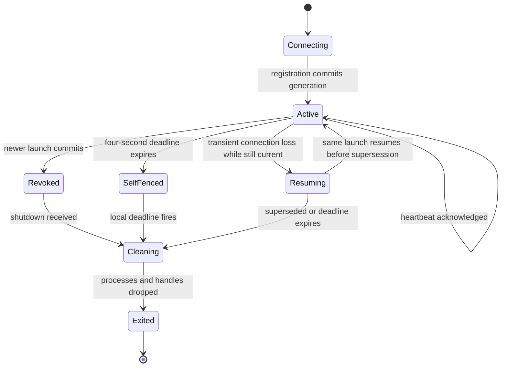
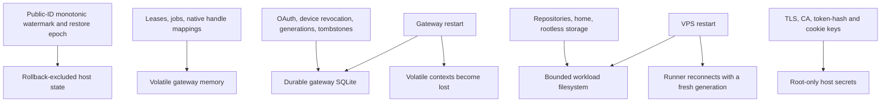

# Hybrid Local and VPS Execution - Plan

## Goal Capsule

- **Objective:** Let one authenticated ChatGPT user use the existing coding tools at any time, with local execution on macOS or Windows while the newest local agent is healthy and an isolated persistent VPS environment as the automatic fallback.
- **Means:** Put one lease-aware gateway on the VPS, connect local and VPS workers through authenticated outbound relay sessions, and keep one persistent rootless-container development environment behind the same MCP endpoint. See KTD1-KTD9.
- **Product authority:** The five-tool contract and security boundaries in `docs/plans/2026-08-23-1219-refactor-codex-parity-skills-sandbox-plan.md`, plus the session-settled decisions in this Product Contract.
- **Execution profile:** Extend the Rust workspace in dependency order, add Windows native packaging and CI, deploy the Linux gateway and VPS runner without touching Amnezia, then run shared conformance and live ChatGPT gates.
- **Stop conditions:** Stop if the verified free HTTPS ingress cannot remain stable and private-to-loopback, if macOS or Windows cannot fail closed behind a verified native launcher, if the VPS container can reach a host control surface, or if deployment requires changing Amnezia or the host Docker daemon.
- **Tail ownership:** The implementation run owns protocol conformance, platform CI, deployment smoke tests, live ChatGPT OAuth and refresh proof, operational documentation, and removal of abandoned relay or containment paths.
- **Open blockers:** None. U1 passed live on 2026-08-24 through the account-owned free stable ngrok HTTPS endpoint; direct ChatGPT access to `:8443` was empirically rejected before a VPS connection was attempted.

---

## Product Contract

Preservation note: this enrichment preserves the meaning and stable IDs of R1-R24, A1-A5, F1-F6, and AE1-AE8. It clarifies the physically enforceable cleanup timing in R9, makes the no-replay outcome in R11 explicit, and adds R25-R30 plus AE9 for route visibility, backend-affine handles, human-only authorization, and the user-confirmed Windows implementation.

### Summary

Provide one authenticated MCP endpoint backed by a lease-aware execution layer rather than a machine-specific server.
The implementation covers the complete single-user hybrid workflow, including macOS and Windows local workers, a Linux VPS fallback, OAuth refresh, generation-safe handles, rootless containment, and automated cross-platform verification.

### Problem Frame

The current product works only while a user starts one server in a local project and exposes it through a development tunnel.
That leaves the tools unavailable when the computer is off, makes the tunnel URL itself powerful authority, and provides no safe execution environment for development away from home.

The desired experience is continuous rather than synchronized.
A local project and the VPS workspace remain separate working copies, so availability must not introduce implicit file replication or pretend that a running process can move between machines.

The current code also binds every tool directly to one startup context, starts every process-manager session range at `1000`, and emits backend-native skill cursors and resources.
A hybrid deployment therefore needs an execution boundary, generation fencing, and public-handle virtualization before automatic routing can be safe.

The settled VPS experience intentionally gives arbitrary container-root commands the same GitHub repository authority stored for `gh`. Service logs must redact credentials, but the product cannot promise that a model-issued command will not deliberately print or transmit that credential; narrower scopes or a future host-side credential broker are the only stronger boundaries.

### Actors

- A1. **User:** Connects the MCP app once, enrolls trusted local installations, starts an agent from a macOS or Windows project, and develops in the persistent VPS workspace when no local agent is active.
- A2. **ChatGPT MCP client:** Calls the existing five tools through one stable endpoint and refreshes its authorization without exposing deployment state as tool arguments.
- A3. **VPS gateway:** Authenticates requests, owns the current local lease, preserves execution affinity, and selects the eligible backend.
- A4. **Local agent:** Registers one immutable launch-directory workspace through an outbound authenticated connection and executes routed work under its native macOS or Windows containment boundary.
- A5. **VPS development environment:** Executes fallback work inside one persistent rootless Podman container with a personal multi-repository workspace and durable developer credentials.

### Key Decisions

- **Single-user first release** (session-settled: user-directed — chosen over first-release multi-user support: deliver the hybrid workflow before adding user administration). Governs R2-R3, R18.
- **One persistent multi-repository VPS workspace** (session-settled: user-directed — chosen over a single fixed repository or per-task temporary workspaces: keep the VPS useful as a personal development machine). Governs R14-R15.
- **Git-only workspace continuity** (session-settled: user-directed — chosen over automatic file synchronization: avoid hidden conflicts and background transfer). Governs R13, R16.
- **Self-hosted OAuth** (session-settled: user-approved — chosen over a secret unauthenticated URL: protect the stable remote-command endpoint without a paid identity service). Governs R1-R4.
- **Lease-based routing through one gateway** (session-settled: user-directed — chosen over endpoint switching or separate ChatGPT apps: preserve one endpoint and automatic fallback). Governs R5-R12.
- **Newest local launch wins** (session-settled: user-directed — chosen over rejecting the second launch or requiring manual device selection: make changing computers immediate). Governs R7-R9.
- **Never replay interrupted work** (session-settled: user-directed — chosen over restarting the same command on the VPS: prevent duplicate destructive effects). Governs R10-R12.
- **Root only inside the VPS container** (session-settled: user-directed — chosen over a fixed unprivileged image or host sudo: allow package installation without granting host authority). Governs R14-R18.
- **Persistent VPS GitHub authorization** (session-settled: user-approved — chosen over public-repository-only access or dependence on local credentials: support private repositories while the local computer is offline). Governs R15-R17.
- **Windows local implementation in the first release** (session-settled: user-directed — chosen over a macOS-only local release: make the local worker usable from Windows even though manual Windows verification is not currently available). Governs R28-R30.



### Requirements

**Endpoint and identity**

- R1. The service must expose one stable public HTTPS MCP endpoint without requiring a new paid domain, tunnel, or identity service.
- R2. The endpoint must authenticate the single admitted user through a self-hosted OAuth flow that supports automatic refresh through `offline_access`.
- R3. OAuth keys, grants, refresh state, gateway incarnation/generation allocation, and public-session allocation state must survive ordinary service restarts so normal use does not require repeated authorization or permit identity or handle reuse.
- R4. Authentication, owner identity, leases, and deployment state must stay outside tool arguments and sensitive values must stay out of logs.

**Tool compatibility and routing**

- R5. The model-visible surface must remain exactly `exec_command`, `write_stdin`, `apply_patch`, `skills.list`, and `skills.read` with the existing input and output schemas; routing may add only the explicit distributed-state errors required by R11-R12 and R25-R26.
- R6. When no healthy local lease exists, every new tool call must execute in the VPS development environment.
- R7. Starting the local command on a supported platform must fix its canonical launch directory and register through an outbound authenticated connection without exposing an inbound port on the local computer.
- R8. A healthy local lease must become the target for new tool calls within five seconds of a successful local launch.
- R9. Committing a new local generation must permanently supersede and immediately fence every prior launch instance; a connected previous agent must terminate at once, while a partitioned previous agent must self-fence and terminate its workloads within five seconds, and it must not reclaim routing by reconnecting.
- R10. Each admitted tool call must remain bound to the backend selected at admission, including follow-up access to live terminal sessions.
- R11. The gateway must dispatch each admitted invocation or terminal-input fragment at most once; only loss before handoff to the relay writer or an authenticated worker rejection may report known non-dispatch, while every loss after writer handoff and before a matching terminal result must report unknown outcome and must never trigger automatic replay.
- R12. After a local lease is lost, new calls must begin using the VPS environment within five seconds, while handles owned by the lost generation must return a terminal lost-context outcome and must never alias a new backend object.
- R13. Local and VPS files must not synchronize automatically; the user and agent exchange changes only through Git operations.
- R25. Before a tool executes on a backend generation different from that MCP session's last confirmed route context, including a return to a previously used generation, the gateway must serialize one non-executing `backend_changed` outcome containing only backend kind, opaque workspace identity, generation, operating system, and privilege posture; no concurrent call may dispatch while the fence is pending, and the next ordered explicit retry may then execute once on that generation.
- R26. Public terminal IDs, skill cursors, and mutable project or global skill handles must preserve backend-generation affinity; a follow-up from a lost generation must fail closed instead of resolving against the current default backend.

**VPS development environment**

- R14. The fallback environment must provide one persistent personal workspace that can contain multiple independent repositories.
- R15. The workspace, container home, installed tools, and GitHub CLI credentials must survive ordinary container and VPS service restarts.
- R16. The environment must include Git, GitHub CLI, ripgrep, fd, jq, curl, wget, OpenSSH client, tmux, common build tools, Python, Node.js, Rust, and Go as its baseline developer toolkit.
- R17. The user must be able to authorize GitHub once inside the VPS environment and use private clone, fetch, pull, and push operations while the local computer is offline.
- R18. Workloads may install additional packages as root inside the development container but must not receive the VPS host filesystem, host privileges, a container-engine socket, relay credentials, access to host/private/control networks, or control of Amnezia services.
- R19. The VPS environment must allow outbound development traffic and internal listener binds without publishing workload ports publicly by default.

**Operations and coexistence**

- R20. Gateway, OAuth, lease, and VPS-runner services must start automatically after a VPS reboot and fail closed when their security prerequisites are unavailable.
- R21. Deployment must coexist with the current Amnezia VPN and the existing Yandex Mail MCP service. It must not take exclusive ownership of the VPN's public port 443 listener, replace the ngrok tunnel that currently serves `<ngrok-domain>/yandex-mail/mcp`, or route that legacy path to tools-mcp. One shared stable hostname may use a path router, but only the explicitly inventoried tools-mcp MCP/OAuth route set may reach the tools-mcp gateway; the Yandex Mail route and all unrelated paths must retain their prior behavior.
- R22. The gateway must add no more than 100 ms p95 processing and relay overhead under idle-server conditions, excluding ChatGPT network time and tool execution time.
- R23. The VPS development workload must have bounded CPU, memory, process, file-descriptor, and disk consumption so it cannot make the gateway, SSH access, or the existing VPN unresponsive.
- R24. Operational logs may record bounded owner, lease, backend, timing, and error classifications but must omit tool arguments, command output, credentials, authorization headers, and absolute workspace paths.

**Human authority and supported local platforms**

- R27. OAuth consent, local-device enrollment or revocation, GitHub login or scope expansion, and VPS host administration must require a human-controlled browser, SSH session, or local console and must not be delegated to model tool calls.
- R28. The first release must provide installable local-agent artifacts for macOS and Windows; Linux local-agent packaging remains deferred while Linux gateway and VPS-runner delivery are in scope.
- R29. The Windows local agent must use a verified native helper that confines writes to the declared capability roots, closes inherited bypass handles, owns descendants in a kill-on-close process tree, and fails before relay registration if that boundary is unavailable.
- R30. Windows-native build, sandbox, process lifecycle, relay, replacement, and packaging tests must run on Windows CI; the unavailable manual Windows-to-ChatGPT walkthrough must remain an explicit unverified release caveat rather than a claimed pass.

### Key Flows

- F1. First ChatGPT connection
  - **Trigger:** A1 creates or reconnects the MCP app in ChatGPT.
  - **Actors:** A1, A2, A3
  - **Steps:** A3 presents the one-user OAuth authorization, A1 approves it once, and A2 receives renewable credentials before scanning the unchanged tools.
  - **Outcome:** A2 can call the five tools without a secret URL or routine reauthorization.
  - **Covers:** R1-R5.

- F2. Local enrollment and activation
  - **Trigger:** A1 enrolls an installation once and later runs the local command from a macOS or Windows project directory.
  - **Actors:** A1, A3, A4
  - **Steps:** A4 fixes the launch workspace, proves its device identity and native boundary, opens the outbound relay, and acquires the current local generation; A3 fences any older local generation.
  - **Outcome:** New tool calls select the newly launched local workspace, while an unreachable predecessor cleans itself up on lease expiry.
  - **Covers:** R7-R9, R27-R30.

- F3. Local tool execution
  - **Trigger:** A2 calls a tool while A4 holds a healthy lease.
  - **Actors:** A2, A3, A4
  - **Steps:** A3 surfaces an unseen generation once, admits the explicit retry to A4, and preserves the same generation for terminal and skill follow-ups.
  - **Outcome:** The call executes where A1 launched the local command.
  - **Covers:** R5, R8, R10, R25-R26.

- F4. Automatic VPS fallback
  - **Trigger:** The current local agent stops, disconnects, or loses its lease without a newer eligible local launch.
  - **Actors:** A2, A3, A4, A5
  - **Steps:** A3 fences delayed local results, reports any ambiguous in-flight outcome without replay, surfaces the VPS generation once, and routes only a later explicit retry or new call to A5.
  - **Outcome:** Work remains available on the VPS without duplicating an interrupted effect or reusing a local handle.
  - **Covers:** R6, R9-R13, R25-R26.

- F5. Remote repository work
  - **Trigger:** A2 receives a development request while no local lease exists.
  - **Actors:** A1, A2, A3, A5
  - **Steps:** A5 works in a repository beneath the fixed multi-repository root, uses explicit `workdir` and path prefixes, uses its own tools and GitHub authorization, and transfers changes through normal Git operations.
  - **Outcome:** A1 can develop against private repositories while away from every local computer.
  - **Covers:** R13-R19.

- F6. VPS recovery
  - **Trigger:** The VPS or a service restarts.
  - **Actors:** A3, A5
  - **Steps:** Managed services reload durable identity and workspace state, discard volatile leases and mappings as lost, reconnect the VPS runner as a fresh generation, and expose the gateway only after containment checks pass.
  - **Outcome:** New requests resume without data loss or routine OAuth and GitHub reauthorization, while pre-restart live contexts remain terminally lost.
  - **Covers:** R3, R11-R12, R15, R20-R21, R23, R26.

### Acceptance Examples

- AE1. One-time ChatGPT authorization
  - **Covers:** R1-R5.
  - **Given:** The app has completed one successful OAuth authorization.
  - **When:** Access tokens expire or the gateway restarts without losing its durable state.
  - **Then:** ChatGPT refreshes access automatically and still discovers exactly the five existing tools without prompting A1 to log in again.

- AE2. VPS is the default backend
  - **Covers:** R6, R14-R19, R25.
  - **Given:** No local agent holds a valid lease and the MCP session has not observed the current VPS generation.
  - **When:** ChatGPT invokes a command, patch, or skill operation and then explicitly retries after `backend_changed`.
  - **Then:** The first call performs no work, and the retry runs once in the persistent VPS environment with its workspace, tools, and GitHub authorization available.

- AE3. Local activation and replacement
  - **Covers:** R7-R10, R25, R28-R30.
  - **Given:** One local agent is active on computer A.
  - **When:** A1 starts the command from a project on computer B.
  - **Then:** Computer B becomes the only gateway target immediately; computer A terminates immediately when reachable or self-terminates within five seconds when partitioned.

- AE4. No replay after local loss
  - **Covers:** R10-R12, R25-R26.
  - **Given:** A local `exec_command` may already have changed state but has not returned a terminal result.
  - **When:** The local relay disappears after dispatch.
  - **Then:** The call returns an unknown-outcome `backend_lost` result, the command is not restarted on the VPS, and only a later explicit call can use the VPS after the context fence.

- AE5. Git-only continuity
  - **Covers:** R13, R16-R17.
  - **Given:** Local files differ from the VPS checkout.
  - **When:** Routing changes between local and VPS execution.
  - **Then:** Neither workspace changes until an explicit Git operation transfers committed work.

- AE6. Root inside the container only
  - **Covers:** R18-R19, R23.
  - **Given:** A VPS command runs as root inside the development container.
  - **When:** It installs a package and then attempts to access host control surfaces.
  - **Then:** The package installation succeeds while host paths, host privileges, the Docker socket, and Amnezia control remain unavailable.

- AE7. Persistence across reboot
  - **Covers:** R3, R15, R20.
  - **Given:** The VPS workspace contains repositories, added packages, OAuth state, and a valid GitHub CLI login.
  - **When:** The VPS reboots and its managed services recover.
  - **Then:** New MCP calls can use the prior workspace and credentials without repeating setup, while pre-reboot terminal sessions return lost-session errors.

- AE8. Existing services remain healthy
  - **Covers:** R21-R23.
  - **Given:** Amnezia VPN is serving on public port 443, the existing ngrok edge serves `/yandex-mail/mcp`, and the hybrid MCP service is running under normal workload.
  - **When:** Routing and representative tool calls are exercised.
  - **Then:** The VPN listener remains unchanged, `/yandex-mail/mcp` preserves its baseline authentication and MCP behavior, unrelated paths are not captured by tools-mcp, gateway overhead stays at or below 100 ms p95, and SSH plus both MCP services remain responsive.

- AE9. Windows local worker without a manual workstation
  - **Covers:** R7-R12, R25-R30.
  - **Given:** A clean Windows CI runner builds the packaged local agent and native helper.
  - **When:** The suite exercises workspace confinement, PowerShell commands, PTY continuation, relay enrollment fixtures, newest-wins replacement, lease self-fencing, and delayed-result rejection.
  - **Then:** Every automated native case passes and the release artifact is produced, while documentation states that the live Windows-to-ChatGPT walkthrough remains unverified until hardware is available.

### Success Criteria

- One configured ChatGPT app completes the same five-tool smoke test against both local and VPS backends without rescanning a different endpoint.
- A seven-day soak with ordinary token expiry completes without routine OAuth reauthorization or loss of the VPS workspace and GitHub login.
- The five-second activation and fallback thresholds in R8 and R12 pass in the acceptance scenarios.
- The gateway overhead threshold in R22 passes under idle-server conditions.
- Adversarial tests prove the containment boundary in R18.
- A VPS reboot satisfies the automatic recovery behavior in R20.
- Windows CI produces and exercises a real Windows artifact; no manual Windows compatibility claim appears until the deferred walkthrough is run.

### Scope Boundaries

**Deferred for later**

- Additional OpenAI accounts, friend onboarding, per-user containers, quotas, and user administration.
- Multiple simultaneous local agents, manual backend selection, named-device routing, and lease handoff without terminating the previous agent.
- Linux local-agent packaging; Linux remains supported for the gateway and VPS runner in this release.
- Automatic file synchronization, shared working trees, conflict resolution, and migration of live processes between machines.
- High availability across multiple VPS hosts, external backups, disaster recovery after disk loss, and zero-downtime upgrades.
- Public preview URLs or automatic publication of development-server ports from inside the VPS container.
- Per-repository VPS project-skill roots or persistent repository-selection state; project skills remain anchored at the multi-repository workspace root.
- Manual Windows-to-ChatGPT acceptance until a Windows workstation is available; automated Windows-native CI remains in scope.

**Outside this product's identity**

- Running the Codex or ChatGPT agent loop, models, prompts, or OpenAI API calls.
- Replacing Git with an implicit synchronization protocol.
- Granting model workloads administrative access to the VPS host or its VPN services.
- Depending on Secure MCP Tunnel, a paid tunnel, a paid identity provider, or a newly purchased domain.

### Dependencies / Assumptions

- The user's current ChatGPT Plus account continues to permit the five observed tool calls even though current public availability guidance is subject to change.
- ChatGPT accepts the self-hosted OAuth metadata, `offline_access` scope, refresh-token behavior, and chosen public HTTPS ingress; planning must validate this with an early live transport spike.
- The existing VPS remains Ubuntu 26.04 with 2 CPUs, 4 GB RAM, about 109 GB free disk, Docker, systemd, and an account-owned stable ngrok domain. That domain already serves a separate Dockerized Yandex Mail MCP service at `/yandex-mail/mcp`; tools-mcp must join through explicit path routing rather than claim the hostname or tunnel wholesale.
- Public port 443 remains owned by Amnezia, so planning must select a compatible no-cost HTTPS ingress without weakening the VPN.
- The user supplies and controls a GitHub credential with enough repository scope for the intended private clone and push operations.
- Linux containment and packaging must become supported work for this release; the current macOS-only release is not deployable to the VPS as-is.
- GitHub-hosted `windows-latest` runners remain available for automated Windows-native validation; lack of a physical Windows workstation limits only the deferred live ChatGPT walkthrough.

### Sources / Research

- `docs/vps-auth-seam.md` defines authentication ahead of the transport adapter and requires owner-scoped deployment context without changing tool contracts.
- `crates/mcp-agent-server/src/handler.rs` and `tests/conformance/tool_surface.rs` confirm the current five-tool surface.
- `crates/mcp-agent/src/cli.rs`, `crates/mcp-agent/src/startup.rs`, and `crates/mcp-agent-authority/src/workspace.rs` confirm loopback-only startup and one fixed launch workspace.
- `crates/mcp-agent-server/src/context.rs` and `crates/codex-tools-runtime/src/process/manager.rs` confirm the fixed local owner and owner-scoped in-memory terminal registry.
- `docs/security-model.md`, `docs/installation.md`, `xtask/src/package.rs`, and `crates/mcp-agent-authority/src/sandbox/linux.rs` establish the macOS-only shipped contract and unfinished Linux lifecycle.
- [OpenAI developer mode and MCP apps guidance](https://help.openai.com/en/articles/12584461-developer-mode-and-full-mcp-connectors-in-chatgpt) documents OAuth refresh-token requirements and the current product availability caveat.
- [MCP authorization](https://modelcontextprotocol.io/specification/2026-07-28/basic/authorization) defines protected-resource metadata, PKCE, resource binding, and authorization-server discovery.
- [MCP client registration](https://modelcontextprotocol.io/specification/2026-07-28/basic/authorization/client-registration) deprecates Dynamic Client Registration in favor of Client ID Metadata Documents.
- [RFC 9700](https://www.rfc-editor.org/rfc/rfc9700.html) supplies the OAuth security baseline and refresh-token replay defenses.
- [RFC 8705](https://www.rfc-editor.org/rfc/rfc8705.html) supplies the mutual-TLS proof-of-possession pattern used for worker identity.
- [Axum WebSocketUpgrade 0.8.9](https://docs.rs/axum/0.8.9/axum/extract/struct.WebSocketUpgrade.html) documents the bounded upgrade surface selected for the relay.
- [Docker Engine security](https://docs.docker.com/engine/security/) establishes why container-engine sockets and the existing rootful daemon are outside the workload boundary.

---

## Planning Contract

### Key Technical Decisions

- KTD1. **Separate public adaptation from executable backends.** A low-level `mcp-agent-tool-contracts` crate owns typed requests, results, errors, deadlines, cancellation, and the backend trait. `mcp-agent-server` remains an MCP/HTTP adapter over contracts; `LocalBackend` moves to `mcp-agent-local-backend`, the only layer allowed to depend on runtime, authority, and skill storage. The gateway dependency graph must contain no local execution stack.
- KTD2. **Use a project-owned WSS relay with handshake-enforced mutual TLS.** (session-settled: user-approved — chosen over endpoint switching or separate MCP apps: one persistent outbound channel preserves automatic fallback for R5-R12.) Public OAuth/MCP arrives through the account-owned stable ngrok HTTPS endpoint and is forwarded only to the gateway's loopback TLS listener on 8443, while relay WSS uses a separate public 8444 listener that requires a valid enrolled client certificate during the TLS handshake. The relay carries typed register, heartbeat, call, cancel, result, error, and shutdown frames rather than raw MCP HTTP; the two listeners have independent connection, handshake, queue, and rate budgets.
- KTD3. **Make gateway lease commit the takeover linearization point.** (session-settled: user-directed — chosen over rejecting or manually selecting a second local agent: the newest committed launch owns new admission for R7-R9.) Each explicit command launch has an immutable unpredictable `launch_instance_id`; connection epochs may resume it only while it remains current. Once another launch commits, the old launch is permanently superseded and cannot register a fresh generation. Workers send one-second application heartbeats; the gateway and worker self-fence at a four-second monotonic deadline.
- KTD4. **Virtualize every backend-affine public handle.** The gateway allocates never-reused positive `i32` terminal IDs from a durable high-water mark and replaces mutable skill cursors, package names, and resource handles with bounded opaque gateway values tied to one generation.
- KTD5. **Serialize route-context confirmation before side effects.** (session-settled: user-approved — chosen over silent switching: prevent a valid destructive call from running in the wrong Git checkout under R13 and R25.) U1 proved `X-OpenAI-Session` stable across calls in one conversation and distinct in a new conversation, with `X-OpenAI-Subject` stable for the authenticated principal. The gateway fingerprints these values and accepts them only from its private loopback ingress after ngrok; direct clients cannot supply trusted copies. Each MCP session records the last confirmed route context, not a set of previously seen generations. Any selected-generation change, including a switch back to an earlier VPS, enters `FencePending`; the fence response and all concurrent calls perform no dispatch, and only the next ordered call confirms and executes in that context. Backend-affine handle resolution occurs before default-route comparison.
- KTD6. **Own OAuth server behavior in the gateway.** The gateway implements authorization code with PKCE S256, protected-resource metadata, exact resource and redirect binding, short-lived opaque access tokens, and rotating opaque refresh families in SQLite. CIMD is primary; constrained DCR is added only if U1 proves ChatGPT requires it.
- KTD7. **Separate human bootstrap from model authority.** The installer creates an Argon2id owner-secret hash over SSH. OAuth consent requires that secret. Local device keys are generated non-exportably in macOS Keychain or Windows CNG; an SSH-admin approves the exact CSR fingerprint, device, platform, relay-only EKU, and expiry before an offline/root-owned issuer signs it. The public gateway holds trust and revocation state, not the root CA key; revocation immediately closes the live relay and fences its work. GitHub login remains human-only, while the resulting container credential is an accepted model-readable authority.
- KTD8. **Run VPS commands through a verified host-side rootless Podman launcher.** (session-settled: user-directed — chosen over host sudo or a fixed unprivileged image: preserve root package installation for R14-R18.) The unprivileged host runner keeps relay keys outside container mounts, verifies namespaces, mounts, cgroups, sockets, and host-enforced egress denial, then invokes commands as container UID 0. Every call owns an in-container process group or cgroup; cancel, relay loss, and shutdown reap the full tree, and an unprovable cleanup forces a development-container restart while preserving workspace, home, and root layer. Host-brokered patch and skill access remains a distinct capability-confined data path.
- KTD9. **Use a stable free HTTPS edge without taking host 443.** U1 proved that ChatGPT rejects direct `:8443` but accepts the account-owned stable ngrok HTTPS endpoint. Ngrok owns public edge 443 outside the VPS and forwards only to gateway loopback TLS on 8443; the mandatory-mTLS relay remains a separate public 8444 listener. The VPS host's Amnezia-owned 443 listener remains untouched, and no paid domain, tunnel tier, or identity provider is required.
- KTD10. **Adapt the pinned native Windows sandbox pattern.** (session-settled: user-directed — chosen over a macOS-only local release: implement R28-R30 without claiming unavailable manual evidence.) The packaged helper uses a restricted token, declared-root capability, inherited-handle closure, and a kill-on-close Job Object.
- KTD11. **Separate durable, rollback-excluded, and volatile state.** SQLite begins in U5 and persists non-reusable gateway incarnation/generation allocation, OAuth and device state, public-ID allocation, and bounded tombstones. A separately protected monotonic watermark survives stale database restore. Active leases, jobs, MCP observations, native mappings, and route fences remain memory-only and become lost on restart. Ordinary reboot preserves authorization; a quiesced deploy rollback may restore only when no later allocator or auth writes committed; any stale/disaster restore invalidates all OAuth families and worker identities, advances the watermark, and requires new consent and enrollment.
- KTD12. **Align deadlines and define dispatch disposition.** Public HTTP, relay, and worker deadlines preserve the existing five-minute empty `write_stdin` ceiling plus transport margin. Each invocation and terminal fragment has a unique ID and states `admitted -> writer_pending -> written_or_ambiguous -> worker_accepted -> completed`; only pre-writer loss or authenticated rejection is `not_dispatched`, every later loss is `outcome_unknown`, and a bounded worker ledger rejects duplicates without replay. `RequestContext.ct` propagates cancellation without resubmitting written input.

### High-Level Technical Design

The diagrams specify component ownership, request sequencing, lease lifecycle, and persistence shape. Exact types and APIs remain implementation choices.

**Component topology**



**Admission and completion**



**Local lease lifecycle**



**State ownership**



### Output Structure

```text
crates/
├── mcp-agent/                    # local worker, direct mode, VPS runner mode
├── mcp-agent-tool-contracts/     # typed backend protocol without execution code
├── mcp-agent-server/             # five-tool MCP/HTTP adapter only
├── mcp-agent-local-backend/      # runtime, authority, and skill implementation
├── mcp-agent-relay/              # relay DTOs and connection machinery
├── mcp-agent-gateway/            # OAuth, routing, leases, handles, admin CLI
├── mcp-agent-windows-sandbox/    # native Windows helper
├── codex-tools-runtime/          # process manager and launcher seam
└── mcp-agent-authority/          # workspace and launcher verification
deploy/vps/
├── Containerfile
├── container/
├── systemd/
├── tmpfiles.d/
└── scripts/
```

### Implementation Constraints

- Keep public MCP on Streamable HTTP. Do not restore legacy HTTP+SSE or tunnel raw MCP through the relay.
- Keep `rmcp` pinned at `3.0.1`; pin Axum to the resolved `0.8.9` API with `ws` and align the relay client on `tokio-tungstenite 0.29`.
- Compose bearer validation ahead of `StreamableHttpService`; keep discovery, authorization, token, enrollment, and relay routes outside the protected MCP subrouter as appropriate.
- Preserve structured tool results and JSON-text fallback from one typed output. Rewrite public handles before either representation is serialized.
- Use application heartbeats, one bounded writer actor per connection, bounded frames and queues, and an awaited task registry for upgraded sockets.
- Never forward ChatGPT OAuth tokens to workers or place device credentials in URLs, logs, or workload mounts.
- Keep the gateway dependency tree free of `mcp-agent-local-backend`, `codex-tools-runtime`, `mcp-agent-authority`, and `skill-store`.
- Never mount Docker or Podman sockets, use privileged or host namespaces, grant host devices, or alter the existing rootful Docker daemon.
- Run Windows release tests on a native Windows runner. Cross-compilation alone cannot satisfy R29-R30.
- Treat `/workspace` as the VPS authority root. Repository choice uses `workdir` and path prefixes; project skills resolve only from `/workspace/.agents/skills`.

### Sequencing

1. U1 establishes external go/no-go facts.
2. U2 creates behavior-preserving seams used by every backend.
3. U4 adds the relay foundation after U2.
4. U5 adds durable routing after typed relay and handles exist.
5. U3, U6, and U7 can proceed after U5: Windows proves the real replacement path, OAuth extends the state store, and VPS supplies fallback.
6. U8 publishes the gateway only after U6 and U7 pass.
7. U9 adds operator surfaces before U10 runs the release tail.

### System-Wide Impact

- **Tool semantics:** Five names and schemas stay fixed, but context-change and distributed-loss outcomes become operational behavior.
- **Sessions and skills:** Public terminal and skill handles stop being backend-native and cannot alias across replacement or restart.
- **Authentication:** A public resource server, authorization server, and human device-enrollment surface replace the tunnel URL as authority.
- **Platform support:** macOS remains the live characterization platform, Windows gains a native package with CI evidence, and Linux becomes the gateway/VPS platform.
- **Operations:** The VPS gains TLS on 8443, dedicated users, rootless Podman state, systemd services, and bounded storage while Amnezia and Docker remain independent.
- **Credentials:** Container root can read the container's GitHub credential by design but cannot read gateway, TLS, CA, or relay credentials.

### Risks and Mitigations

| Risk | Consequence | Mitigation |
|---|---|---|
| Free stable ngrok ingress is removed or changes behavior | ChatGPT cannot reach the gateway while host 443 remains reserved | Fail readiness and preserve Amnezia; require an explicitly approved equivalent free stable HTTPS edge before release. |
| tools-mcp claims the existing ngrok hostname or shadows `/yandex-mail/mcp` | The deployed Yandex Mail integration becomes unavailable or requests reach the wrong MCP server | Keep one owner for the stable-domain tunnel, inventory every existing route first, add an explicit shared path router, default unmatched paths to their prior behavior or fail closed, and gate activation on before/after Yandex Mail probes. |
| Work completes after its response path is lost | Retry could duplicate a destructive effect | At-most-once gateway dispatch and explicit unknown outcome. |
| Native handles collide across generations | Input reaches the wrong process or resource | Durable public IDs, opaque skill handles, and generation checks. |
| A partitioned old agent keeps running briefly | Local effects continue after logical takeover | Immediate gateway fencing plus worker self-fence below five seconds. |
| A superseded launch reconnects as newest | Silent routing returns to an old computer | Immutable launch identity; supersession is terminal and reconnect cannot mint a replacement generation. |
| Parallel calls bypass a route fence | A destructive call executes before the user sees the context change | Per-session serialized `FencePending` admission with no concurrent dispatch. |
| Refresh token is replayed | Persistent remote-command access | Keyed hashes, rotation, family revocation, and exact resource/client binding. |
| A stale backup resurrects authority or IDs | Revoked OAuth/device access returns or an old terminal ID aliases a new session | Rollback-excluded watermark, matched DB/secret recovery set, and forced grant/device invalidation on stale restore. |
| Relay authentication is weakened by path routing | An unauthenticated worker reaches HTTP-layer checks or public clients receive certificate prompts | Separate 8444 listener with mandatory handshake mTLS and independent budgets. |
| Container root reaches host controls | VPS or VPN compromise | Rootless host user, host-side keys, no sockets, verified mounts and namespaces. |
| Container root reaches host/VPN networks | Host services or metadata become a lateral path | Host-enforced egress denial for host, private, link-local, Docker, Amnezia, and control endpoints. |
| A detached descendant survives cancellation | Revoked or lost work continues invisibly | Per-call in-container job ownership; bounded reap or forced container restart. |
| Workload exhausts the small VPS | VPN, SSH, or gateway stalls | Byte/inode caps, host reserve, log limits, and CPU, memory, PID, and descriptor enforcement. |
| Windows helper compiles but is unsafe | False platform claim | Native Windows tests, fail-closed preflight, CI smoke, and manual-live caveat. |
| HTTP and terminal timeouts disagree | Valid polls fail at two minutes | One five-minute deadline contract plus transport margin. |
| Partial deployment corrupts a working host | OAuth, VPN, SSH, or rollback becomes unavailable | Checkpointed activation, explicit STOP/rollback criteria, and previous artifacts retained through soak. |
| Container root exports the GitHub credential | Model-issued commands gain the credential's repository authority | Accepted trust boundary, narrow dedicated credential and scopes, periodic scope review, and no secrecy claim. |

### Alternative Approaches Considered

- **Two MCP apps or endpoint switching:** Rejected by the one-endpoint workflow.
- **Proxy raw MCP HTTP:** Rejected because auth, cancellation, and handle rewriting belong at the gateway boundary.
- **Silent switching:** Rejected because independent Git workspaces make invisible changes unsafe.
- **Rootful Docker or a mounted Docker socket:** Rejected because it couples workloads to the Amnezia host-control plane.
- **Relay client inside the root container:** Rejected because container root could steal the VPS worker identity.
- **Assumed 443 SNI multiplexing:** Rejected because the existing listener is not an HTTP service this plan may reconfigure.
- **DCR as the primary OAuth path:** Rejected because MCP 2026-07-28 deprecates it.
- **Windows cross-compilation without native tests:** Rejected because helper, Job Object, PTY, and path behavior need a Windows kernel.

### Deferred Implementation Notes

- U1 records the actual ChatGPT protocol and registration mechanism, which decides whether constrained DCR compatibility is needed.
- The container build records exact base-image digest and tool versions in a generated manifest rather than freezing stale patch numbers in this plan.
- Initial VPS targets are at most 60 GB total workload storage, 2.5 GB container memory, 1.5 CPU, and 512 processes; U7 tunes them against preflight evidence without weakening R23.
- The manual Windows-to-ChatGPT walkthrough remains deferred until hardware is available. Windows implementation and native CI are not deferred.

---

## Implementation Units

| Unit | Title | Primary files | Depends on |
|---|---|---|---|
| U1 | Prove ingress and ChatGPT contracts | `xtask/src/transport_spike.rs`, `tests/e2e/chatgpt-manual.md` | None |
| U2 | Extract backend and launcher seams | `crates/mcp-agent-tool-contracts/`, `crates/mcp-agent-local-backend/` | U1 |
| U3 | Deliver the native Windows worker | `crates/mcp-agent-windows-sandbox/`, `xtask/src/package.rs` | U2, U4, U5 |
| U4 | Build the authenticated relay | `crates/mcp-agent-relay/`, `crates/mcp-agent/` | U2 |
| U5 | Add leases, routing, and handle affinity | `crates/mcp-agent-gateway/src/routing/` | U4 |
| U6 | Add one-user OAuth and enrollment | `crates/mcp-agent-gateway/src/auth/` | U1, U5 |
| U7 | Build the persistent VPS runtime | `deploy/vps/Containerfile`, `crates/mcp-agent-authority/` | U2, U4, U5 |
| U8 | Deploy supervised ingress and services | `deploy/vps/systemd/`, `deploy/vps/scripts/` | U6, U7 |
| U9 | Add operations and documentation | `docs/`, `deploy/vps/` | U6-U8 |
| U10 | Prove and package hybrid behavior | `tests/conformance/`, `tests/e2e/`, `.github/workflows/` | U3, U5-U9 |

### U1. Prove Ingress and ChatGPT Contracts

**Goal:** Establish the HTTPS, OAuth, protocol-version, refresh, and context-visibility facts that determine whether the settled deployment is feasible.

**Requirements:** R1-R5, R21, R25. Flow F1. Example AE1. Decisions KTD6, KTD9.

**Dependencies:** None.

**Files:** `xtask/src/transport_spike.rs`, `xtask/tests/transport_spike.rs`, `tests/e2e/chatgpt-manual.md`, `tests/e2e/chatgpt-scan-tools-checkpoint.toml`, HTTP fixture tests under `crates/mcp-agent-server/tests/`, and `docs/vps-auth-seam.md`.

**Approach:**

1. Extend the disposable transport spike with private HTTPS on loopback 8443, protected-resource and authorization-server metadata, PKCE, short access-token expiry, refresh issuance, and the unchanged tool surface.
2. Route the account-owned free stable ngrok HTTPS endpoint to loopback 8443 without binding or reconfiguring VPS port 443.
3. Connect a draft ChatGPT app and record its MCP version, registration mechanism, redirect URIs, Host/Origin behavior, and refresh exchange.
4. Probe route-context visibility through trusted ingress headers and prove salted `X-OpenAI-Session` fingerprints are stable within one conversation and different across conversations; never persist raw values.
5. Remove disposable credentials and retain only bounded fixtures and checkpoint evidence.

**Execution note:** Completed 2026-08-24. Direct public `:8443` failed before reaching the VPS; the stable free ngrok edge completed OAuth, refresh, five-tool discovery/calls, and conversation correlation without disturbing Amnezia. U2 is unblocked.

**Patterns to follow:** Current transport spike, manual ChatGPT checkpoint, HTTP admission middleware, and exact tool-surface fixture.

**Test scenarios:**

- Covers AE1. ChatGPT authorizes with `offline_access`, scans five tools, expires an access token, and refreshes without new consent.
- The canonical resource includes scheme, host, port, and `/mcp` identically across discovery, challenge, authorization, token, and audience validation.
- Missing token, wrong audience, altered redirect, code replay, or absent S256 never reaches MCP handling.
- ChatGPT connects through the stable free edge while the gateway accepts MCP only on loopback 8443 and Amnezia remains the sole VPS-host 443 listener.
- Both MCP `2025-11-25` and `2026-07-28` negotiation are captured instead of relying on `ProtocolVersion::LATEST`.
- A generation change exposes `backend_changed` before any side effect if metadata or refreshed instructions are not model-visible.

**Verification:** The passed checkpoint records CIMD registration, five-tool scan/calls, three refresh exchanges, MCP `2026-07-28`, stable per-conversation correlation, distinct new-chat correlation, and no change to the Amnezia-owned VPS port 443 listener.

### U2. Extract Typed Backend and Launcher Seams

**Goal:** Preserve direct behavior behind typed execution and command-launcher boundaries that support local, relay, Windows, and container backends.

**Requirements:** R5, R10-R12, R22, R26, R29. Flows F2-F4. Decisions KTD1, KTD12.

**Dependencies:** U1.

**Files:** new `crates/mcp-agent-tool-contracts/`, new `crates/mcp-agent-local-backend/`, `crates/mcp-agent-server/src/handler.rs`, `crates/mcp-agent-server/src/context.rs`, `crates/codex-tools-runtime/src/process/manager.rs`, new launcher modules under `crates/codex-tools-runtime/src/process/`, `crates/mcp-agent-authority/src/sandbox/mod.rs`, `crates/mcp-agent/src/startup.rs`, focused crate tests, and `tests/conformance/`.

**Approach:**

1. Put typed requests, outputs, errors, cancellation/deadline context, and the backend trait in an execution-free contracts crate; keep tool decoding and MCP rendering in the server adapter so one result produces structured content and JSON-text fallback.
2. Preserve the current application context as `LocalBackend` in its own crate with its existing owner, authority, process manager, and skill catalog.
3. Replace the concrete verified-sandbox dependency in `ProcessManager` with a sealed launcher that supplies capabilities and owns cleanup.
4. Keep the macOS launcher as the first implementation and add fake launchers and backends for distributed-state tests.
5. Pass `RequestContext.ct` to calls and align request, tool, and launcher deadlines.

**Execution note:** Add characterization coverage before changing ownership; all current local conformance must pass before relay work starts.

**Patterns to follow:** `AgentHandler::call_tool`, `ApplicationContext`, `ProcessManager::build_command`, `PendingResult::handoff`, and current error rendering.

**Test scenarios:**

- Every existing success and error for the five tools remains byte-compatible through `LocalBackend`.
- A fake backend returns each typed output and produces matching structured content and JSON text; `cargo tree -p mcp-agent-gateway` contains no runtime, authority, skill-store, or local-backend crate.
- Request cancellation reaches the backend and never repeats written terminal input.
- A fake launcher cannot bypass the sealed path, and shutdown terminates its process tree.
- A five-minute empty poll no longer collides with the HTTP layer's current two-minute timeout.
- Failed launcher preflight prevents worker advertisement.

**Verification:** Direct macOS behavior and conformance remain green, and handlers no longer reach concrete process or skill state outside `LocalBackend`.

### U3. Deliver the Native Windows Worker

**Goal:** Produce a Windows package whose local worker, native containment, process lifecycle, and relay fixtures are verified on a real Windows CI kernel.

**Requirements:** R7-R12, R25-R30. Flows F2-F4. Examples AE3-AE4, AE9. Decision KTD10.

**Dependencies:** U2, U4, U5.

**Files:** new `crates/mcp-agent-windows-sandbox/`, `crates/mcp-agent-authority/src/sandbox/windows.rs`, `crates/mcp-agent-authority/src/sandbox/mod.rs`, `crates/codex-tools-runtime/src/process/pty.rs`, `crates/codex-tools-runtime/src/process/manager.rs`, `crates/mcp-agent/src/startup.rs`, `xtask/src/package.rs`, `xtask/tests/package.rs`, `tests/e2e/packaged_binary.rs`, `.github/workflows/ci.yml`, `.github/workflows/release.yml`, and Windows fixtures.

**Approach:**

1. Adapt the pinned Codex `windows-sandbox-rs` boundary and record its exact provenance, restricted/AppContainer SID, deny-only SIDs, integrity level, removed privileges, and declared-root ACL policy in the verified-helper manifest.
2. Create each child suspended, close unrelated inheritable handles, assign a non-breakaway kill-on-close Job Object, then resume; deny the restricted SID access to relay keys, credential stores, parent control handles, registry and named control brokers.
3. Support PowerShell default execution, explicit shell selection, PTY/non-PTY, fixed environment, Ctrl-C, shutdown, and lease self-fence.
4. Package helper, policy, canary, binary, provenance, and checksums as a target-specific Windows archive.
5. Replace the deferred-platform CI placeholder with native Windows build, sandbox, runtime, conformance, relay-fixture, and package jobs.

**Patterns to follow:** macOS launcher verification, the current Windows manifest seam, packaged-binary tests, and pinned upstream provenance from the foundation plan.

**Test scenarios:**

- Covers AE9. A clean Windows runner builds the package from a path with spaces and non-ASCII text and completes five-tool conformance.
- Workspace and managed-root writes succeed through PowerShell and a child, while user-owned paths outside the root, junction, reparse, hard-link, inherited-handle, rename, registry, named-pipe/COM, injection, and descendant-breakaway escapes fail.
- A yielded PTY accepts incremental input and its full Job Object terminates on revocation, lease expiry, Ctrl-C, or shutdown.
- Modified, missing, or wrong-target helper, canary, or manifest prevents relay registration.
- Two Windows workers race registration; only the committed generation receives new work, the loser cleans up within five seconds, and the superseded launch cannot reclaim routing by reconnecting.
- The archive installs without a Unix shell and rejects mismatched helper provenance.

**Verification:** Windows CI proves helper containment, process-tree ownership, relay behavior, and package integrity; documentation retains the manual-live caveat.

### U4. Build the Authenticated Relay

**Goal:** Connect workers through one bounded outbound full-duplex protocol with device authentication, correlation, cancellation, and deterministic shutdown.

**Requirements:** R4-R12, R22-R24, R27. Flows F2-F4. Examples AE3-AE4. Decisions KTD2-KTD3, KTD12.

**Dependencies:** U2.

**Files:** new `crates/mcp-agent-relay/`, `Cargo.toml`, `Cargo.lock`, `crates/mcp-agent/Cargo.toml`, `crates/mcp-agent/src/cli.rs`, `crates/mcp-agent/src/startup.rs`, relay integration tests, worker lifecycle tests, and TLS listener fixtures.

**Approach:**

1. Define versioned bounded frames for registration, heartbeat, call, cancellation, result, error, revocation, and shutdown; registration includes protocol range, five-tool schema digest, result/error version, system-skill manifest digest, platform, containment posture, launch identity, and connection epoch.
2. Add a dedicated 8444 Axum WebSocket listener and `tokio-tungstenite` worker client with mandatory handshake mTLS, one writer actor, bounded queues, subprotocol negotiation, independent resource budgets, and revocation-aware peer identity.
3. Assign unpredictable non-reusable connection and invocation identities; authenticate owner, launch, generation, epoch, tool, deadline, and payload digest. Retain a bounded worker disposition ledger and reject stale, duplicate, out-of-order, oversized, expired, or wrong-generation frames.
4. Add pending-CSR enrollment and ordinary worker modes behind a non-exportable credential provider; daily startup remains a bare command after enrollment.
5. Track and await every socket task, propagate cancellation, and terminate local processes before reconnect.

**Patterns to follow:** HTTP admission bounds, Tokio cancellation in startup, and the existing at-most-once `write_stdin` behavior.

**Test scenarios:**

- Valid device certificate registers; missing, revoked, wrong-CA, wrong-purpose/EKU, expired, malformed, or unknown certificates fail during the TLS handshake without consuming 8443 MCP capacity.
- A worker with an incompatible protocol, tool schema, error/result contract, system-skill manifest, platform, or containment posture never becomes eligible.
- Duplicate job, wrong epoch, out-of-order sequence, modified digest, oversized frame, full queue, or expired deadline fails without dispatch.
- Loss is injected around writer enqueue, socket write, worker acceptance, mutation, result write, and result receipt; only pre-writer loss is `not_dispatched`, every ambiguous boundary is `outcome_unknown`, and duplicate call/input IDs never execute twice.
- Cancellation before dispatch starts no command; cancellation after dispatch sends one cancel and never repeats terminal bytes.
- Half-open sockets, delayed heartbeats, reconnect, and shutdown close every pending call and socket task.
- A real loopback listener exercises WebSocket upgrade, frame limits, TLS provider initialization, and graceful shutdown.
- Idle fake-worker relay overhead stays inside the budget left by R22.

**Verification:** Unit and loopback integration tests prove authenticated generation, bounded backpressure, correlation, cancellation, and complete shutdown without embedding MCP inside the relay.

### U5. Add Leases, Routing, and Handle Affinity

**Goal:** Route each admitted call to one generation and prevent terminal or skill follow-ups from crossing generations.

**Requirements:** R5-R12, R22, R25-R26. Flows F2-F4, F6. Examples AE2-AE4, AE7. Decisions KTD3-KTD5, KTD11.

**Dependencies:** U4.

**Files:** new routing and `GatewayStateStore` modules plus first SQLite migrations under `crates/mcp-agent-gateway/src/`, gateway tests, `crates/mcp-agent-server/src/handler.rs`, `crates/mcp-agent-server/src/context.rs`, relay fake-worker fixtures, terminal conformance tests, and new routed skill conformance tests.

**Approach:**

1. Create the gateway state store and durably allocate never-reused gateway incarnations, generations, restore epochs, public terminal high-water, and tombstones before publishing corresponding volatile state; exhaustion fails closed.
2. Maintain separate VPS fallback and single-current-local slots; commit local takeover atomically, permanently supersede older launch identities, and select one generation at admission.
3. Enforce one-second heartbeat and four-second lease deadlines on gateway and worker; discard delayed revoked-generation frames.
4. Allocate public terminal IDs durably before reply and resolve `write_stdin` only through owner, security principal, handle kind, generation, restore epoch, and native ID.
5. Issue opaque cursors, package aliases, and resources for mutable skill results with the same authority binding; expose immutable system handles only for a matching verified manifest.
6. Serialize per-session confirmed route context and `FencePending`; handle affinity resolves first, every default-route change fences again, and parallel calls cannot dispatch through a pending fence.
7. Convert restart, backend loss, tombstone expiry, exhaustion, and both-backends-unavailable into non-aliasing errors without host execution, queuing, or retry.

**Execution note:** Begin with fake backends that intentionally reuse native terminal IDs and skill handles.

**Patterns to follow:** Owner checks and tombstones in `ProcessManager`, stale cursor handling in `SkillCatalog`, and structured server errors.

**Test scenarios:**

- Covers AE3. Race two registrations against admission and prove one linearization point, no post-revocation dispatch, and cleanup by five seconds.
- Partition A, commit B, then repeatedly reconnect A; A stays superseded, cannot mint a generation, and never displaces B. A transient reconnect without B follows the documented same-launch resume path.
- Covers AE4. Disconnect before send, after send, after mutation, and before result; distinguish known non-dispatch from unknown outcome with zero replay.
- Local A, local B, and VPS each return native session `1000`; public IDs stay distinct and `write_stdin` never crosses.
- Gateway restart and old-backup restore make old public IDs lost and unable to alias newly allocated sessions; missing or corrupt watermark blocks readiness.
- A VPS terminal remains usable after local activation because its affinity does not follow the new default route.
- Colliding skills across takeover require fresh gateway handles; old cursor or resource use fails closed.
- Switch VPS -> local -> the same VPS and race concurrent calls; every route change produces a new serialized fence, and both backends unavailable never triggers host execution.
- Handles cannot cross security principals or kinds, and generation/public-ID allocation never reuses a value across restart or restore.

**Verification:** Deterministic race and routed conformance tests prove at-most-once admission, handle non-reuse, affinity, and five-second switching.

### U6. Add One-User OAuth and Device Enrollment

**Goal:** Protect MCP and relay with durable one-user OAuth, human consent, rotating refresh state, and revocable device identity.

**Requirements:** R1-R4, R20, R24, R27. Flows F1-F2, F6. Examples AE1, AE7. Decisions KTD6-KTD7, KTD11.

**Dependencies:** U1, U5.

**Files:** `crates/mcp-agent-gateway/`, OAuth/device extensions to U5 migrations, `crates/mcp-agent-server/src/http.rs`, `crates/mcp-agent/src/cli.rs`, OAuth and enrollment tests, `Cargo.toml`, and `Cargo.lock`.

**Approach:**

1. Extend U5 SQLite state with clients, codes, grants, keyed-hash access tokens, refresh families, keyed-hash refresh tokens, device certificates, revocation, and key identifiers; consume codes, refresh predecessors, and revocations transactionally with defensive SQLite settings and consistent WAL-aware backup.
2. Implement discovery, authorization code with PKCE S256, exact redirect/resource binding, owner-secret login and consent, rotating refresh, revocation, and bearer middleware around only `/mcp`. Bind browser state to client, redirect, resource, scopes, PKCE, expiry, CSRF, a rotated secure cookie, and strict no-store/CSP/referrer headers.
3. Insert the validated owner and grant/security-principal ID into request extensions so `rmcp` copies authority into `RequestContext`; bind in-flight calls and all handles to it.
4. Add SSH-only owner initialization, pending-CSR approval bound to fingerprint/device/platform/EKU/expiry, device/grant/emergency-owner revocation, matched-secret database backup, and security-safe restore commands.
5. Generate non-exportable device keys locally, sign only the approved CSR through a root-owned issuer unavailable to the gateway, and keep OAuth tokens separate from relay identity. Revocation closes active authority and terminates associated calls, terminals, handles, generations, and process trees.
6. Provision and pin the exact normalized CIMD metadata observed in U1 through SSH administration; runtime fetch, if unavoidable, rejects redirects, private addresses, DNS rebinding, proxy environment, unexpected media/type/digest, and metadata mutation. Add constrained DCR only if the checkpoint requires it.

**Patterns to follow:** Axum middleware composition in the current HTTP adapter and the official `rmcp 3.0.1` auth example only as a routing seam.

**Test scenarios:**

- Covers AE1. One consent issues `offline_access`; repeated access expiry and gateway restart refresh without new consent.
- Discovery stays public, `/mcp` returns the correct challenge, and only valid claims instantiate a handler.
- Missing S256, redirect mismatch, code replay, wrong client/resource/audience, expired code, denied consent, and owner brute force fail closed.
- CSRF, clickjacking, fixation, open redirect, stale transaction, scope/resource substitution, and concurrent code exchange fail closed under bounded rate limits.
- Concurrent refreshes cannot both commit; predecessor reuse revokes the family, and raw tokens never appear in SQLite, logs, URLs, or backups.
- Grant revoke immediately rejects tokens, cancels calls, closes terminals, and invalidates its handles without changing unrelated grants; emergency owner revoke terminates all grant and device authority.
- CSR substitution/replay/race and SAN, EKU, platform, or fingerprint changes fail; certificate revoke closes an active relay, fences its generation, and completes process cleanup within the settled bound.
- CIMD fetch to private, loopback, link-local, non-HTTPS, redirected, oversized, or non-allowlisted targets is rejected.

**Verification:** OAuth and persistence suites pass across restart and matched restore; stale restore forces reauthorization/re-enrollment and advances the allocator, while canary scans find no raw credentials, headers, payloads, or paths.

### U7. Build the Persistent VPS Runtime

**Goal:** Execute fallback tools as container root through a verified host-side rootless Podman launcher with persistent developer state and hard resource isolation.

**Requirements:** R6, R13-R20, R23, R27. Flows F4-F6. Examples AE2, AE5-AE7. Decisions KTD8, KTD11.

**Dependencies:** U2, U4, U5.

**Files:** `deploy/vps/Containerfile`, `deploy/vps/container/`, new container-launcher modules under `crates/mcp-agent-authority/src/sandbox/`, `crates/codex-tools-runtime/src/process/manager.rs`, `crates/mcp-agent/src/cli.rs`, `crates/mcp-agent/src/startup.rs`, launcher tests, container smoke fixtures, and tool-version manifest generation under `xtask/src/`.

**Approach:**

1. Build a digest-pinned Ubuntu 26.04 image with the R16 baseline and generated exact-version manifest.
2. Run a stable container under a dedicated unprivileged rootless Podman user with writable workspace, persistent home and root layer, private networking, minimal capabilities, private user/mount/PID/IPC/network namespaces, default seccomp, masked kernel paths, and no published workload ports.
3. Keep the runner and relay key on the host account; verify image, user namespace, non-overlapping subuid/subgid, id mapping, mounts, namespaces, capabilities, devices, socket absence, cgroup-v2 enforcement, rootless storage, network egress policy, and reboot-persistent user runtime before every registration. Any rootful fallback or missing control blocks eligibility.
4. Launch commands through `podman exec` as container UID 0 under a per-call process group/cgroup and await full descendant cleanup. If targeted cleanup cannot be proven within the bound, restart the development container before re-registering. Keep `apply_patch` and skills on a separate host no-follow capability path.
5. Enforce host-side egress denial for host loopback/gateway/interfaces, link-local and metadata ranges, private networks, Docker/Amnezia subnets, and Podman control endpoints while allowing ordinary DNS, HTTPS, GitHub, package, and development traffic.
6. Place rootless graph storage, workspace, and home under byte and inode limits while reserving host capacity for Docker/Amnezia, gateway, SSH, WAL/backups/logs, and one old plus one new image.
7. Keep image replacement manual; ordinary restart preserves the container, while explicit upgrade records tool versions and root-layer consequences.

**Patterns to follow:** Verified launcher identity, fixed capability snapshots, no-follow operations, and process-manager shutdown ownership.

**Test scenarios:**

- Covers AE6. Container root installs a package and retains it after restart while host root, peers, devices, engine sockets, relay keys, and Amnezia remain unavailable.
- Every R16 tool executes from a clean container and appears in the version manifest.
- A private Git fixture clones, fetches, commits, and pushes through persistent `gh` credentials without leaking them.
- Workspace, home, packages, and root layer survive ordinary service restart; live terminal sessions do not.
- CPU, memory, PID, descriptor, and disk stress hit limits while gateway, SSH, and VPN probes remain responsive.
- Byte ENOSPC and inode exhaustion fail only the workload; workspace and home remain independently recoverable from graph/root-layer corruption.
- Internal listeners work without producing a public host listener.
- From container root, host SSH/gateway/admin, Docker, Amnezia, Podman control, private/link-local networks, and `169.254.169.254` are unreachable while normal development egress works.
- Double-fork and background descendants do not survive cancellation, relay loss, gateway restart, or runner reconnect.
- Wrong image, unexpected mount, host network, privileged flag, socket, missing limit/egress/cgroup control, or failed rootless preflight prevents worker registration.

**Verification:** Persistence and escape suites prove the boundary from inside and outside; inspection shows no modification of rootful Docker or Amnezia.

### U8. Deploy Supervised Ingress and Services

**Goal:** Install a reboot-safe VPS topology for TLS, gateway, container, runner, certificates, and bounded storage without changing VPN ownership.

**Requirements:** R1-R3, R15, R20-R24. Flow F6. Examples AE7-AE8. Decisions KTD8-KTD9, KTD11-KTD12.

**Dependencies:** U6, U7.

**Files:** `deploy/vps/systemd/`, `deploy/vps/tmpfiles.d/`, `deploy/vps/scripts/`, gateway and runner configuration examples, `xtask/src/package.rs`, package tests, `.github/workflows/release.yml`, and deployment smoke tests.

**Approach:**

1. Capture a go/no-go baseline before any mutation: IPv4/IPv6 listeners; ngrok account/domain/tunnel owner and complete path-routing behavior, including the Dockerized `/yandex-mail/mcp` service; routes/firewall; Docker daemon config/state; Amnezia image, ID, config, network and data-plane; external SSH/VPN/Yandex-Mail-MCP probes; recoverable SSH access; users, storage, subuid/subgid, cgroup delegation, and projected byte/inode peak. Stop on unexpected 8443/8444 ownership, unhealthy ingress/baseline, inability to preserve `/yandex-mail/mcp`, required Docker restart/firewall rewrite, rootful fallback, or inadequate reserve.
2. Create a quiesced, integrity-checked recovery set for SQLite/WAL interpretation keys, TLS/trust state, service config, and the rollback-excluded allocator watermark. Install dedicated users, bounded workload storage, rootless assets, packages, binaries, units, and certificates inactive while retaining prior artifacts.
3. Prove rootless containment, egress, persistence, cgroups, id maps, mounts, and limits with no public listener; then quiesce gateway writers, validate/migrate SQLite, start the gateway privately, start container/runner, and require a compatible fresh VPS generation.
4. Bind ordinary server TLS for OAuth/MCP only on loopback 8443 and mandatory client-certificate TLS for relay WSS on public 8444 with independent limits. Put a shared ingress router behind the single existing stable-domain ngrok tunnel: preserve `/yandex-mail/mcp` and its required subpaths exactly, forward only the inventoried tools-mcp MCP/OAuth paths to 8443, and preserve or fail closed for every unmatched path. Do not start a second tunnel that claims the same hostname. Validate upstream identities and permissions before reload, and trust OpenAI correlation headers only on the tools-mcp loopback path.
5. Activate the shared path routes and 8444 only after private readiness, then run external TLS, OAuth/refresh, relay, harmless five-tool, Yandex Mail MCP, unmatched-path, SSH, VPN, listener, Docker/Amnezia-diff, and resource probes. Reboot only after every earlier checkpoint passes; readiness ordering is secrets/TLS -> SQLite integrity/schema -> gateway auth/routing -> verified container -> fresh runner generation -> shared ingress routes -> protected `/mcp`.
6. Treat every stage as a deployment transaction with an explicit STOP and rollback. Rollback removes only the new tools-mcp routes and 8444 surface, restores the prior shared-ingress behavior plus prior code/config/units/image/certificate, retains `/workspace`, `/home`, rootless storage, and never alters the Yandex Mail containers, Docker, or Amnezia; database rollback is allowed only under KTD11. Keep prior artifacts through the +24-hour checkpoint and seven-day soak.
7. Package Linux gateway/runner separately from macOS and Windows local artifacts and declare gateway/runner schema compatibility plus upgrade order.

**Execution note:** Show exact proposed users, paths, listeners, writable-path inventory, byte/inode caps, host reserve, storage, units, firewall deltas, and rollback commands before applying them. Any unexpected Docker/Amnezia/network diff, loss of a security control, or two consecutive external VPN/SSH failures triggers rollback rather than warning.

**Patterns to follow:** Deterministic package manifests and the explicit auth seam in `docs/vps-auth-seam.md`.

**Test scenarios:**

- Clean, repeated, interrupted, and rolled-back installs leave port 443, Docker, Amnezia, host routes, VPN data-plane, and the existing `/yandex-mail/mcp` behavior unchanged; tools-mcp and Yandex Mail requests never cross-route.
- ACME staging and production issuance prove external port 80 plus correct A/AAAA; renewal validates and reloads last-known-good TLS without losing OAuth, revocation, workspace, or container state. Certificate warning/urgent/no-go thresholds are 30/14/7 days.
- Clean reboot, abrupt power loss, and interrupted activation start dependencies in order, fail closed until ready, reconnect a fresh runner, and mark old contexts lost.
- Ordinary reboot preserves consent; quiesced deploy rollback follows its snapshot precondition; stale restore advances IDs, rejects every old token/certificate, and requires fresh consent/enrollment.
- Gateway, container, runner, disk, certificate, SQLite, secret, or ownership failure yields a bounded operator error and no insecure fallback.
- Resource stress leaves SSH, gateway health, and VPN responsive.
- Target packages contain only their platform-owned helpers and verify deterministically.

**Verification:** Checkpointed deployment rehearsal, rollback, restore classes, abrupt recovery, and real reboot satisfy AE7-AE8; signed baseline/diff evidence proves Amnezia, host Docker, routes, firewall, SSH, and VPN data-plane were not modified or degraded.

### U9. Add Operations, Privacy-Safe Telemetry, and Documentation

**Goal:** Make enrollment, context changes, recovery, revocation, updates, and containment understandable without logging payloads or overstating evidence.

**Requirements:** R4, R13, R15-R24, R27-R30. Flows F1-F6. Decisions KTD5, KTD7-KTD12.

**Dependencies:** U6-U8.

**Files:** `docs/installation.md`, `docs/security-model.md`, `docs/vps-auth-seam.md`, new `docs/hybrid-routing.md`, `docs/vps-deployment.md`, `docs/windows-installation.md`, `tests/e2e/chatgpt-manual.md`, gateway logging modules, service config, backup scripts, and documentation tests.

**Approach:**

1. Emit allowlisted structured events with opaque owner, call, lease and generation IDs, backend kind, tool name, duration, dispatch disposition, and error class only.
2. Add health and metrics for eligible backends, generation/compatibility, lease age, in-flight work, queue saturation/drops, refresh outcomes, relay latency, gateway readiness/restarts/5xx/p95, SQLite integrity/schema/backup age, certificate lifetime, bytes/inodes, cgroup OOM/PID/CPU pressure, log growth, and external SSH/VPN/Yandex-Mail-route probes.
3. Document one-time consent, refresh, SSH enrollment/revocation, bare startup, context retry, unknown outcome, Git-only continuity, VPS `workdir`, root trust, GitHub login, and no-backend behavior.
4. Document macOS, Windows, and VPS install/upgrade, including ownership of the shared ngrok tunnel, the exact legacy and tools-mcp route table, safe route rollback, and a warning that the stable hostname must never be claimed by a second tunnel; state Linux-local deferral and the unverified Windows live walkthrough.
5. Add root-only online-consistent SQLite backup rotation with matched key IDs, integrity validation, rollback-excluded watermark, and separate ordinary-reboot, deploy-rollback, and stale-restore drills; state that Git and same-disk backups do not provide total-disk disaster recovery.
6. Add a VPS-operator checklist at +5 minutes, +1 hour, +24 hours, and +7 days. Roll back on containment/Docker/Amnezia drift, SQLite/key mismatch, credential resurrection/leak, unknown rootful fallback, queue drop, missing VPS generation/readiness beyond five seconds, repeated external SSH/VPN failure, or p95 above 100 ms for the declared sample window.
7. Document the accepted GitHub boundary: arbitrary container-root commands can read or transmit its credential. Require the narrowest practical fine-grained scopes, preferably a dedicated identity, and periodic scope review; do not claim model secrecy.

**Patterns to follow:** Capability tables in `docs/security-model.md`, exact tool guidance in `docs/installation.md`, and bounded server errors.

**Test scenarios:**

- Seed credentials, headers, secrets, paths, arguments, output, patches, and skill contents; scan logs, metrics, journald, crashes, and backups for absence.
- Activation, takeover, fallback, unknown outcome, refresh, revocation, no-backend, and reboot emit enough opaque events to diagnose state.
- Operator walkthroughs enroll/revoke a device, revoke ChatGPT, exercise every restore class, reauthorize and inspect GitHub scope, and inspect backend health without model consent.
- Documentation agrees on five tools, root-level project skills, context fences, platform support, and no sync or replay.
- Windows instructions never claim the deferred live walkthrough passed.

**Verification:** Privacy scans are empty, drills follow the docs, and every security claim maps to a native or deployment test.

### U10. Prove Hybrid Behavior and Package the Release

**Goal:** Run one release matrix across direct local, routed macOS, routed Windows CI, and routed VPS implementations, then publish only evidence-supported artifacts.

**Requirements:** R1-R30. Flows F1-F6. Examples AE1-AE9. All KTDs.

**Dependencies:** U3, U5-U9.

**Files:** `tests/conformance/`, `tests/e2e/`, `xtask/src/conformance.rs`, `xtask/src/inspector.rs`, new hybrid and OAuth smoke tasks, `.github/workflows/ci.yml`, `.github/workflows/release.yml`, release manifests, release notes, and compatibility fixtures.

**Approach:**

1. Parameterize five-tool conformance over direct local, routed macOS, routed Windows on CI, and routed VPS.
2. Add fake-clock races, split-listener TLS, relay-disposition, native platform, container escape/egress/descendant, OAuth adversarial, restore-class, interrupted-deploy, and reboot suites.
3. Run live ChatGPT for OAuth, refresh, macOS, VPS, takeover, loss, context fence, and no replay; retain Windows live testing as deferred.
4. Measure p95 relay overhead and service responsiveness under bounded stress.
5. Build deterministic target packages, validate provenance, remove dead attempts, and publish evidence-scoped release notes.

**Execution note:** Run deterministic gates first; run live ChatGPT, reboot, soak, and stress after native and containment suites pass.

**Test scenarios:**

- Covers AE1-AE2. One app refreshes and runs all five tools against macOS and VPS after one fence per route-context change.
- Covers AE3-AE4. Takeover, partition, superseded reconnect, concurrent fence, delayed result, duplicate fragment, ambiguous mutation, explicit retry, and fallback satisfy five-second and no-replay rules.
- Covers AE5-AE7. Git-only transfer, root containment, persistence, private GitHub access, and reboot match the contract.
- Covers AE8. Overhead and stress stay within thresholds while VPN and SSH remain healthy and 443 unchanged.
- Covers AE9. Windows-native CI completes routed conformance and packaging while release notes retain the live caveat.
- Schema, result, error, cancellation, handle collision, stale context, OAuth denial, device revocation, and no-backend cases match across implementations.
- A seven-day short-access-token soak rotates refresh state without routine consent or workspace loss.

**Verification:** Every applicable gate below passes, and release artifacts claim only macOS/VPS live evidence plus Windows-native CI evidence.

---

## Verification Contract

### Focused Development Gates

| Area | Command or gate | Proves |
|---|---|---|
| Server/backend | `cargo test -p mcp-agent-server` | Tool rendering, backend behavior, cancellation, HTTP admission |
| Contracts | `cargo test -p mcp-agent-tool-contracts` | Execution-free typed requests, results, errors, deadlines |
| Local backend | `cargo test -p mcp-agent-local-backend` | Runtime/authority/skill composition outside gateway |
| Runtime/launcher | `cargo test -p codex-tools-runtime` | Process lifecycle, PTY, timeouts, launcher cleanup |
| Authority | `cargo test -p mcp-agent-authority` | Workspace and native/container verification |
| Relay | `cargo test -p mcp-agent-relay` | Mandatory mTLS, frames, identity, disposition ledger, bounds, shutdown |
| Gateway | `cargo test -p mcp-agent-gateway` | OAuth, persistence, leases, routing, handles, fences |
| Skills | `cargo test -p skill-store` | Native cursor/resource behavior beneath virtualization |
| macOS | Native authority/runtime suites on macOS | Existing capability boundary |
| Windows | Native suites and package smoke on `windows-latest` | Helper, Job Object, PowerShell, Windows artifact |
| VPS | `cargo run -p xtask -- vps-smoke` on Linux with rootless Podman | Container identity, tools, persistence, escape denial |
| OAuth | `cargo run -p xtask -- oauth-conformance` | Discovery, PKCE, resource binding, refresh, restart |
| Routing | `cargo run -p xtask -- hybrid-smoke` | Lease, collision, fallback, no replay, context visibility |

### Full Repository Gates

Run from the repository root after focused tests pass:

```bash
cargo fmt --all -- --check
cargo clippy --workspace --all-targets --all-features -- -D warnings
cargo test --workspace --all-targets --all-features
cargo run -p xtask -- upstream-verify
cargo run -p xtask -- conformance
cargo run -p xtask -- oauth-conformance
cargo run -p xtask -- hybrid-smoke
cargo run -p xtask -- package
cargo run -p xtask -- inspector-smoke
cargo tree -d
```

Run the native package matrix on macOS, Windows, and Linux CI. Linux builds gateway, host runner, and container assets; it does not claim a general local package.

### Behavioral Evaluation

- Connect ChatGPT to `https://fidela-unsubversive-imaginarily.ngrok-free.dev/mcp`, consent once, expire access repeatedly, and verify refresh while `/yandex-mail/mcp` continues to reach only the pre-existing service and unmatched-path behavior remains unchanged.
- Exercise all tools on macOS local and VPS fallback through one app, including terminal continuation, patching, skill pagination, and resource reads.
- Race takeover, sever workers before and after dispatch, delay results, restart gateway, and prove fences, non-aliasing, unknown outcomes, and no replay.
- Reboot and abruptly power-cycle the VPS; verify OAuth, workspace, home, packages, and GitHub login persist while volatile contexts remain lost.
- Exercise quiesced deploy rollback and stale restore; only the latter invalidates OAuth/devices, and no previously issued handle or generation can alias.
- Run escape and pressure probes in the container; verify storage cap plus SSH, gateway, and VPN responsiveness.
- Run routed Windows suites on `windows-latest`, inspect the package, and keep live Windows-to-ChatGPT marked unverified.

### Release and Documentation Gates

- Public MCP shares the existing stable ngrok hostname through an explicit path router, its upstream is loopback-only 8443, and relay uses public 8444 with mandatory client certificates; `/yandex-mail/mcp`, unmatched-path behavior, VPS port 443, Amnezia, Docker config, routes/firewall, SSH, and VPN health remain unchanged.
- Rootless Podman, cgroup, id-map, egress, byte/inode reserve, and listener preflights are release-blocking; missing enforcement never falls back to rootful or weaker operation.
- The VPS operator completes signed +5-minute, +1-hour, +24-hour, and +7-day checks with no rollback signal; seven days is the final release/soak gate.
- Every target package contains its expected helper, manifest, provenance, and checksums and reproduces across two builds.
- OAuth/database/log scans contain no raw token, credential, header, payload, output, or absolute workspace path.
- Security and installation docs state actual local, Windows, container-root, GitHub, OAuth, unknown-outcome, and context boundaries.
- Release notes separate live-verified macOS/VPS behavior from Windows-native CI and the deferred live walkthrough.

---

## Definition of Done

### Global Completion

- R1-R30 and AE1-AE9 are implemented, with the explicitly deferred Windows live walkthrough represented by the evidence boundary in R30.
- One OAuth-protected ChatGPT app exposes five tools and refreshes short-lived access without routine reauthorization.
- New calls select the newest healthy local generation or VPS within five seconds, while admitted calls and handles retain generation affinity.
- Superseded launch identities cannot reclaim routing, and a pending route-context fence blocks every concurrent side effect.
- Backend loss never causes gateway replay; ambiguous execution returns an unknown outcome before another backend may be called explicitly.
- macOS and Windows packages fail closed behind verified native launchers and terminate process trees on replacement or lease expiry.
- The public gateway dependency graph contains no local execution runtime, authority, skill store, or local backend.
- The VPS supplies the baseline persistent container-root environment without access to host controls, host/private networks, engine sockets, relay keys, or surviving detached workloads.
- Gateway, runner, container, OAuth, certificates, security-safe backups, allocator watermark, shared-ingress routes, and health checks recover after reboot without modifying the Yandex Mail service, Amnezia, or Docker; stale restore cannot resurrect credentials or reuse handles.
- Applicable latency, resource, privacy, platform, conformance, package, live, soak, and containment gates pass.
- Documentation states Git-only continuity, project-skill scope, human-only authorization, unknown outcomes, and platform evidence accurately.
- Dead-end abstractions, insecure fallbacks, spike credentials, obsolete fixtures, and abandoned package paths are removed.

### Unit Completion

- **U1:** Live stable-edge OAuth, CIMD registration, five-tool, repeated refresh, and trusted conversation-correlation checkpoint passes without changing VPS port 443.
- **U2:** Direct behavior is preserved behind execution-free contracts and an isolated local-backend/launcher stack; gateway dependency audit is clean.
- **U3:** Windows package passes native helper, Job Object, runtime, relay-fixture, and package CI with manual-live caveat visible.
- **U4:** Dedicated 8444 mandatory-mTLS relay identity, compatibility, disposition, duplicate denial, bounds, cancellation, heartbeat, revocation, and shutdown pass real WebSocket tests.
- **U5:** Durable generation/public-ID allocation, supersession, principal-bound handles, serialized fences, collisions, restart and restore loss pass race tests.
- **U6:** OAuth browser security, rotation, principal revocation, CSR-bound enrollment, security-safe restore, durability, and secret absence pass adversarial tests.
- **U7:** Rootless Podman provides persistent container-root development while escape, egress, descendant, byte/inode, and resource probes fail safely.
- **U8:** Checkpointed install, shared-hostname path routing, renewal, rollback, interrupted recovery, restore classes, power loss, and reboot preserve state, preserve `/yandex-mail/mcp`, prevent cross-routing, and leave Amnezia plus Docker untouched.
- **U9:** Thresholded telemetry and timed operator docs support enrollment, revocation, restore, GitHub scope, diagnosis, and accurate trust claims.
- **U10:** Deterministic, native, container, live, soak, stress, package, and documentation gates pass with evidence-scoped notes.
